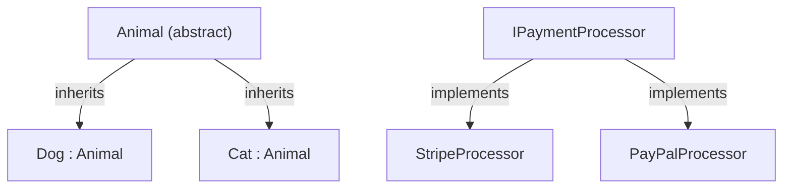
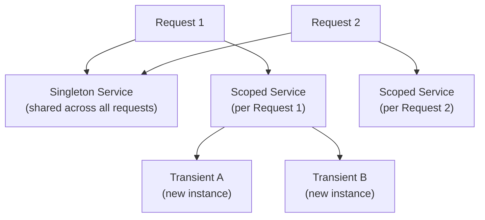
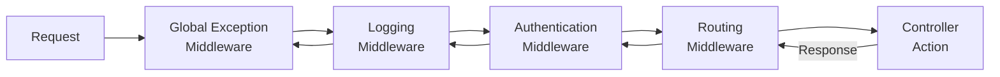
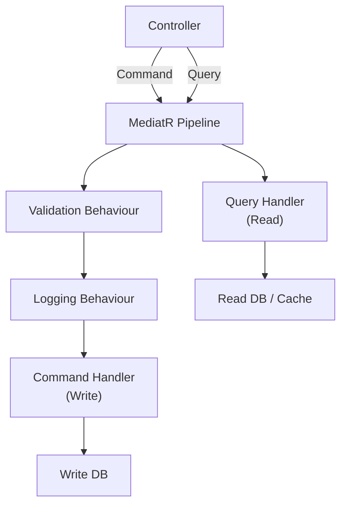

# .NET Interview Questions & Answers

## 1. OOP Principles in C#

### Question
Explain the four OOP pillars with C# examples.

### Answer

```csharp
// ENCAPSULATION – hide internals, expose interface
public class BankAccount
{
    private decimal _balance;       // private field

    public decimal Balance => _balance;   // read-only property

    public void Deposit(decimal amount)
    {
        if (amount <= 0) throw new ArgumentException("Must be positive");
        _balance += amount;
    }

    public bool Withdraw(decimal amount)
    {
        if (amount > _balance) return false;
        _balance -= amount;
        return true;
    }
}

// INHERITANCE – derive from base class
public abstract class Animal
{
    public string Name { get; init; }
    public Animal(string name) => Name = name;
    public abstract string Speak();         // must be overridden
    public virtual string Describe() => $"I am {Name}";
}

public class Dog : Animal
{
    public Dog(string name) : base(name) { }
    public override string Speak() => "Woof!";
    public override string Describe() => base.Describe() + ", a dog";
}

// POLYMORPHISM – same interface, different behaviour
Animal[] animals = { new Dog("Rex"), new Cat("Whiskers") };
foreach (var a in animals)
    Console.WriteLine(a.Speak()); // Dog: Woof!  Cat: Meow!

// ABSTRACTION – abstract the contract
public interface IPaymentProcessor
{
    Task<PaymentResult> ProcessAsync(PaymentRequest request);
    Task<bool> RefundAsync(string transactionId);
}

public class StripeProcessor : IPaymentProcessor { /* ... */ }
public class PayPalProcessor : IPaymentProcessor { /* ... */ }
```

### Diagram



---

## 2. LINQ – Language Integrated Query

### Question
Explain LINQ with real-world examples.

### Answer

```csharp
var orders = new List<Order>
{
    new(1, "Alice", 999m,  "delivered",  DateTime.Parse("2024-01-15")),
    new(2, "Bob",   25m,   "pending",    DateTime.Parse("2024-02-01")),
    new(3, "Alice", 350m,  "delivered",  DateTime.Parse("2024-02-20")),
    new(4, "Carol", 1200m, "cancelled",  DateTime.Parse("2024-03-01"))
};

// Basic filter + sort
var recentDelivered = orders
    .Where(o => o.Status == "delivered" && o.Date >= DateTime.Parse("2024-01-01"))
    .OrderByDescending(o => o.Amount)
    .Select(o => new { o.Id, o.Customer, o.Amount })
    .ToList();

// Aggregates
decimal totalRevenue = orders
    .Where(o => o.Status == "delivered")
    .Sum(o => o.Amount);   // 1349

// GroupBy – revenue per customer
var customerRevenue = orders
    .Where(o => o.Status == "delivered")
    .GroupBy(o => o.Customer)
    .Select(g => new
    {
        Customer = g.Key,
        TotalSpent = g.Sum(o => o.Amount),
        OrderCount = g.Count()
    })
    .OrderByDescending(x => x.TotalSpent);

// FirstOrDefault / SingleOrDefault with null safety
var topOrder = orders.MaxBy(o => o.Amount);
var aliceOrders = orders.Where(o => o.Customer == "Alice").ToList();

// Any / All
bool hasPending  = orders.Any(o => o.Status == "pending");
bool allDelivered = orders.All(o => o.Status == "delivered");

// Deferred execution – query built, NOT executed yet
var query = orders.Where(o => o.Amount > 100); // no execution
var result = query.ToList();                    // executes NOW
```

### Real-World Example – Reporting API

```csharp
public async Task<SalesSummary> GetMonthlySummaryAsync(int year, int month)
{
    return await _context.Orders
        .Where(o => o.Date.Year == year
                 && o.Date.Month == month
                 && o.Status == OrderStatus.Delivered)
        .GroupBy(o => o.Product.Category)
        .Select(g => new CategorySummary
        {
            Category   = g.Key,
            Revenue    = g.Sum(o => o.TotalAmount),
            OrderCount = g.Count(),
            AvgOrder   = g.Average(o => o.TotalAmount)
        })
        .OrderByDescending(c => c.Revenue)
        .ToListAsync();
}
```

---

## 3. Async/Await & Task Parallel Library

### Question
Explain async/await, Task, and common pitfalls.

### Answer

```csharp
// Basic async/await
public async Task<User> GetUserAsync(int id)
{
    var user = await _context.Users.FindAsync(id);
    if (user is null) throw new NotFoundException($"User {id} not found");
    return user;
}

// Parallel execution – run all tasks at once
public async Task<DashboardDto> LoadDashboardAsync(int userId)
{
    // Start all tasks simultaneously (not sequential await)
    var userTask    = _userService.GetByIdAsync(userId);
    var ordersTask  = _orderService.GetByUserAsync(userId);
    var notifTask   = _notifService.GetUnreadAsync(userId);

    // Await all at once
    await Task.WhenAll(userTask, ordersTask, notifTask);

    return new DashboardDto
    {
        User          = userTask.Result,
        RecentOrders  = ordersTask.Result,
        Notifications = notifTask.Result
    };
}

// Cancellation support
public async Task<List<Product>> SearchAsync(
    string query,
    CancellationToken cancellationToken)
{
    return await _context.Products
        .Where(p => p.Name.Contains(query))
        .ToListAsync(cancellationToken);  // cancels DB call if client disconnects
}

// Retry with exponential back-off (Polly)
var pipeline = new ResiliencePipelineBuilder()
    .AddRetry(new RetryStrategyOptions
    {
        MaxRetryAttempts = 3,
        Delay            = TimeSpan.FromSeconds(1),
        BackoffType      = DelayBackoffType.Exponential
    })
    .Build();

var result = await pipeline.ExecuteAsync(async ct =>
    await _httpClient.GetStringAsync("/api/data", ct), cancellationToken);
```

### Common Pitfalls

```csharp
// ❌ Deadlock – never .Result or .Wait() in sync context
var user = _userService.GetByIdAsync(1).Result;  // DEADLOCK!

// ✅ Always await async calls
var user = await _userService.GetByIdAsync(1);

// ❌ async void – swallows exceptions (only OK for event handlers)
async void LoadData() { await _service.LoadAsync(); }

// ✅ async Task for all other methods
async Task LoadDataAsync() { await _service.LoadAsync(); }

// ❌ Sequential when parallel is possible
var a = await taskA;
var b = await taskB;  // waits for A to finish first

// ✅ Parallel
await Task.WhenAll(taskA, taskB);
```

---

## 4. Dependency Injection in ASP.NET Core

### Question
Explain DI lifetimes and how to configure them.

### Answer

```csharp
// Program.cs – service registration
var builder = WebApplication.CreateBuilder(args);

// Transient – new instance every time it's requested
builder.Services.AddTransient<IEmailService, SmtpEmailService>();

// Scoped – one instance per HTTP request
builder.Services.AddScoped<IOrderRepository, OrderRepository>();
builder.Services.AddScoped<IUnitOfWork, UnitOfWork>();

// Singleton – one instance for the application lifetime
builder.Services.AddSingleton<ICache, RedisCache>();
builder.Services.AddSingleton<ILogger>(Log.Logger);

// Register with factory (conditional)
builder.Services.AddScoped<IPaymentProcessor>(sp =>
{
    var config = sp.GetRequiredService<IConfiguration>();
    return config["Payment:Provider"] == "Stripe"
        ? new StripeProcessor(config)
        : new PayPalProcessor(config);
});

// Using the services
[ApiController, Route("api/[controller]")]
public class OrdersController : ControllerBase
{
    private readonly IOrderRepository _orders;
    private readonly IEmailService    _email;

    // Constructor injection – recommended
    public OrdersController(IOrderRepository orders, IEmailService email)
    {
        _orders = orders;
        _email  = email;
    }

    [HttpPost]
    public async Task<IActionResult> Create(CreateOrderRequest request)
    {
        var order = await _orders.CreateAsync(request);
        await _email.SendOrderConfirmationAsync(order);
        return CreatedAtAction(nameof(GetById), new { id = order.Id }, order);
    }
}
```

### Diagram



---

## 5. Middleware in ASP.NET Core

### Question
How does the middleware pipeline work? Write a custom middleware.

### Answer

```csharp
// Middleware pipeline – each component calls next()
public class RequestLoggingMiddleware
{
    private readonly RequestDelegate _next;
    private readonly ILogger<RequestLoggingMiddleware> _logger;

    public RequestLoggingMiddleware(
        RequestDelegate next,
        ILogger<RequestLoggingMiddleware> logger)
    {
        _next   = next;
        _logger = logger;
    }

    public async Task InvokeAsync(HttpContext context)
    {
        var stopwatch = Stopwatch.StartNew();
        var requestId = Guid.NewGuid().ToString("N")[..8];
        context.Items["RequestId"] = requestId;

        _logger.LogInformation(
            "[{RequestId}] {Method} {Path} started",
            requestId, context.Request.Method, context.Request.Path);

        try
        {
            await _next(context);   // call next middleware
        }
        finally
        {
            stopwatch.Stop();
            _logger.LogInformation(
                "[{RequestId}] {Status} in {Ms}ms",
                requestId, context.Response.StatusCode, stopwatch.ElapsedMilliseconds);
        }
    }
}

// Exception handling middleware
public class GlobalExceptionMiddleware
{
    private readonly RequestDelegate _next;

    public GlobalExceptionMiddleware(RequestDelegate next) => _next = next;

    public async Task InvokeAsync(HttpContext context)
    {
        try
        {
            await _next(context);
        }
        catch (NotFoundException ex)
        {
            await WriteErrorAsync(context, 404, ex.Message);
        }
        catch (ValidationException ex)
        {
            await WriteErrorAsync(context, 400, ex.Message);
        }
        catch (Exception ex)
        {
            await WriteErrorAsync(context, 500, "An error occurred");
            // log full ex to monitoring
        }
    }

    private static Task WriteErrorAsync(HttpContext ctx, int status, string msg)
    {
        ctx.Response.StatusCode  = status;
        ctx.Response.ContentType = "application/json";
        return ctx.Response.WriteAsJsonAsync(new { error = msg });
    }
}

// Register in Program.cs
app.UseMiddleware<GlobalExceptionMiddleware>();  // outermost – catches everything
app.UseMiddleware<RequestLoggingMiddleware>();
app.UseAuthentication();
app.UseAuthorization();
app.MapControllers();
```

### Diagram



---

## 6. Entity Framework Core

### Question
Explain DbContext, relationships, and performance best practices.

### Answer

```csharp
// Entity models
public class Product
{
    public int     Id          { get; set; }
    public string  Name        { get; set; } = "";
    public decimal Price       { get; set; }
    public int     CategoryId  { get; set; }
    public Category Category   { get; set; } = null!;
    public ICollection<OrderItem> OrderItems { get; set; } = new List<OrderItem>();
}

// DbContext
public class AppDbContext : DbContext
{
    public AppDbContext(DbContextOptions<AppDbContext> options) : base(options) { }

    public DbSet<Product>   Products   => Set<Product>();
    public DbSet<Order>     Orders     => Set<Order>();
    public DbSet<Customer>  Customers  => Set<Customer>();

    protected override void OnModelCreating(ModelBuilder modelBuilder)
    {
        // Fluent API configuration
        modelBuilder.Entity<Product>(e =>
        {
            e.Property(p => p.Name).HasMaxLength(200).IsRequired();
            e.Property(p => p.Price).HasPrecision(18, 2);
            e.HasIndex(p => p.CategoryId);
        });

        modelBuilder.Entity<OrderItem>()
            .HasKey(oi => new { oi.OrderId, oi.ProductId }); // composite PK
    }
}

// Efficient querying patterns
public class ProductRepository
{
    private readonly AppDbContext _db;
    public ProductRepository(AppDbContext db) => _db = db;

    // ✅ AsNoTracking – faster reads when you don't need to update
    public Task<List<ProductDto>> GetAllAsync() =>
        _db.Products
           .AsNoTracking()
           .Select(p => new ProductDto { Id = p.Id, Name = p.Name, Price = p.Price })
           .ToListAsync();

    // ✅ Include only what you need (avoid SELECT *)
    public Task<Order?> GetOrderWithItemsAsync(int id) =>
        _db.Orders
           .Include(o => o.Items).ThenInclude(i => i.Product)
           .Include(o => o.Customer)
           .AsNoTracking()
           .FirstOrDefaultAsync(o => o.Id == id);

    // ✅ Pagination with keyset (better than OFFSET for large tables)
    public Task<List<Product>> GetPageAsync(int lastId, int pageSize) =>
        _db.Products
           .Where(p => p.Id > lastId)
           .OrderBy(p => p.Id)
           .Take(pageSize)
           .AsNoTracking()
           .ToListAsync();
}
```

### N+1 Problem

```csharp
// ❌ N+1 – 1 query for orders + N queries for each customer
var orders = await _db.Orders.ToListAsync();
foreach (var o in orders)
    Console.WriteLine(o.Customer.Name); // lazy load = N extra queries!

// ✅ Eager load – 1 query with JOIN
var orders = await _db.Orders.Include(o => o.Customer).ToListAsync();
```

---

## 7. Authentication & Authorization with JWT

### Question
Implement JWT authentication in ASP.NET Core.

### Answer

```csharp
// Program.cs – JWT setup
builder.Services
    .AddAuthentication(JwtBearerDefaults.AuthenticationScheme)
    .AddJwtBearer(options =>
    {
        options.TokenValidationParameters = new TokenValidationParameters
        {
            ValidateIssuerSigningKey = true,
            IssuerSigningKey         = new SymmetricSecurityKey(
                                           Encoding.UTF8.GetBytes(
                                               builder.Configuration["Jwt:Secret"]!)),
            ValidateIssuer           = true,
            ValidIssuer              = builder.Configuration["Jwt:Issuer"],
            ValidateAudience         = true,
            ValidAudience            = builder.Configuration["Jwt:Audience"],
            ValidateLifetime         = true,
            ClockSkew                = TimeSpan.Zero
        };
    });

// Token generation service
public class TokenService
{
    private readonly IConfiguration _config;
    public TokenService(IConfiguration config) => _config = config;

    public string GenerateToken(User user)
    {
        var claims = new[]
        {
            new Claim(ClaimTypes.NameIdentifier, user.Id.ToString()),
            new Claim(ClaimTypes.Email, user.Email),
            new Claim(ClaimTypes.Role, user.Role),
        };

        var key   = new SymmetricSecurityKey(
                        Encoding.UTF8.GetBytes(_config["Jwt:Secret"]!));
        var creds = new SigningCredentials(key, SecurityAlgorithms.HmacSha256);

        var token = new JwtSecurityToken(
            issuer:    _config["Jwt:Issuer"],
            audience:  _config["Jwt:Audience"],
            claims:    claims,
            expires:   DateTime.UtcNow.AddHours(1),
            signingCredentials: creds);

        return new JwtSecurityTokenHandler().WriteToken(token);
    }
}

// Role-based authorization
[Authorize(Roles = "Admin")]
[HttpDelete("{id}")]
public async Task<IActionResult> Delete(int id) { /* ... */ }

// Policy-based authorization
builder.Services.AddAuthorization(opts =>
{
    opts.AddPolicy("CanManageOrders", policy =>
        policy.RequireRole("Admin", "Manager")
              .RequireClaim("department", "operations"));
});

[Authorize(Policy = "CanManageOrders")]
[HttpPatch("{id}/status")]
public async Task<IActionResult> UpdateStatus(int id, string status) { /* ... */ }
```

---

## 8. Design Patterns in .NET

### Question
Implement Repository, Unit of Work, and CQRS patterns.

### Answer

```csharp
// REPOSITORY PATTERN – abstract data access
public interface IRepository<T> where T : class
{
    Task<T?> GetByIdAsync(int id, CancellationToken ct = default);
    Task<IReadOnlyList<T>> GetAllAsync(CancellationToken ct = default);
    Task<T> AddAsync(T entity, CancellationToken ct = default);
    Task UpdateAsync(T entity, CancellationToken ct = default);
    Task DeleteAsync(int id, CancellationToken ct = default);
}

public class ProductRepository : IRepository<Product>
{
    private readonly AppDbContext _db;
    public ProductRepository(AppDbContext db) => _db = db;

    public Task<Product?> GetByIdAsync(int id, CancellationToken ct = default) =>
        _db.Products.AsNoTracking().FirstOrDefaultAsync(p => p.Id == id, ct);

    public async Task<Product> AddAsync(Product entity, CancellationToken ct = default)
    {
        _db.Products.Add(entity);
        await _db.SaveChangesAsync(ct);
        return entity;
    }
    // ...
}

// UNIT OF WORK – coordinate multiple repositories in one transaction
public interface IUnitOfWork : IDisposable
{
    IProductRepository  Products  { get; }
    IOrderRepository    Orders    { get; }
    ICustomerRepository Customers { get; }
    Task<int> CommitAsync(CancellationToken ct = default);
}

public class UnitOfWork : IUnitOfWork
{
    private readonly AppDbContext _db;
    public IProductRepository  Products  { get; }
    public IOrderRepository    Orders    { get; }
    public ICustomerRepository Customers { get; }

    public UnitOfWork(AppDbContext db, /* inject repos */ )
    {
        _db       = db;
        Products  = new ProductRepository(db);
        Orders    = new OrderRepository(db);
        Customers = new CustomerRepository(db);
    }

    public Task<int> CommitAsync(CancellationToken ct = default) =>
        _db.SaveChangesAsync(ct);

    public void Dispose() => _db.Dispose();
}

// Usage
public async Task<Order> PlaceOrderAsync(PlaceOrderCommand cmd)
{
    using var uow = _unitOfWork;
    var customer = await uow.Customers.GetByIdAsync(cmd.CustomerId);
    var products = await uow.Products.GetByIdsAsync(cmd.ProductIds);

    var order = Order.Create(customer, products, cmd.Quantities);
    await uow.Orders.AddAsync(order);
    await uow.CommitAsync(); // single transaction
    return order;
}
```

---

## 9. CQRS with MediatR

### Question
Implement CQRS using MediatR.

### Answer

```csharp
// COMMAND – changes state
public record CreateOrderCommand(int CustomerId, List<OrderLineItem> Items)
    : IRequest<int>;

public class CreateOrderHandler : IRequestHandler<CreateOrderCommand, int>
{
    private readonly IUnitOfWork _uow;
    private readonly IEmailService _email;

    public CreateOrderHandler(IUnitOfWork uow, IEmailService email)
    {
        _uow   = uow;
        _email = email;
    }

    public async Task<int> Handle(CreateOrderCommand cmd, CancellationToken ct)
    {
        var order = Order.Create(cmd.CustomerId, cmd.Items);
        await _uow.Orders.AddAsync(order, ct);
        await _uow.CommitAsync(ct);

        await _email.SendConfirmationAsync(order.Id);
        return order.Id;
    }
}

// QUERY – reads state, no side effects
public record GetOrderByIdQuery(int OrderId) : IRequest<OrderDto?>;

public class GetOrderByIdHandler : IRequestHandler<GetOrderByIdQuery, OrderDto?>
{
    private readonly AppDbContext _db;    // use DbContext directly for reads

    public GetOrderByIdHandler(AppDbContext db) => _db = db;

    public Task<OrderDto?> Handle(GetOrderByIdQuery q, CancellationToken ct) =>
        _db.Orders
           .AsNoTracking()
           .Where(o => o.Id == q.OrderId)
           .Select(o => new OrderDto { Id = o.Id, Total = o.Total, Status = o.Status })
           .FirstOrDefaultAsync(ct);
}

// PIPELINE BEHAVIOUR – cross-cutting concerns (validation, logging)
public class ValidationBehaviour<TRequest, TResponse>
    : IPipelineBehavior<TRequest, TResponse>
    where TRequest : IRequest<TResponse>
{
    private readonly IEnumerable<IValidator<TRequest>> _validators;

    public ValidationBehaviour(IEnumerable<IValidator<TRequest>> validators) =>
        _validators = validators;

    public async Task<TResponse> Handle(
        TRequest request, RequestHandlerDelegate<TResponse> next, CancellationToken ct)
    {
        var context = new ValidationContext<TRequest>(request);
        var failures = _validators
            .Select(v => v.Validate(context))
            .SelectMany(r => r.Errors)
            .Where(f => f is not null)
            .ToList();

        if (failures.Any())
            throw new ValidationException(failures);

        return await next();  // proceed to handler
    }
}

// Controller – thin, just dispatches
[HttpPost]
public async Task<IActionResult> Create(CreateOrderRequest req)
{
    var command = new CreateOrderCommand(req.CustomerId, req.Items);
    var orderId = await _mediator.Send(command);
    return CreatedAtAction(nameof(GetById), new { id = orderId }, new { id = orderId });
}
```

### Diagram



---

## 10. Clean Architecture

### Question
Explain Clean Architecture and how to structure an ASP.NET Core project.

### Answer

```
Solution Structure:
  MyApp.Domain          – Entities, Value Objects, Domain Events, Interfaces
  MyApp.Application     – Use Cases (Commands/Queries), DTOs, Validators
  MyApp.Infrastructure  – EF Core, Redis, Email, external API clients
  MyApp.API             – Controllers, Middleware, Startup
  MyApp.Tests           – Unit + Integration tests
```

**Dependency Rule:** Inner layers know nothing about outer layers.

```mermaid
graph TD
    API["🌐 API Layer\n(Controllers, Middleware)"]
    App["⚙️ Application Layer\n(Commands, Queries, Handlers)"]
    Domain["🏛️ Domain Layer\n(Entities, Business Rules)"]
    Infra["🗄️ Infrastructure Layer\n(EF Core, Redis, SMTP)"]

    API -->|depends on| App
    App -->|depends on| Domain
    Infra -->|depends on| App
    Infra -->|implements interfaces from| Domain

    style Domain fill:#4CAF50,color:#fff
```



**Domain Entity – no framework dependencies:**

```csharp
// Domain/Entities/Order.cs
public class Order
{
    private readonly List<OrderItem> _items = new();

    public int         Id         { get; private set; }
    public int         CustomerId { get; private set; }
    public OrderStatus Status     { get; private set; }
    public decimal     Total      => _items.Sum(i => i.LineTotal);
    public IReadOnlyList<OrderItem> Items => _items.AsReadOnly();

    // Factory method – encapsulates creation rules
    public static Order Create(int customerId, IEnumerable<OrderItem> items)
    {
        if (!items.Any()) throw new DomainException("Order must have at least one item");
        return new Order { CustomerId = customerId, Status = OrderStatus.Pending }
               .WithItems(items);
    }

    public void Confirm()
    {
        if (Status != OrderStatus.Pending)
            throw new DomainException("Only pending orders can be confirmed");
        Status = OrderStatus.Confirmed;
        AddDomainEvent(new OrderConfirmedEvent(Id));
    }
}
```

---

## 11. Unit Testing with xUnit & Moq

### Question
Write unit tests for a service with dependencies.

### Answer

```csharp
public class OrderServiceTests
{
    private readonly Mock<IOrderRepository> _orderRepoMock;
    private readonly Mock<IEmailService>    _emailMock;
    private readonly Mock<IUnitOfWork>      _uowMock;
    private readonly OrderService           _sut;  // System Under Test

    public OrderServiceTests()
    {
        _orderRepoMock = new Mock<IOrderRepository>();
        _emailMock     = new Mock<IEmailService>();
        _uowMock       = new Mock<IUnitOfWork>();
        _uowMock.Setup(u => u.Orders).Returns(_orderRepoMock.Object);
        _sut = new OrderService(_uowMock.Object, _emailMock.Object);
    }

    [Fact]
    public async Task PlaceOrder_ValidRequest_ReturnsNewOrderId()
    {
        // Arrange
        var request = new PlaceOrderRequest(CustomerId: 1, Items: new[]
        {
            new OrderItem(ProductId: 10, Qty: 2, Price: 50m)
        });

        _orderRepoMock
            .Setup(r => r.AddAsync(It.IsAny<Order>(), It.IsAny<CancellationToken>()))
            .ReturnsAsync((Order o, CancellationToken _) => { o.SetId(42); return o; });

        // Act
        var orderId = await _sut.PlaceOrderAsync(request);

        // Assert
        Assert.Equal(42, orderId);
        _emailMock.Verify(e =>
            e.SendConfirmationAsync(42), Times.Once);
    }

    [Fact]
    public async Task PlaceOrder_EmptyItems_ThrowsDomainException()
    {
        var request = new PlaceOrderRequest(CustomerId: 1, Items: Array.Empty<OrderItem>());

        await Assert.ThrowsAsync<DomainException>(() => _sut.PlaceOrderAsync(request));
        _emailMock.Verify(e => e.SendConfirmationAsync(It.IsAny<int>()), Times.Never);
    }

    [Theory]
    [InlineData(100,  "Bronze")]
    [InlineData(1000, "Silver")]
    [InlineData(5000, "Gold")]
    public void GetTier_Amount_ReturnsCorrectTier(decimal amount, string expected)
    {
        var tier = CustomerTierCalculator.Calculate(amount);
        Assert.Equal(expected, tier);
    }
}
```

---

## 12. Caching in ASP.NET Core

### Question
How do you implement caching in ASP.NET Core?

### Answer

```csharp
// IMemoryCache – in-process (single server)
public class ProductService
{
    private readonly IMemoryCache _cache;
    private readonly IProductRepository _repo;

    public ProductService(IMemoryCache cache, IProductRepository repo)
    {
        _cache = cache;
        _repo  = repo;
    }

    public async Task<Product?> GetByIdAsync(int id)
    {
        var key = $"product:{id}";
        if (_cache.TryGetValue(key, out Product? cached))
            return cached;

        var product = await _repo.GetByIdAsync(id);
        if (product is not null)
        {
            _cache.Set(key, product, new MemoryCacheEntryOptions
            {
                SlidingExpiration  = TimeSpan.FromMinutes(5),
                AbsoluteExpiration = DateTimeOffset.UtcNow.AddHours(1),
                Size               = 1
            });
        }
        return product;
    }
}

// IDistributedCache (Redis) – works across multiple servers
public class DistributedProductService
{
    private readonly IDistributedCache _cache;
    private readonly IProductRepository _repo;

    public async Task<Product?> GetByIdAsync(int id, CancellationToken ct = default)
    {
        var key  = $"product:{id}";
        var json = await _cache.GetStringAsync(key, ct);
        if (json is not null)
            return JsonSerializer.Deserialize<Product>(json);

        var product = await _repo.GetByIdAsync(id, ct);
        if (product is not null)
        {
            await _cache.SetStringAsync(key,
                JsonSerializer.Serialize(product),
                new DistributedCacheEntryOptions
                {
                    AbsoluteExpirationRelativeToNow = TimeSpan.FromMinutes(30)
                }, ct);
        }
        return product;
    }

    public async Task InvalidateAsync(int id) =>
        await _cache.RemoveAsync($"product:{id}");
}

// Response caching – HTTP-level cache headers
[HttpGet("{id}")]
[ResponseCache(Duration = 300, VaryByHeader = "Accept")]
public async Task<IActionResult> GetById(int id) { /* ... */ }
```

---

## 13. Background Services & Worker Processes

### Question
How do you run background tasks in ASP.NET Core?

### Answer

```csharp
// Hosted service – runs for application lifetime
public class OrderExpiryWorker : BackgroundService
{
    private readonly IServiceScopeFactory _scopeFactory;
    private readonly ILogger<OrderExpiryWorker> _logger;

    public OrderExpiryWorker(IServiceScopeFactory sf, ILogger<OrderExpiryWorker> log)
    {
        _scopeFactory = sf;
        _logger       = log;
    }

    protected override async Task ExecuteAsync(CancellationToken stoppingToken)
    {
        while (!stoppingToken.IsCancellationRequested)
        {
            try
            {
                // Use scope for scoped services (like DbContext) inside singleton worker
                using var scope = _scopeFactory.CreateScope();
                var db = scope.ServiceProvider.GetRequiredService<AppDbContext>();

                var expired = await db.Orders
                    .Where(o => o.Status == OrderStatus.Pending
                             && o.CreatedAt < DateTime.UtcNow.AddMinutes(-30))
                    .ToListAsync(stoppingToken);

                foreach (var order in expired)
                    order.Cancel("Expired");

                await db.SaveChangesAsync(stoppingToken);
                _logger.LogInformation("Expired {Count} orders", expired.Count);
            }
            catch (Exception ex)
            {
                _logger.LogError(ex, "Error in OrderExpiryWorker");
            }

            await Task.Delay(TimeSpan.FromMinutes(5), stoppingToken);
        }
    }
}

// Register
builder.Services.AddHostedService<OrderExpiryWorker>();
```

---

## 14. Generics & Constraints

### Question
Explain generics with constraints and real-world usage.

### Answer

```csharp
// Generic Result type – avoids exceptions for expected failures
public class Result<T>
{
    private Result() { }

    public bool   IsSuccess { get; private init; }
    public T?     Value     { get; private init; }
    public string Error     { get; private init; } = "";

    public static Result<T> Success(T value) =>
        new() { IsSuccess = true, Value = value };

    public static Result<T> Failure(string error) =>
        new() { IsSuccess = false, Error = error };

    public TOut Match<TOut>(Func<T, TOut> onSuccess, Func<string, TOut> onFailure) =>
        IsSuccess ? onSuccess(Value!) : onFailure(Error);
}

// Generic repository with constraints
public interface IRepository<T> where T : class, IEntity
{
    Task<T?> GetByIdAsync(int id);
    Task<T>  AddAsync(T entity);
}

// Generic specification pattern
public abstract class Specification<T>
{
    public abstract Expression<Func<T, bool>> Criteria { get; }
    public List<Expression<Func<T, object>>> Includes { get; } = new();
}

public class ExpensiveProductsSpec : Specification<Product>
{
    private readonly decimal _minPrice;
    public ExpensiveProductsSpec(decimal minPrice) => _minPrice = minPrice;
    public override Expression<Func<Product, bool>> Criteria =>
        p => p.Price > _minPrice && p.IsActive;
}

// Usage in service
var spec    = new ExpensiveProductsSpec(minPrice: 500);
var products = await _repo.ListAsync(spec);
```

---

## 15. Minimal APIs (ASP.NET Core 6+)

### Question
How do Minimal APIs differ from controller-based APIs?

### Answer

```csharp
var builder = WebApplication.CreateBuilder(args);
builder.Services.AddDbContext<AppDbContext>(o =>
    o.UseSqlServer(builder.Configuration.GetConnectionString("Default")));

var app = builder.Build();

// Group endpoints
var products = app.MapGroup("/api/products").RequireAuthorization();

products.MapGet("/", async (AppDbContext db) =>
    await db.Products.AsNoTracking().ToListAsync());

products.MapGet("/{id:int}", async (int id, AppDbContext db) =>
    await db.Products.FindAsync(id)
        is Product p ? Results.Ok(p) : Results.NotFound());

products.MapPost("/", async (CreateProductDto dto, AppDbContext db) =>
{
    var product = new Product { Name = dto.Name, Price = dto.Price };
    db.Products.Add(product);
    await db.SaveChangesAsync();
    return Results.Created($"/api/products/{product.Id}", product);
});

products.MapPut("/{id:int}", async (int id, UpdateProductDto dto, AppDbContext db) =>
{
    var existing = await db.Products.FindAsync(id);
    if (existing is null) return Results.NotFound();
    existing.Name  = dto.Name;
    existing.Price = dto.Price;
    await db.SaveChangesAsync();
    return Results.NoContent();
});

products.MapDelete("/{id:int}", async (int id, AppDbContext db) =>
{
    var existing = await db.Products.FindAsync(id);
    if (existing is null) return Results.NotFound();
    db.Products.Remove(existing);
    await db.SaveChangesAsync();
    return Results.NoContent();
});

app.Run();
```

---

## Interview Level Summary

### Junior
| Topic | Key Points |
|---|---|
| OOP | Encapsulation, Inheritance, Polymorphism |
| C# Basics | var, LINQ basics, null handling |
| ASP.NET Core | Controller, routing, simple CRUD |
| EF Core | DbContext, basic queries |

### Mid-Level
| Topic | Key Points |
|---|---|
| Async/Await | Task.WhenAll, CancellationToken, pitfalls |
| Dependency Injection | Lifetimes, constructor injection |
| Design Patterns | Repository, UoW, Factory |
| Testing | xUnit, Moq, AAA pattern |

### Senior
| Topic | Key Points |
|---|---|
| Clean Architecture | Domain/Application/Infrastructure layers |
| CQRS + MediatR | Commands, Queries, Pipeline Behaviours |
| Performance | EF Core tuning, caching strategies |
| Security | JWT, OAuth2, policy-based auth |

