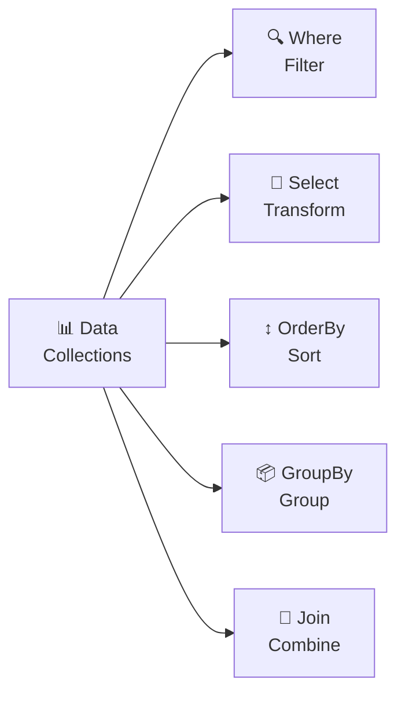
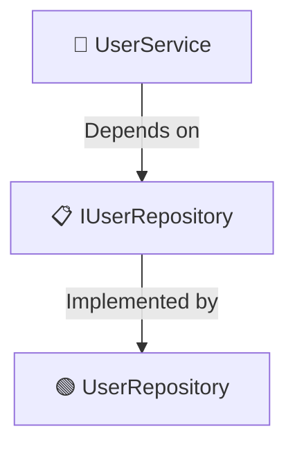
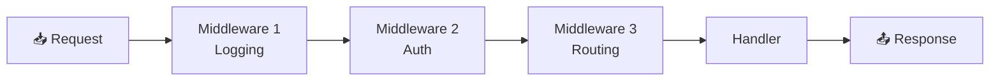

# .NET Interview Questions

## Overview

This folder contains comprehensive interview questions for .NET developers, covering C#, .NET Core, ASP.NET, Entity Framework, and related technologies.

## Topics Covered

### Core C# & .NET

- **OOP Principles** - Inheritance, Polymorphism, Encapsulation, Abstraction
- **Collections** - List, Dictionary, HashSet, Queue, Stack
- **LINQ** - Query syntax, Method syntax, Deferred execution
- **Async/Await** - Asynchronous programming patterns
- **Delegates & Events** - Callback mechanisms
- **Generics** - Type parameters, Constraints
- **Reflection** - Metadata inspection
- **Threading** - Concurrency, Thread safety

### ASP.NET Core

- **MVC vs Minimal APIs** - Architecture patterns
- **Dependency Injection** - Built-in DI container
- **Middleware** - Request pipeline
- **Routing** - URL mapping
- **Authentication & Authorization** - Identity, JWT, OAuth2
- **Entity Framework** - ORM, Migrations, Relationships
- **Configuration** - AppSettings, Environment variables
- **Logging** - Built-in logging framework

### Database

- **SQL & T-SQL** - Queries, Stored Procedures
- **Entity Framework Core** - DbContext, Migrations, Performance
- **Database Design** - Normalization, Relationships
- **Transactions** - ACID properties

### Advanced Topics

- **Design Patterns** - Singleton, Factory, Repository, Decorator
- **Architectural Patterns** - Clean Architecture, SOLID principles
- **Microservices** - Communication, Service Discovery
- **Docker & Containers** - Containerization
- **Azure Services** - App Service, SQL Database, KeyVault
- **Performance** - Caching, Optimization, Profiling

## Key Competencies

✅ Strong C# fundamentals  
✅ ASP.NET Core architecture  
✅ Database design and optimization  
✅ RESTful API design  
✅ Testing and code quality  
✅ Cloud deployment (Azure)  
✅ Security best practices  
✅ Performance optimization

## Interview Levels

### Junior Developer

- Basic C# syntax
- OOP concepts
- Simple queries
- MVC basics
- CRUD operations

### Mid-Level Developer

- Design patterns
- Async programming
- LINQ mastery
- Entity Framework advanced
- API security
- Unit testing

### Senior Developer

- System design
- Microservices architecture
- Performance optimization
- Cloud architecture (Azure)
- Leadership & mentoring
- Complex business logic

---

## Getting Started

1. Review core C# concepts first
2. Master async/await patterns
3. Learn Entity Framework thoroughly
4. Study ASP.NET Core request pipeline
5. Practice API design
6. Explore design patterns
7. Understand Azure services

## Recommended Resources

- **Microsoft Docs:** https://docs.microsoft.com/en-us/dotnet/
- **C# Programming Guide:** https://docs.microsoft.com/en-us/dotnet/csharp/
- **Entity Framework Core:** https://docs.microsoft.com/en-us/ef/core/
- **ASP.NET Core:** https://docs.microsoft.com/en-us/aspnet/core/

---

**Note:** This folder will be populated with detailed interview questions and answers for .NET positions.

---

# .NET Interview Questions & Answers

## 1. LINQ (Language Integrated Query)

### Question

What is LINQ and provide real-world examples?

### Answer

LINQ enables querying collections using SQL-like syntax.

### Query Syntax

```csharp
var numbers = new[] { 1, 2, 3, 4, 5 };

// Query syntax
var evens = from n in numbers
            where n % 2 == 0
            select n;

// Method syntax
var evens2 = numbers.Where(n => n % 2 == 0);
```

### Real-World Example: E-commerce

```csharp
public class Order
{
    public int OrderId { get; set; }
    public DateTime OrderDate { get; set; }
    public decimal Amount { get; set; }
    public string CustomerName { get; set; }
}

List<Order> orders = GetOrders();

// Query syntax
var highValueOrders = from o in orders
                      where o.Amount > 1000
                      orderby o.OrderDate descending
                      select new { o.CustomerName, o.Amount };

// Method syntax
var result = orders
    .Where(o => o.Amount > 1000)
    .OrderByDescending(o => o.OrderDate)
    .Select(o => new { o.CustomerName, o.Amount })
    .ToList();
```

### Common LINQ Operations



---

## 2. Async/Await

### Question

Explain async/await with real-world examples?

### Answer

Async/await enables non-blocking asynchronous operations.

```csharp
// Traditional approach - blocking
public string FetchData()
{
    var result = _httpClient.GetStringAsync("https://api.example.com/data").Result;
    return result; // Blocks thread!
}

// Modern approach - async/await
public async Task<string> FetchDataAsync()
{
    var result = await _httpClient.GetStringAsync("https://api.example.com/data");
    return result; // Non-blocking!
}
```

### Real-World API Example

```csharp
public class UserService
{
    private readonly HttpClient _httpClient;

    public async Task<User> GetUserAsync(int userId)
    {
        var response = await _httpClient.GetAsync($"/api/users/{userId}");
        response.EnsureSuccessStatusCode();

        var json = await response.Content.ReadAsStringAsync();
        return JsonConvert.DeserializeObject<User>(json);
    }
}

// Usage
var user = await userService.GetUserAsync(123);
```

### Parallel Async Operations

```csharp
// Run multiple operations in parallel
public async Task<UserProfile> GetUserProfileAsync(int userId)
{
    var userTask = _userService.GetUserAsync(userId);
    var ordersTask = _orderService.GetUserOrdersAsync(userId);
    var reviewsTask = _reviewService.GetUserReviewsAsync(userId);

    // Wait for all to complete
    await Task.WhenAll(userTask, ordersTask, reviewsTask);

    return new UserProfile
    {
        User = await userTask,
        Orders = await ordersTask,
        Reviews = await reviewsTask
    };
}
```

---

## 3. Entity Framework Core

### Question

Explain Entity Framework Core and relationships?

### Answer

Entity Framework Core is an ORM for data access.

```csharp
// DbContext
public class ApplicationDbContext : DbContext
{
    public DbSet<User> Users { get; set; }
    public DbSet<Order> Orders { get; set; }

    protected override void OnConfiguring(DbContextOptionsBuilder options)
    {
        options.UseSqlServer("connection_string");
    }
}

// Models with relationships
public class User
{
    public int Id { get; set; }
    public string Name { get; set; }
    public ICollection<Order> Orders { get; set; } // One-to-many
}

public class Order
{
    public int Id { get; set; }
    public decimal Amount { get; set; }
    public int UserId { get; set; }
    public User User { get; set; } // Foreign key
}
```

### Query Example

```csharp
// Include related data
var users = await _context.Users
    .Include(u => u.Orders)
    .Where(u => u.Orders.Count > 0)
    .ToListAsync();

// Projection
var userOrders = await _context.Users
    .Select(u => new
    {
        u.Name,
        OrderCount = u.Orders.Count,
        TotalSpent = u.Orders.Sum(o => o.Amount)
    })
    .ToListAsync();
```

---

## 4. Dependency Injection

### Question

Explain Dependency Injection in .NET?

### Answer

DI provides dependencies to classes rather than creating them internally.

```csharp
// Interface
public interface IUserRepository
{
    Task<User> GetUserAsync(int id);
}

// Implementation
public class UserRepository : IUserRepository
{
    private readonly ApplicationDbContext _context;

    public UserRepository(ApplicationDbContext context)
    {
        _context = context; // Injected dependency
    }

    public async Task<User> GetUserAsync(int id)
    {
        return await _context.Users.FindAsync(id);
    }
}

// Service using dependency
public class UserService
{
    private readonly IUserRepository _repository;

    public UserService(IUserRepository repository)
    {
        _repository = repository; // DI constructor
    }

    public async Task<User> GetUserAsync(int id)
    {
        return await _repository.GetUserAsync(id);
    }
}

// Startup configuration
public void ConfigureServices(IServiceCollection services)
{
    services.AddScoped<IUserRepository, UserRepository>();
    services.AddScoped<UserService>();
}
```

### Mermaid Diagram



---

## 5. Middleware in ASP.NET Core

### Question

How do you create and use middleware?

### Answer

Middleware is a component in the HTTP request pipeline.

```csharp
// Custom middleware
public class LoggingMiddleware
{
    private readonly RequestDelegate _next;
    private readonly ILogger<LoggingMiddleware> _logger;

    public LoggingMiddleware(RequestDelegate next, ILogger<LoggingMiddleware> logger)
    {
        _next = next;
        _logger = logger;
    }

    public async Task InvokeAsync(HttpContext context)
    {
        _logger.LogInformation($"Request: {context.Request.Path}");

        await _next(context); // Call next middleware

        _logger.LogInformation($"Response: {context.Response.StatusCode}");
    }
}

// Register middleware
public void Configure(IApplicationBuilder app)
{
    app.UseMiddleware<LoggingMiddleware>();
    app.UseRouting();
    app.UseEndpoints(endpoints => endpoints.MapControllers());
}
```

### Request Pipeline



---

## 6. REST API Best Practices

### Question

How do you design a RESTful API in ASP.NET Core?

### Answer

```csharp
[ApiController]
[Route("api/[controller]")]
public class UsersController : ControllerBase
{
    private readonly IUserService _userService;

    public UsersController(IUserService userService)
    {
        _userService = userService;
    }

    // GET /api/users
    [HttpGet]
    public async Task<ActionResult<IEnumerable<UserDto>>> GetUsers()
    {
        var users = await _userService.GetAllUsersAsync();
        return Ok(users);
    }

    // GET /api/users/{id}
    [HttpGet("{id}")]
    public async Task<ActionResult<UserDto>> GetUser(int id)
    {
        var user = await _userService.GetUserAsync(id);
        if (user == null)
            return NotFound();
        return Ok(user);
    }

    // POST /api/users
    [HttpPost]
    public async Task<ActionResult<UserDto>> CreateUser(CreateUserDto dto)
    {
        var user = await _userService.CreateUserAsync(dto);
        return CreatedAtAction(nameof(GetUser), new { id = user.Id }, user);
    }

    // PUT /api/users/{id}
    [HttpPut("{id}")]
    public async Task<IActionResult> UpdateUser(int id, UpdateUserDto dto)
    {
        await _userService.UpdateUserAsync(id, dto);
        return NoContent();
    }

    // DELETE /api/users/{id}
    [HttpDelete("{id}")]
    public async Task<IActionResult> DeleteUser(int id)
    {
        await _userService.DeleteUserAsync(id);
        return NoContent();
    }
}
```

### HTTP Status Codes

```csharp
// Success responses
return Ok(data);                          // 200
return CreatedAtAction(...);              // 201
return Accepted();                        // 202
return NoContent();                       // 204

// Client error responses
return BadRequest("Invalid input");       // 400
return Unauthorized();                    // 401
return Forbidden();                       // 403
return NotFound();                        // 404
return Conflict();                        // 409

// Server error responses
return StatusCode(500, "Internal error"); // 500
```

---

## 7. SOLID Principles

### Question

Explain SOLID principles in .NET?

### Answer

### Single Responsibility Principle

```csharp
// ❌ Violates SRP - multiple responsibilities
public class UserManager
{
    public void CreateUser(string name) { }
    public void SendEmail(string email) { }
    public void LogActivity(string action) { }
}

// ✅ Follows SRP - single responsibility
public class UserService
{
    public void CreateUser(string name) { }
}

public class EmailService
{
    public void SendEmail(string email) { }
}

public class LoggingService
{
    public void LogActivity(string action) { }
}
```

### Open/Closed Principle

```csharp
// ❌ Violates OCP - need to modify for new types
public class PaymentProcessor
{
    public void Process(string paymentType)
    {
        if (paymentType == "Credit")
            ProcessCredit();
        else if (paymentType == "PayPal")
            ProcessPayPal();
    }
}

// ✅ Follows OCP - open for extension
public interface IPaymentProcessor
{
    void Process(decimal amount);
}

public class CreditCardProcessor : IPaymentProcessor
{
    public void Process(decimal amount) { /* Credit card logic */ }
}

public class PayPalProcessor : IPaymentProcessor
{
    public void Process(decimal amount) { /* PayPal logic */ }
}
```

---

## 8. Exception Handling

### Question

Best practices for exception handling in .NET?

### Answer

```csharp
// Global exception middleware
public class ExceptionMiddleware
{
    private readonly RequestDelegate _next;

    public ExceptionMiddleware(RequestDelegate next)
    {
        _next = next;
    }

    public async Task InvokeAsync(HttpContext context)
    {
        try
        {
            await _next(context);
        }
        catch (Exception ex)
        {
            context.Response.StatusCode = StatusCodes.Status500InternalServerError;
            context.Response.ContentType = "application/json";

            await context.Response.WriteAsync(new ErrorResponse
            {
                Message = ex.Message,
                StatusCode = 500
            }.ToString());
        }
    }
}

// Service with proper exception handling
public async Task<User> GetUserAsync(int id)
{
    try
    {
        return await _context.Users.FindAsync(id);
    }
    catch (DbUpdateException ex)
    {
        _logger.LogError($"Database error: {ex.Message}");
        throw new ApplicationException("Error retrieving user", ex);
    }
    catch (Exception ex)
    {
        _logger.LogError($"Unexpected error: {ex.Message}");
        throw;
    }
}
```

---

## 9. Memory Management

### Question

Explain memory management and garbage collection in .NET?

### Answer

```csharp
// Stack - automatic cleanup
public void StackExample()
{
    int age = 30;           // Stack - auto cleaned when out of scope
    string name = "John";   // Reference on stack, object on heap
}

// Heap - managed by GC
public void HeapExample()
{
    var user = new User { Name = "John" };  // Object on heap
    // When user goes out of scope, GC will collect it
}

// Implementing IDisposable for cleanup
public class DatabaseConnection : IDisposable
{
    private IntPtr _dbHandle = IntPtr.Zero;

    public void Dispose()
    {
        Dispose(true);
        GC.SuppressFinalize(this);
    }

    protected virtual void Dispose(bool disposing)
    {
        if (disposing)
        {
            // Clean managed resources
        }

        if (_dbHandle != IntPtr.Zero)
        {
            // Clean unmanaged resources
            NativeMethods.CloseHandle(_dbHandle);
            _dbHandle = IntPtr.Zero;
        }
    }

    ~DatabaseConnection()
    {
        Dispose(false);
    }
}

// Usage
using (var connection = new DatabaseConnection())
{
    // Use connection
} // Automatically disposed
```

---

## 10. Authentication and Authorization

### Question

How to implement authentication in ASP.NET Core?

### Answer

```csharp
// Startup configuration
public void ConfigureServices(IServiceCollection services)
{
    services.AddAuthentication(JwtBearerDefaults.AuthenticationScheme)
        .AddJwtBearer(options =>
        {
            options.TokenValidationParameters = new TokenValidationParameters
            {
                ValidateIssuer = true,
                ValidateAudience = true,
                ValidateLifetime = true,
                ValidateIssuerSigningKey = true,
                ValidIssuer = _config["Jwt:Issuer"],
                ValidAudience = _config["Jwt:Audience"],
                IssuerSigningKey = new SymmetricSecurityKey(
                    Encoding.UTF8.GetBytes(_config["Jwt:Key"])
                )
            };
        });

    services.AddAuthorization();
}

// Login endpoint
[HttpPost("login")]
public async Task<IActionResult> Login(LoginRequest request)
{
    var user = await _userService.AuthenticateAsync(request.Username, request.Password);
    if (user == null)
        return Unauthorized();

    var token = GenerateJwtToken(user);
    return Ok(new { token });
}

// Protected endpoint
[HttpGet("profile")]
[Authorize]
public async Task<IActionResult> GetProfile()
{
    var userId = int.Parse(User.FindFirst(ClaimTypes.NameIdentifier)?.Value ?? "0");
    var user = await _userService.GetUserAsync(userId);
    return Ok(user);
}

// Role-based authorization
[HttpGet("admin")]
[Authorize(Roles = "Admin")]
public IActionResult AdminPanel()
{
    return Ok("Admin content");
}
```

### JWT Token Generation

```csharp
private string GenerateJwtToken(User user)
{
    var key = new SymmetricSecurityKey(
        Encoding.UTF8.GetBytes(_config["Jwt:Key"])
    );
    var credentials = new SigningCredentials(key, SecurityAlgorithms.HmacSha256);

    var claims = new[]
    {
        new Claim(ClaimTypes.NameIdentifier, user.Id.ToString()),
        new Claim(ClaimTypes.Name, user.Username),
        new Claim(ClaimTypes.Role, user.Role)
    };

    var token = new JwtSecurityToken(
        issuer: _config["Jwt:Issuer"],
        audience: _config["Jwt:Audience"],
        claims: claims,
        expires: DateTime.UtcNow.AddHours(24),
        signingCredentials: credentials
    );

    return new JwtSecurityTokenHandler().WriteToken(token);
}
```
