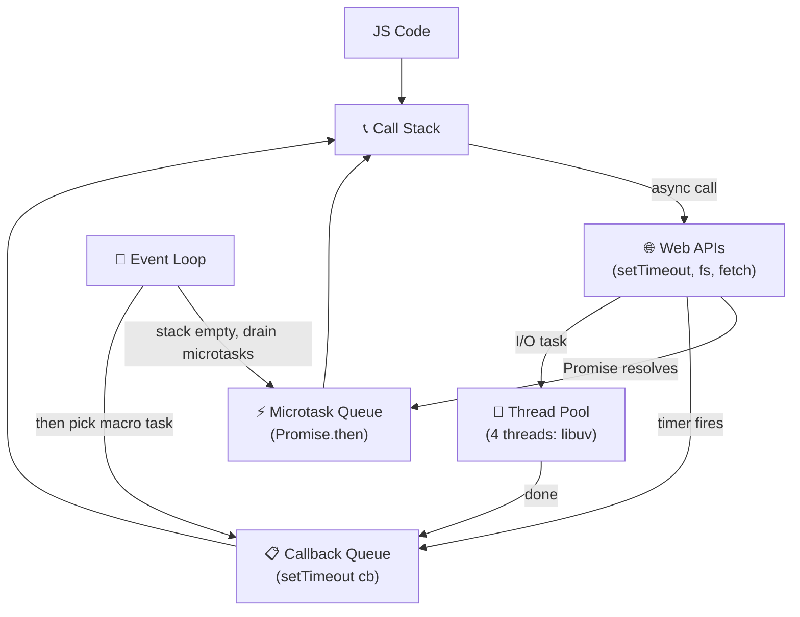
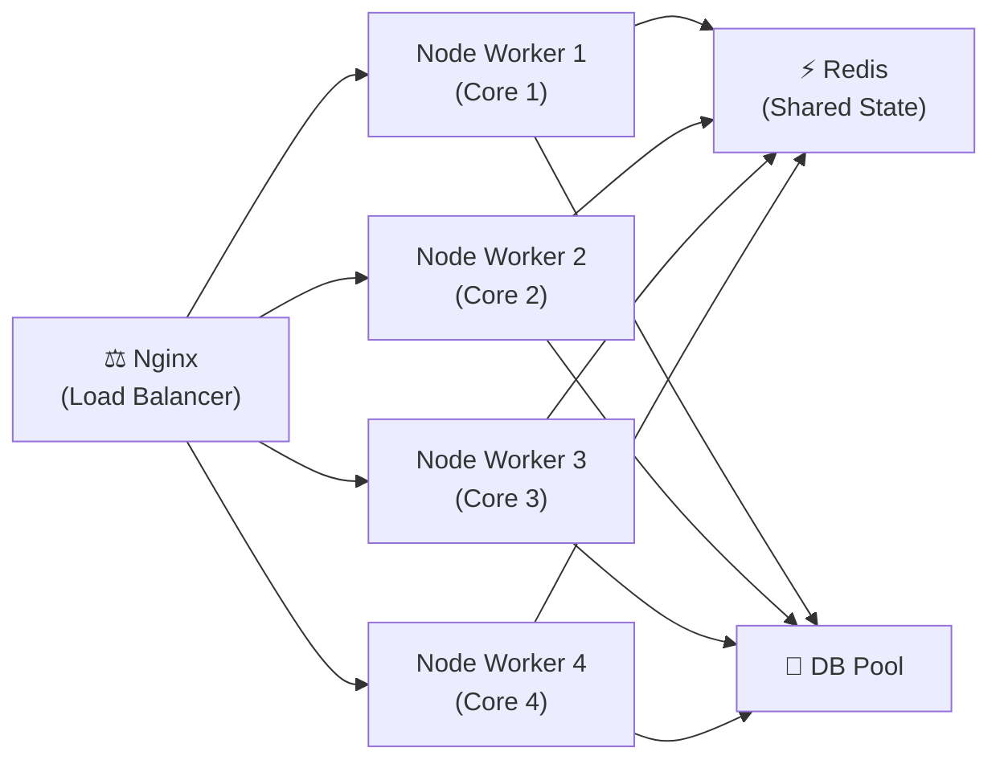
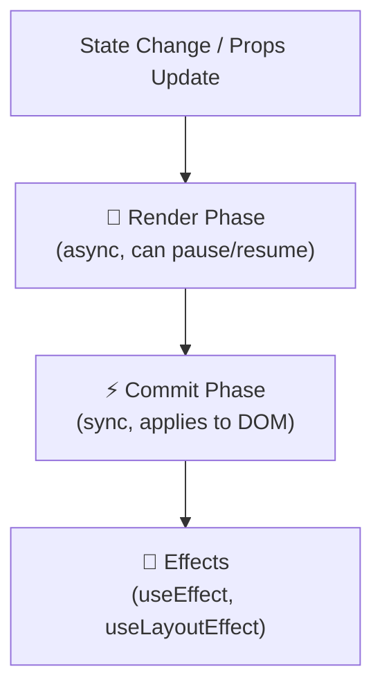
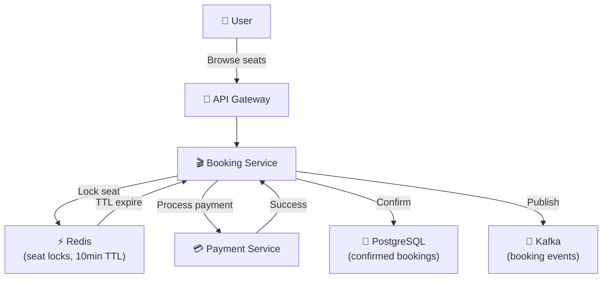
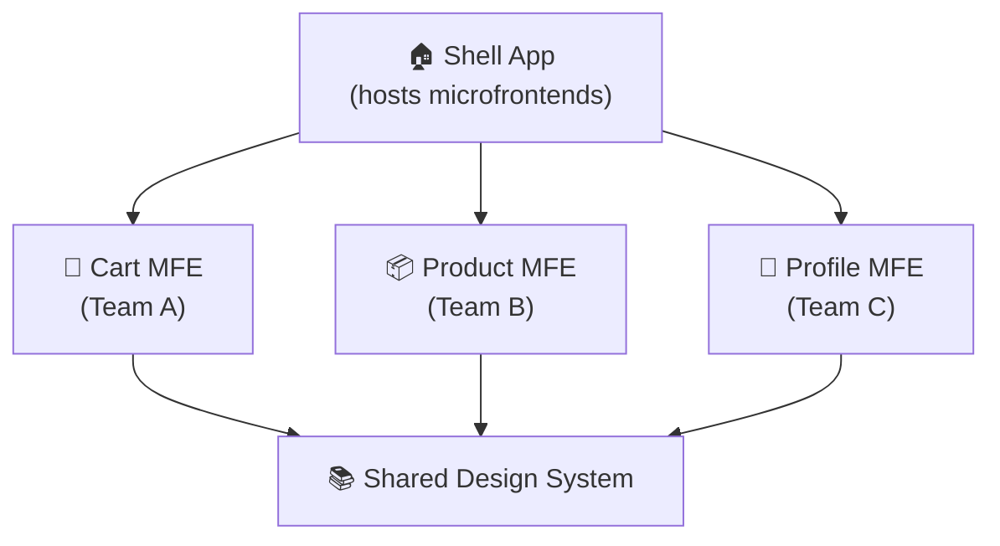

# 📚 Fullstack Interview Questions & Answers (Node.js, React.js, SQL, JavaScript, Java, .NET, ADO.NET)

This repository contains a **curated list of interview questions with answers, real-world examples, and diagrams** collected from real interviews in **2026** for Fullstack developers (React.js + Node.js + SQL + .NET + JavaScript + Java).

---

## 🔹 Node.js

### Callstack, Event Loop, Thread pool, Task / Callback Queue, Microtask Queue, Web API?

**Answer:**

Node.js is single-threaded but non-blocking thanks to its event-driven architecture powered by **libuv**.

| Component | Role |
|---|---|
| **Call Stack** | Executes synchronous JS code (LIFO) |
| **Web APIs / C++ APIs** | Browser/Node built-ins: `setTimeout`, `fetch`, `fs.readFile` |
| **Microtask Queue** | `Promise.then`, `queueMicrotask`, `MutationObserver` — runs **before** next macro task |
| **Callback/Task Queue** | `setTimeout`, `setInterval`, I/O callbacks — runs after microtasks |
| **Thread Pool (libuv)** | 4 threads (default) for CPU-bound work: file I/O, crypto, DNS |
| **Event Loop** | Continuously checks: is Call Stack empty? → drain Microtasks → pick next Task |

```javascript
console.log("1 - sync");

setTimeout(() => console.log("4 - setTimeout"), 0);   // Callback Queue

Promise.resolve().then(() => console.log("3 - Promise microtask")); // Microtask Queue

console.log("2 - sync end");

// Output: 1, 2, 3, 4
```



> **Real-World:** An Express server receiving 10,000 simultaneous HTTP requests doesn't block — each I/O operation is offloaded to the OS/thread pool while Node's event loop keeps accepting new connections.

---

### How to handle 1 million concurrent requests using Node.js?

**Answer:**

```javascript
// 1. Cluster module — use all CPU cores
const cluster = require("cluster");
const os      = require("os");
const http    = require("http");

if (cluster.isPrimary) {
  const cpuCount = os.cpus().length;
  console.log(`Forking ${cpuCount} workers`);
  for (let i = 0; i < cpuCount; i++) cluster.fork();
  cluster.on("exit", (worker) => {
    console.log(`Worker ${worker.process.pid} died. Restarting...`);
    cluster.fork();
  });
} else {
  // Each worker is an independent Node.js process
  http.createServer((req, res) => {
    res.end(`Handled by PID ${process.pid}`);
  }).listen(3000);
}

// 2. Avoid blocking the event loop — use async I/O
// ❌ Blocks event loop for ALL requests while file is read
const data = fs.readFileSync("large.json");

// ✅ Non-blocking — event loop continues accepting requests
const data = await fs.promises.readFile("large.json");

// 3. Load balancer (Nginx) in front of multiple Node processes
// 4. Redis for shared session/state across workers
// 5. Connection pooling for databases
```



> **Real-World:** WhatsApp Node.js servers handle millions of WebSocket connections by keeping I/O non-blocking and running one worker per CPU core behind a load balancer.

---

### What are streams / buffers in Node.js?

**Answer:**

**Buffer** is a fixed-size chunk of raw binary data in memory. **Streams** process data piece-by-piece instead of loading everything into memory at once.

| Stream Type | Example |
|---|---|
| `Readable` | `fs.createReadStream`, `http.IncomingMessage` |
| `Writable` | `fs.createWriteStream`, `http.ServerResponse` |
| `Duplex` | `net.Socket` (reads and writes) |
| `Transform` | `zlib.createGzip` (transform data in-flight) |

```javascript
const fs   = require("fs");
const zlib = require("zlib");

// ❌ Without streams – loads entire 2GB file into memory
const data = fs.readFileSync("large.log");
fs.writeFileSync("large.log.gz", gzip(data));

// ✅ With streams – memory stays ~100KB regardless of file size
fs.createReadStream("large.log")
  .pipe(zlib.createGzip())
  .pipe(fs.createWriteStream("large.log.gz"))
  .on("finish", () => console.log("Done – memory efficient!"));

// HTTP streaming response
app.get("/stream", (req, res) => {
  res.setHeader("Content-Type", "text/plain");
  const readable = fs.createReadStream("huge-file.txt");
  readable.pipe(res);  // chunks sent to client as they are read
});
```

> **Real-World:** Netflix streams video chunks to browsers — if they buffered the entire movie first, nobody could watch before the download finished.

---

### How to create custom middleware in Node.js?

**Answer:**

Middleware is a function `(req, res, next)` that sits in the request pipeline. Call `next()` to pass to the next middleware or `next(error)` to jump to an error handler.

```javascript
const express = require("express");
const app     = express();

// 1. Request logger middleware
const requestLogger = (req, res, next) => {
  const start = Date.now();
  console.log(`→ ${req.method} ${req.url}`);
  res.on("finish", () => {
    console.log(`← ${res.statusCode} in ${Date.now() - start}ms`);
  });
  next();  // must call next() to continue pipeline
};

// 2. Auth middleware
const authenticate = (req, res, next) => {
  const token = req.headers.authorization?.split(" ")[1];
  if (!token) return res.status(401).json({ error: "No token" });
  try {
    req.user = jwt.verify(token, process.env.JWT_SECRET);
    next();
  } catch {
    res.status(401).json({ error: "Invalid token" });
  }
};

// 3. Error handling middleware – MUST have 4 params
const errorHandler = (err, req, res, next) => {
  console.error(err.stack);
  res.status(err.status || 500).json({ error: err.message });
};

app.use(requestLogger);               // global
app.get("/profile", authenticate, (req, res) => {
  res.json({ user: req.user });       // route-specific
});
app.use(errorHandler);                // last – catches all errors
```

> **Real-World:** Express apps use middleware layers like an onion — request passes inward through auth, rate-limit, body-parser, then response peels outward through error handling.

---

### Have you created custom middleware in Node.js and how?

**Answer:** Yes — see example above. A real scenario: rate-limiting middleware that counts requests per IP using Redis.

```javascript
const rateLimit = (maxReqs, windowMs) => {
  const counts = new Map();
  return (req, res, next) => {
    const ip  = req.ip;
    const now = Date.now();
    const windowStart = now - windowMs;

    if (!counts.has(ip)) counts.set(ip, []);
    // Remove timestamps outside current window
    const timestamps = counts.get(ip).filter(t => t > windowStart);
    timestamps.push(now);
    counts.set(ip, timestamps);

    if (timestamps.length > maxReqs) {
      return res.status(429).json({ error: "Too many requests" });
    }
    next();
  };
};

app.use(rateLimit(100, 60_000)); // 100 requests per minute
```

---

### How do you handle CPU intensive tasks in Node.js?

**Answer:**

CPU-intensive work (image processing, encryption, ML inference) blocks the event loop. Solutions:

```javascript
// 1. Worker Threads (Node.js 12+) – parallel JS execution
const { Worker, isMainThread, parentPort, workerData } = require("worker_threads");

if (isMainThread) {
  // Main thread stays free for HTTP requests
  const worker = new Worker(__filename, { workerData: { n: 40 } });
  worker.on("message", result => console.log("Fib:", result));
} else {
  // Heavy computation runs in background thread
  function fib(n) { return n <= 1 ? n : fib(n-1) + fib(n-2); }
  parentPort.postMessage(fib(workerData.n));
}

// 2. Child Process – spawn a separate process
const { fork } = require("child_process");
const child = fork("./compute.js");
child.send({ task: "primeFactors", n: 999999999 });
child.on("message", result => console.log(result));

// 3. Offload to a queue (Bull/BullMQ + Redis)
const queue = new Queue("image-processing");
app.post("/resize", async (req, res) => {
  await queue.add("resize", { imageUrl: req.body.url, width: 800 });
  res.json({ status: "queued" });
});
// Separate worker process handles the queue
```

---

### How do you handle concurrent requests in Node.js?

**Answer:** Node handles concurrency natively through its non-blocking event loop — no need for threads per request like Java/PHP. Key techniques:

```javascript
// Use async/await everywhere (no blocking)
app.get("/orders", async (req, res) => {
  // These two DB calls run in parallel
  const [orders, count] = await Promise.all([
    Order.find().limit(20),
    Order.countDocuments()
  ]);
  res.json({ orders, count });
});

// Connection pooling prevents DB exhaustion
const pool = mysql.createPool({ connectionLimit: 20 });
```

---

### How do you manage a high CPU on a server?

**Answer:**

```
Diagnosis steps:
1. top / htop – identify which process consumes CPU
2. node --prof app.js → node --prof-process isolate-*.log  (V8 profiler)
3. clinic.js flame – flamegraph to spot hot functions
4. Add APM (New Relic / Datadog) for production profiling

Fixes:
- Move CPU work to Worker Threads
- Cache expensive computations
- Offload to message queue (Kafka, BullMQ)
- Scale horizontally – add more servers behind load balancer
- CDN for static assets
```

---

### How do you create indexing in MongoDB?

**Answer:**

```javascript
// Single field index
db.orders.createIndex({ customerId: 1 });  // 1 = ascending

// Compound index – order of fields matters
db.orders.createIndex({ status: 1, createdAt: -1 });

// Text index for full-text search
db.products.createIndex({ name: "text", description: "text" });

// Partial index – only index pending orders
db.orders.createIndex(
  { createdAt: 1 },
  { partialFilterExpression: { status: "pending" } }
);

// TTL index – auto-delete documents after 1 hour
db.sessions.createIndex({ createdAt: 1 }, { expireAfterSeconds: 3600 });

// Check index usage
db.orders.explain("executionStats").find({ customerId: "123" });
// Look for: IXSCAN (index scan ✅) vs COLLSCAN (full scan ❌)
```

---

### How do you design a scalable schema using MongoDB?

**Answer:**

Two strategies: **Embedding** (denormalise) vs **Referencing** (normalise).

```javascript
// EMBEDDING – for data always queried together, max ~16MB doc limit
{
  _id: "order123",
  customer: { name: "Alice", email: "a@example.com" },  // embedded
  items: [
    { productId: "p1", name: "Laptop", price: 999, qty: 1 }
  ],
  total: 999,
  status: "delivered"
}

// REFERENCING – for large/frequently updated sub-documents
{
  _id: "order123",
  customerId: ObjectId("cust456"),  // reference
  productIds: [ObjectId("p1")],
  total: 999
}

// Rule of thumb:
// ✅ Embed: < 16MB, not updated independently, always fetched together
// ✅ Reference: Frequently updated, large arrays (1000+ items), shared data
```

---

### CAP Theorem

**Answer:**

A distributed system can guarantee only **2 of 3** properties simultaneously:

| Property | Meaning |
|---|---|
| **C**onsistency | All nodes see the same data at the same time |
| **A**vailability | Every request gets a response (not necessarily latest data) |
| **P**artition Tolerance | System works despite network failures between nodes |

Network partitions always happen → choose C or A:
- **CP** (MongoDB, HBase): consistent but may reject requests during partition
- **AP** (Cassandra, DynamoDB): always responds but may return stale data

> **Real-World:** Bank balance → CP (never show wrong balance). Social media like count → AP (showing 9,999 vs 10,000 likes is fine).

---

### Kafka – why use it instead of SQL?

**Answer:**

| SQL | Kafka |
|---|---|
| Pull-based queries | Push-based event streaming |
| Request-response | Publish-subscribe (fan-out) |
| Store state | Store event log (infinite replay) |
| Poor at high throughput writes | Millions of events/sec |
| Tight coupling | Decoupled producers/consumers |

```javascript
// Use Kafka when:
// 1. Multiple services need the same event (fan-out)
// Order placed → notify Inventory + Payment + Email + Analytics simultaneously

// 2. Event sourcing – replay history to rebuild state
// 3. High-throughput pipelines: logs, metrics, IoT data
// 4. Decoupling microservices

const { Kafka } = require("kafkajs");
const kafka = new Kafka({ brokers: ["kafka:9092"] });

// Producer
const producer = kafka.producer();
await producer.send({
  topic: "order.placed",
  messages: [{ value: JSON.stringify({ orderId: "123", amount: 999 }) }]
});

// Consumer
const consumer = kafka.consumer({ groupId: "inventory-service" });
await consumer.subscribe({ topic: "order.placed" });
await consumer.run({
  eachMessage: async ({ message }) => {
    const order = JSON.parse(message.value.toString());
    await reserveStock(order);
  }
});
```

---

### How to build Docker image (dependencies)?

**Answer:**

Dependencies are **NOT** automatically added — you define everything in a `Dockerfile`. Use multi-stage builds and layer caching.

```dockerfile
# Stage 1: Install dependencies (cached layer if package.json unchanged)
FROM node:20-alpine AS deps
WORKDIR /app
COPY package*.json ./
RUN npm ci --omit=dev          # production deps only

# Stage 2: Build
FROM node:20-alpine AS builder
WORKDIR /app
COPY --from=deps /app/node_modules ./node_modules
COPY . .
RUN npm run build

# Stage 3: Production image (smallest possible)
FROM node:20-alpine AS production
WORKDIR /app
ENV NODE_ENV=production
COPY --from=deps    /app/node_modules ./node_modules
COPY --from=builder /app/dist         ./dist
EXPOSE 3000
USER node   # don't run as root
CMD ["node", "dist/server.js"]
```

```bash
docker build -t myapp:1.0 .
docker run -p 3000:3000 --env-file .env myapp:1.0
```

> Layer caching: only re-runs `npm ci` if `package.json` changes, not on every code change → fast builds.

---

### Sharding and partitioning

**Answer:**

**Partitioning** = split one table/collection into smaller pieces.
**Sharding** = distribute those partitions across multiple physical servers.

```
Partition strategies:
- Range: orders Jan-Mar → Shard 1, Apr-Jun → Shard 2
- Hash:  hash(userId) % 4 → even distribution, avoids hotspots
- Directory: lookup table maps keys to shards

MongoDB sharding example:
sh.enableSharding("ecommerce")
sh.shardCollection("ecommerce.orders", { customerId: "hashed" })
```

---

### Horizontal vs vertical scaling

**Answer:**

| | Vertical (Scale Up) | Horizontal (Scale Out) |
|---|---|---|
| Method | Bigger server (more CPU/RAM) | More servers |
| Downtime | Yes (resize) | No |
| Limit | Hardware ceiling | Nearly unlimited |
| Cost | Expensive | Commodity hardware |
| State | Easy (single server) | Need external session store |

> **Real-World:** Netflix uses horizontal scaling — 1,000s of small EC2 instances behind load balancers, not one giant server.

---

### What is child process in Node.js?

**Answer:**

Node's `child_process` module spawns OS processes. Use it to run shell commands, Python scripts, or CPU-heavy computations without blocking.

```javascript
const { exec, spawn, fork } = require("child_process");

// exec – runs shell command, buffers output
exec("ls -la", (err, stdout) => console.log(stdout));

// spawn – streams output (good for long-running processes)
const ls = spawn("ls", ["-la", "/tmp"]);
ls.stdout.on("data", data => process.stdout.write(data));

// fork – spawns another Node.js file with IPC channel
const child = fork("./worker.js");
child.send({ job: "compress", file: "large.csv" });
child.on("message", result => console.log("Done:", result));
```

---

### Design patterns: Singleton, Factory, Observer?

**Answer:**

```javascript
// SINGLETON – one instance for entire app lifecycle
class DatabasePool {
  static #instance = null;
  #pool;
  constructor() { this.#pool = createPool(config); }
  static getInstance() {
    if (!DatabasePool.#instance) DatabasePool.#instance = new DatabasePool();
    return DatabasePool.#instance;
  }
  query(sql) { return this.#pool.execute(sql); }
}
const db = DatabasePool.getInstance(); // always same instance

// FACTORY – create objects without specifying exact class
class NotificationFactory {
  static create(type, config) {
    const providers = { email: EmailNotifier, sms: SMSNotifier, push: PushNotifier };
    const Provider = providers[type];
    if (!Provider) throw new Error(`Unknown type: ${type}`);
    return new Provider(config);
  }
}
const notifier = NotificationFactory.create("email", { from: "no-reply@app.com" });

// OBSERVER – event-driven decoupling (Node's EventEmitter)
const EventEmitter = require("events");

class OrderService extends EventEmitter {
  async placeOrder(data) {
    const order = await saveOrder(data);
    this.emit("order:placed", order);  // broadcast
    return order;
  }
}

const orderService = new OrderService();
orderService.on("order:placed", order => sendConfirmationEmail(order));
orderService.on("order:placed", order => reserveInventory(order));
orderService.on("order:placed", order => notifyWarehouse(order));
```

---

### How do you handle if request route is not found using Node.js?

**Answer:**

```javascript
// Express – add 404 handler AFTER all routes
app.use((req, res) => {
  res.status(404).json({
    error: "Not Found",
    message: `Route ${req.method} ${req.url} does not exist`,
    timestamp: new Date().toISOString()
  });
});

// Fastify
fastify.setNotFoundHandler((request, reply) => {
  reply.status(404).send({ error: "Route not found" });
});
```

---

## 🔹 React.js

### Controlled vs Uncontrolled components

**Answer:**

| | Controlled | Uncontrolled |
|---|---|---|
| State owned by | React state | DOM |
| Access value via | `state` | `ref.current.value` |
| Validation | On every keystroke | On submit only |
| Use case | Forms with live validation | File inputs, simple forms |

```jsx
// CONTROLLED – React is the single source of truth
function ControlledForm() {
  const [name, setName] = useState("");
  return (
    <input value={name} onChange={e => setName(e.target.value)} />
  );
}

// UNCONTROLLED – DOM owns the value
function UncontrolledForm() {
  const inputRef = useRef(null);
  const handleSubmit = () => console.log(inputRef.current.value);
  return <input ref={inputRef} defaultValue="" />;
}
```

---

### Static site vs server-side rendering

**Answer:**

| | Static Site (SSG) | Server-Side Rendering (SSR) | Client-Side Rendering (CSR) |
|---|---|---|---|
| HTML generated | Build time | Per request | In browser |
| Speed | Fastest (CDN) | Slower (server) | Slow initial |
| SEO | ✅ Best | ✅ Good | ❌ Poor |
| Dynamic data | Limited | ✅ Yes | ✅ Yes |
| Examples | Next.js SSG, Gatsby | Next.js SSR, Remix | Create React App |

```jsx
// Next.js SSG – generated at build time
export async function getStaticProps() {
  const products = await fetchProducts();
  return { props: { products }, revalidate: 60 }; // ISR – regenerate every 60s
}

// Next.js SSR – generated per request
export async function getServerSideProps(context) {
  const user = await getUser(context.req.cookies.token);
  return { props: { user } };
}
```

---

### How do you manage state in React?

**Answer:**

```
Local state     → useState / useReducer
Shared state    → Context API (small apps) / Redux Toolkit (large apps)
Server state    → React Query / SWR (auto-fetch, cache, refetch)
URL state       → React Router useSearchParams
Form state      → React Hook Form
```

```jsx
// Server state with React Query
function Products() {
  const { data, isLoading, error } = useQuery({
    queryKey: ["products"],
    queryFn: () => fetch("/api/products").then(r => r.json()),
    staleTime: 5 * 60 * 1000  // 5 min cache
  });
  if (isLoading) return <Spinner />;
  if (error)     return <p>Error: {error.message}</p>;
  return <ProductList products={data} />;
}
```

---

### How to avoid prop drilling in React?

**Answer:**

```jsx
// Context API
const UserContext = createContext(null);

function App() {
  const [user, setUser] = useState(null);
  return (
    <UserContext.Provider value={{ user, setUser }}>
      <Navbar />   {/* doesn't need user prop */}
      <Dashboard />
    </UserContext.Provider>
  );
}

// Deep child consumes directly
function UserAvatar() {
  const { user } = useContext(UserContext);
  return ;
}

// Alternative: Component composition (pass JSX, not data)
function Layout({ sidebar, content }) {
  return (
    <div>
      <aside>{sidebar}</aside>
      <main>{content}</main>
    </div>
  );
}
```

---

### Context API vs Redux (re-renders)

**Answer:**

| | Context API | Redux Toolkit |
|---|---|---|
| Re-renders | ALL consumers re-render on ANY context change | Only components whose selected slice changed |
| DevTools | None built-in | Redux DevTools (time-travel debugging) |
| Async | Manual (useEffect + fetch) | createAsyncThunk |
| Boilerplate | Low | Low (with RTK) |
| Best for | Theme, locale, auth | Complex app-wide state |

```jsx
// Context flaw – PriceDisplay re-renders even when only user changes
const AppContext = createContext({ user: null, price: 0 });

// Redux fix – components subscribe to specific slices
const price = useSelector(state => state.cart.total); // only re-renders when total changes
```

---

### React.memo vs useMemo

**Answer:**

```jsx
// React.memo – memoize a COMPONENT (prevents re-render if props unchanged)
const ProductCard = React.memo(({ product, onAdd }) => {
  console.log("ProductCard rendered");
  return <div>{product.name}<button onClick={() => onAdd(product.id)}>Add</button></div>;
});

// useMemo – memoize a COMPUTED VALUE inside a component
function ProductList({ products, searchTerm }) {
  const filtered = useMemo(
    () => products.filter(p => p.name.toLowerCase().includes(searchTerm.toLowerCase())),
    [products, searchTerm]  // only recompute when these change
  );
  return filtered.map(p => <ProductCard key={p.id} product={p} />);
}
```

---

### useEffect vs useLayoutEffect

**Answer:**

| | `useEffect` | `useLayoutEffect` |
|---|---|---|
| Timing | After browser paint (async) | After DOM update, before paint (sync) |
| Use | Data fetching, subscriptions | DOM measurements, prevent flicker |
| Blocks paint | No | Yes |

```jsx
// useLayoutEffect – measure DOM before browser paints (prevents flicker)
function Tooltip({ text, targetRef }) {
  const [pos, setPos] = useState({ top: 0, left: 0 });
  useLayoutEffect(() => {
    const rect = targetRef.current.getBoundingClientRect();
    setPos({ top: rect.bottom, left: rect.left }); // set BEFORE paint
  }, []);
  return <div style={pos}>{text}</div>;
}
```

---

### useReducer vs useCallback vs useMemo

**Answer:**

```jsx
// useReducer – complex state with multiple actions (like Redux for components)
const [cart, dispatch] = useReducer(cartReducer, { items: [], total: 0 });
dispatch({ type: "ADD_ITEM", payload: product });

// useCallback – memoize a FUNCTION REFERENCE (prevents child re-renders)
const handleAdd = useCallback((id) => {
  dispatch({ type: "ADD_ITEM", payload: id });
}, []);  // stable reference – ProductCard won't re-render unnecessarily

// useMemo – memoize an EXPENSIVE CALCULATION
const sortedItems = useMemo(
  () => [...cart.items].sort((a, b) => a.price - b.price),
  [cart.items]
);
```

---

### useRefs in React vs DOM manipulation in JavaScript

**Answer:**

```jsx
// useRef – access DOM without state re-render
function VideoPlayer() {
  const videoRef = useRef(null);
  const play  = () => videoRef.current.play();
  const pause = () => videoRef.current.pause();
  return (
    <>
      <video ref={videoRef} src="/movie.mp4" />
      <button onClick={play}>Play</button>
      <button onClick={pause}>Pause</button>
    </>
  );
}

// useRef to persist value across renders without triggering re-render
function Timer() {
  const intervalRef = useRef(null);
  useEffect(() => {
    intervalRef.current = setInterval(() => tick(), 1000);
    return () => clearInterval(intervalRef.current); // cleanup
  }, []);
}

// Pure JS DOM: document.getElementById("video").play()
// Problem: bypasses React's virtual DOM, causes sync issues
```

---

### React portals

**Answer:**

Portals render children into a different DOM node than the parent — useful for modals, tooltips, toasts.

```jsx
import { createPortal } from "react-dom";

function Modal({ isOpen, children, onClose }) {
  if (!isOpen) return null;
  return createPortal(
    <div className="modal-overlay" onClick={onClose}>
      <div className="modal-box" onClick={e => e.stopPropagation()}>
        {children}
      </div>
    </div>,
    document.getElementById("modal-root")  // renders outside app div
  );
}

// index.html needs: <div id="modal-root"></div>
// Events still bubble up through React tree (not DOM tree)
```

---

### mapStateToProps

**Answer:**

`mapStateToProps` is used with the older `connect()` HOC (class components / old Redux style).

```jsx
// Old pattern (connect API)
const mapStateToProps = (state) => ({
  user:     state.auth.user,
  cartCount: state.cart.items.length
});
const mapDispatchToProps = { logout, addToCart };

export default connect(mapStateToProps, mapDispatchToProps)(NavBar);

// Modern equivalent with hooks (preferred)
function NavBar() {
  const user      = useSelector(state => state.auth.user);
  const cartCount = useSelector(state => state.cart.items.length);
  const dispatch  = useDispatch();
  return <nav>{user.name} ({cartCount}) <button onClick={() => dispatch(logout())}>Logout</button></nav>;
}
```

---

### Redux connect() arguments

**Answer:**

`connect(mapStateToProps, mapDispatchToProps, mergeProps, options)` — 4 args, all optional.

```jsx
connect(
  state => ({ user: state.auth.user }),  // 1. mapStateToProps
  { fetchUser, updateUser },             // 2. mapDispatchToProps (object shorthand)
  (stateProps, dispatchProps, ownProps) => ({  // 3. mergeProps (rare)
    ...stateProps, ...dispatchProps, ...ownProps
  }),
  { pure: true }                         // 4. options
)(MyComponent);
```

---

### React virtualization (react-window, react-virtualized)

**Answer:**

Only render visible rows — essential for lists of 10,000+ items.

```jsx
import { FixedSizeList } from "react-window";

const Row = ({ index, style }) => (
  <div style={style}>Row {index}: {data[index].name}</div>
);

function HugeList() {
  return (
    <FixedSizeList
      height={600}          // viewport height
      itemCount={100_000}   // total items
      itemSize={50}         // row height in px
      width="100%"
    >
      {Row}
    </FixedSizeList>
    // Only ~12 DOM nodes rendered at any time regardless of list size
  );
}
```

---

### How to unmount a component in functional React?

**Answer:**

```jsx
// Conditional rendering
function App() {
  const [showWidget, setShowWidget] = useState(true);
  return (
    <>
      <button onClick={() => setShowWidget(false)}>Remove</button>
      {showWidget && <Widget />}  {/* unmounts when false */}
    </>
  );
}

// Cleanup runs on unmount via useEffect return
function Widget() {
  useEffect(() => {
    const sub = subscribe();
    return () => sub.unsubscribe();  // runs on unmount
  }, []);
  return <div>Widget</div>;
}
```

---

### How many virtual DOMs does React use?

**Answer:** React maintains **2 virtual DOM trees** — the current (last rendered) and the work-in-progress (new). The diffing algorithm compares them and generates the minimal set of real DOM mutations. With React Fiber, work-in-progress can be interrupted and resumed.

---

### Filter elements from array in React (search example)

**Answer:**

```jsx
function FruitSearch() {
  const fruits = ["Banana","Apple","Orange","Mango","Pineapple","Watermelon"];
  const [query, setQuery] = useState("");

  const filtered = useMemo(
    () => fruits.filter(f => f.toLowerCase().includes(query.toLowerCase())),
    [query]
  );

  return (
    <div>
      <input
        placeholder="Search fruits..."
        value={query}
        onChange={e => setQuery(e.target.value)}
      />
      <ul>{filtered.map(f => <li key={f}>{f}</li>)}</ul>
    </div>
  );
}
```

---

### Jest unit test for button render and API response

**Answer:**

```jsx
// ProductList.test.jsx
import { render, screen, waitFor } from "@testing-library/react";
import userEvent from "@testing-library/user-event";
import { ProductList } from "./ProductList";

// Mock fetch globally
global.fetch = jest.fn();

test("renders loading then product list", async () => {
  fetch.mockResolvedValueOnce({
    ok: true,
    json: async () => [{ id: 1, title: "iPhone", price: 999 }]
  });

  render(<ProductList />);
  expect(screen.getByRole("progressbar")).toBeInTheDocument();  // loading

  await waitFor(() =>
    expect(screen.getByText("iPhone")).toBeInTheDocument()
  );
});

test("add to cart button calls handler", async () => {
  const onAdd = jest.fn();
  const user  = userEvent.setup();
  render(<ProductCard product={{ id: 1, title: "iPhone" }} onAdd={onAdd} />);

  await user.click(screen.getByRole("button", { name: /add to cart/i }));
  expect(onAdd).toHaveBeenCalledWith(1);
});
```

---

### How do you secure React applications?

**Answer:**

```
1. XSS Prevention
   - Avoid dangerouslySetInnerHTML
   - Use DOMPurify if HTML injection needed
   - Content Security Policy (CSP) headers

2. Authentication
   - Store JWT in HttpOnly cookie (not localStorage – XSS safe)
   - Refresh tokens with silent refresh

3. Authorization
   - Protected routes using React Router
   - Show/hide UI based on roles

4. HTTPS everywhere
5. Dependency audits: npm audit --fix
6. Avoid exposing secrets in env vars (REACT_APP_ is public!)
```

```jsx
// Protected route
function PrivateRoute({ children }) {
  const { isLoggedIn } = useAuth();
  return isLoggedIn ? children : <Navigate to="/login" replace />;
}
```

---

### How do you make code more maintainable and readable in React?

**Answer:**

```
1. Feature-based folder structure (not type-based)
   features/cart/CartPage.jsx, useCart.js, cartSlice.js

2. Extract custom hooks for logic (useCart, useFetch, useAuth)
3. Small, single-responsibility components (<200 lines)
4. Consistent naming: components PascalCase, hooks useCamelCase
5. TypeScript for type safety
6. Storybook for component documentation
7. ESLint + Prettier
8. Avoid deeply nested JSX – extract sub-components
```

---

### How do you debug React apps (e.g. login failure)?

**Answer:**

```
1. React DevTools – inspect state, props, re-renders
2. Redux DevTools – time-travel, action log
3. Network tab – check API request/response headers, status codes
4. Console errors – look for unhandled promise rejections
5. Add error boundaries to catch component crashes
6. console.log → use debugger statement instead for step-through

Debugging login failure:
- Network tab: check /api/login request body and response
- Check JWT token in Application > Cookies/Storage
- Verify Authorization header is sent on protected calls
- Check CORS headers on response
```

---

### Difference Between Axios vs Fetch API?

**Answer:**

| | Axios | Fetch |
|---|---|---|
| JSON auto-parse | ✅ | ❌ `.json()` needed |
| Request intercept | ✅ | ❌ |
| Error on 4xx/5xx | ✅ throws | ❌ only network errors |
| Request cancellation | ✅ `AbortController` | ✅ |
| Bundle size | +14KB | 0 (built-in) |
| Progress upload | ✅ | Limited |

```javascript
// Axios
const { data } = await axios.get("/api/users", { headers: { Authorization: `Bearer ${token}` } });

// Fetch
const res = await fetch("/api/users", { headers: { Authorization: `Bearer ${token}` } });
if (!res.ok) throw new Error(`HTTP ${res.status}`);
const data = await res.json();
```

---

### Create search feature in React for given array

**Answer:**

```jsx
const fruits = ["Banana","Apple","Orange","Mango","Pineapple","Watermelon"];

function FruitSearch() {
  const [search, setSearch] = useState("");
  const results = fruits.filter(f =>
    f.toLowerCase().includes(search.toLowerCase())
  );
  return (
    <div>
      <input
        type="text"
        placeholder="Search..."
        value={search}
        onChange={e => setSearch(e.target.value)}
      />
      {results.length === 0
        ? <p>No results found</p>
        : <ul>{results.map(f => <li key={f}>{f}</li>)}</ul>
      }
    </div>
  );
}
```

---

### Create todo application in React

**Answer:**

```jsx
function TodoApp() {
  const [todos, setTodos] = useState([]);
  const [input,  setInput]  = useState("");

  const addTodo = () => {
    if (!input.trim()) return;
    setTodos(prev => [...prev, { id: Date.now(), text: input, done: false }]);
    setInput("");
  };

  const toggle = id =>
    setTodos(prev => prev.map(t => t.id === id ? { ...t, done: !t.done } : t));

  const remove = id =>
    setTodos(prev => prev.filter(t => t.id !== id));

  return (
    <div>
      <h1>Todos ({todos.filter(t => !t.done).length} remaining)</h1>
      <input value={input} onChange={e => setInput(e.target.value)}
             onKeyDown={e => e.key === "Enter" && addTodo()} />
      <button onClick={addTodo}>Add</button>
      <ul>
        {todos.map(t => (
          <li key={t.id} style={{ textDecoration: t.done ? "line-through" : "none" }}>
            <input type="checkbox" checked={t.done} onChange={() => toggle(t.id)} />
            {t.text}
            <button onClick={() => remove(t.id)}>✕</button>
          </li>
        ))}
      </ul>
    </div>
  );
}
```

---

### How do you handle concurrency in React using useTransition?

**Answer:**

`useTransition` marks state updates as non-urgent so React can interrupt them and keep the UI responsive.

```jsx
function SearchPage() {
  const [query,   setQuery]   = useState("");
  const [results, setResults] = useState([]);
  const [isPending, startTransition] = useTransition();

  function handleSearch(e) {
    setQuery(e.target.value);  // urgent – update input immediately

    startTransition(() => {
      // non-urgent – can be interrupted if user types again
      setResults(expensiveSearch(e.target.value));
    });
  }

  return (
    <>
      <input value={query} onChange={handleSearch} />
      {isPending && <Spinner />}
      <ResultsList results={results} />
    </>
  );
}
```

---

### React Fiber Algorithm

**Answer:**

React Fiber (React 16+) reimplements the reconciliation algorithm to be **incremental** — work can be paused, resumed, and prioritised.

```
Old reconciler: synchronous, recursive – couldn't be interrupted
Fiber: linked-list of "fiber nodes", work split into units

Phases:
1. Render phase (async, interruptible)
   - Traverse fiber tree
   - Compute what changed
   - Build "work-in-progress" tree

2. Commit phase (synchronous, not interruptible)
   - Apply DOM mutations
   - Run layout effects

Priority levels (Lanes):
  SyncLane > InputContinuousLane > DefaultLane > TransitionLane > IdleLane
```



---

### Create ON/OFF button in React

**Answer:**

```jsx
function ToggleButton() {
  const [isOn, setIsOn] = useState(false);
  return (
    <button
      onClick={() => setIsOn(prev => !prev)}
      style={{ background: isOn ? "green" : "red", color: "white", padding: "10px 20px" }}
    >
      {isOn ? "ON" : "OFF"}
    </button>
  );
}
```

---

### What is Higher Order Component (HOC)? Why and when to use?

**Answer:**

A HOC is a function that takes a component and returns an enhanced component — a reusable wrapper for cross-cutting concerns.

```jsx
// withLoadingSpinner HOC
function withLoadingSpinner(WrappedComponent) {
  return function WithLoading({ isLoading, ...props }) {
    if (isLoading) return <div className="spinner" />;
    return <WrappedComponent {...props} />;
  };
}

const ProductListWithLoading = withLoadingSpinner(ProductList);

// Usage
<ProductListWithLoading isLoading={loading} products={products} />

// Modern alternative: custom hooks (preferred in 2024+)
function useProductList() {
  const { data, isLoading } = useFetch("/api/products");
  return { products: data, isLoading };
}
```

---

### React Reconciliation Algorithm?

**Answer:**

React's diffing makes 2 assumptions to achieve O(n) instead of O(n³):
1. Elements of different types produce different trees → destroy and rebuild
2. `key` prop helps identify stable elements in lists

```jsx
// Without key – React cannot match old/new items efficiently
{items.map(item => <Item name={item.name} />)}  // ❌

// With stable key – React reuses correct DOM nodes
{items.map(item => <Item key={item.id} name={item.name} />)}  // ✅

// key = index is bad when list is sorted/filtered – causes wrong reuse
{items.map((item, i) => <Item key={i} />)}  // ❌ avoid
```

---

### Throttling vs Debouncing?

**Answer:**

| | Debounce | Throttle |
|---|---|---|
| Fires | After user **stops** triggering | At most once per interval |
| Use case | Search box, form autosave | Scroll, resize, mouse move |

```javascript
// Debounce – wait 300ms after last keystroke
const debouncedSearch = debounce(async (q) => {
  const res = await fetch(`/api/search?q=${q}`);
  setResults(await res.json());
}, 300);

// Throttle – update scroll progress at most every 100ms
const throttledScroll = throttle(() => {
  const pct = (window.scrollY / document.body.scrollHeight) * 100;
  setProgress(pct);
}, 100);
```

---

### Redux Thunk vs Redux Saga middleware?

**Answer:**

| | Redux Thunk | Redux Saga |
|---|---|---|
| Syntax | async/await functions | Generator functions |
| Complexity | Low | High |
| Testing | Harder (mock dispatch) | Easy (effect assertions) |
| Concurrency | Manual | Built-in (takeLatest, race) |
| Use case | Simple async flows | Complex workflows, cancellation |

```javascript
// Thunk
export const fetchProducts = () => async (dispatch) => {
  dispatch(setLoading(true));
  const data = await api.getProducts();
  dispatch(setProducts(data));
};

// Saga
function* fetchProductsSaga() {
  try {
    const data = yield call(api.getProducts);
    yield put(setProducts(data));
  } catch (err) {
    yield put(setError(err.message));
  }
}
function* rootSaga() {
  yield takeLatest("FETCH_PRODUCTS", fetchProductsSaga); // cancels previous if called again
}
```

---

### React Hydration?

**Answer:**

Hydration attaches React's event listeners to server-rendered HTML without re-creating DOM nodes.

```
SSR flow:
1. Server renders HTML string → sends to browser
2. Browser displays HTML immediately (fast First Contentful Paint)
3. React "hydrates" – attaches JS event handlers to existing DOM
4. App becomes interactive

Hydration mismatch error:
- Server and client render different HTML
- Common cause: using Date.now(), Math.random(), or browser-only APIs during SSR
```

```jsx
// Next.js 13+ – hydration happens automatically
// To skip hydration for a component (e.g., it uses browser APIs):
import dynamic from "next/dynamic";
const Map = dynamic(() => import("./Map"), { ssr: false });
```

---

### What is Webpack, how to configure?

**Answer:**

Webpack is a module bundler — takes JS/CSS/images as input, outputs optimised bundles.

```javascript
// webpack.config.js
const path = require("path");
const HtmlPlugin = require("html-webpack-plugin");
const MiniCssExtract = require("mini-css-extract-plugin");

module.exports = {
  entry: "./src/index.jsx",
  output: {
    path: path.resolve(__dirname, "dist"),
    filename: "[name].[contenthash].js",  // hash for cache busting
    clean: true
  },
  module: {
    rules: [
      { test: /\.[jt]sx?$/, use: "babel-loader", exclude: /node_modules/ },
      { test: /\.css$/,     use: [MiniCssExtract.loader, "css-loader"] },
      { test: /\.(png|svg)$/, type: "asset/resource" }
    ]
  },
  plugins: [
    new HtmlPlugin({ template: "./public/index.html" }),
    new MiniCssExtract()
  ],
  optimization: {
    splitChunks: { chunks: "all" }  // vendor code splitting
  },
  resolve: { extensions: [".tsx", ".ts", ".jsx", ".js"] }
};
```

---

### useEffect variants comparison

- `useEffect(() => {}, [])` — runs **once** after first render (componentDidMount)
- `useEffect(() => {})` — runs after **every** render (no dependency array)
- `useEffect(() => {}, [dependency])` — runs when **dependency changes**

```jsx
useEffect(() => {
  fetch("/api/user").then(r => r.json()).then(setUser);
}, []);  // ✅ fetch once on mount

useEffect(() => {
  document.title = `Cart (${count})`;
});  // ⚠️ updates title after EVERY render – likely want [count]

useEffect(() => {
  const sub = subscribe(userId);
  return () => sub.unsubscribe();  // cleanup on change
}, [userId]);  // ✅ re-subscribe when userId changes
```

---

## 🔹 JavaScript

### ES6+ features (Spread, Rest, Arrow functions, Destructuring, Promises, Import, Class)

**Answer:**

```javascript
// Arrow functions – lexical this, concise syntax
const double = n => n * 2;
const add    = (a, b) => a + b;

// Destructuring
const { name, age = 25 } = user;       // object with default
const [first, , third]   = [1, 2, 3];  // array (skip index 1)

// Spread – expand
const merged = { ...defaults, ...overrides };
const clone  = [...originalArray];

// Rest – collect
function sum(first, ...rest) { return rest.reduce((a, b) => a + b, first); }

// Template literals
const msg = `Hello ${name}, you have ${count} messages`;

// Promises
fetch("/api/data")
  .then(r => r.json())
  .catch(err => console.error(err));

// Async/await
const data = await fetch("/api/data").then(r => r.json());

// Classes
class Animal {
  #name; // private field
  constructor(name) { this.#name = name; }
  speak() { return `${this.#name} makes a sound`; }
}

// Modules
import { add, subtract } from "./math.js";
export default function App() {}
```

---

### Closure

**Answer:**

A closure is a function that remembers the variables from its outer scope even after the outer function has returned.

```javascript
function makeAdder(x) {
  return function(y) { return x + y; };  // closes over x
}
const add5 = makeAdder(5);
add5(3);  // 8

// Real-world: private counter
function createCounter() {
  let count = 0;
  return {
    increment: () => ++count,
    decrement: () => --count,
    value:     () => count   // count is private
  };
}
```

---

### Hoisting

**Answer:**

```javascript
// var – hoisted AND initialized to undefined
console.log(x); // undefined (not ReferenceError)
var x = 5;

// let/const – hoisted but NOT initialized (Temporal Dead Zone)
// console.log(y); // ReferenceError
let y = 10;

// Functions – fully hoisted (declaration, not expression)
greet();  // "Hello!" – works before declaration
function greet() { console.log("Hello!"); }

arrow();  // TypeError – arrow is var = undefined
var arrow = () => {};
```

---

### Rest vs Spread operator

**Answer:**

Both use `...` — context determines which it is.
- **Rest**: in function parameters → collects remaining args into array
- **Spread**: in call site / array/object literal → expands iterable

```javascript
// REST (parameter position)
function logAll(first, ...rest) { console.log(first, rest); }
logAll(1, 2, 3);  // 1, [2, 3]

// SPREAD (call/literal position)
Math.max(...[1, 5, 3]);       // 5
const arr2 = [...arr1, 4, 5]; // clone + extend
const obj2 = { ...obj1, key: "new" }; // shallow merge
```

---

### call(), bind(), apply()

**Answer:**

```javascript
const greet = function(greeting, punct) {
  return `${greeting}, ${this.name}${punct}`;
};
const user = { name: "Alice" };

greet.call(user, "Hello", "!");        // invoke now, args listed
greet.apply(user, ["Hey", "."]);       // invoke now, args as array
const fn = greet.bind(user, "Hi");     // returns new fn, invoke later
fn("?");  // "Hi, Alice?"
```

---

### forEach vs map()

**Answer:**

```javascript
// forEach – side effects, returns undefined
[1,2,3].forEach(n => console.log(n));

// map – transforms array, returns NEW array
const doubled = [1,2,3].map(n => n * 2);  // [2, 4, 6]

// Rule: use map when you need the result, forEach for side effects only
```

---

### map vs filter vs reduce

**Answer:**

```javascript
const orders = [
  { id: 1, amount: 100, status: "delivered" },
  { id: 2, amount: 50,  status: "pending"   },
  { id: 3, amount: 200, status: "delivered" }
];

const totals    = orders.map(o => o.amount * 1.1);           // transform
const delivered = orders.filter(o => o.status === "delivered"); // subset
const revenue   = orders.reduce((sum, o) => sum + o.amount, 0); // aggregate → 350
```

---

### Currying (with and without nested functions)

**Answer:**

```javascript
// With nested functions
function multiply(a) {
  return function(b) {
    return a * b;
  };
}
const double = multiply(2);
double(5);  // 10

// Arrow function shorthand
const multiply = a => b => a * b;

// Generic curry helper
const curry = fn => {
  const curried = (...args) =>
    args.length >= fn.length
      ? fn(...args)
      : (...more) => curried(...args, ...more);
  return curried;
};

const add = curry((a, b, c) => a + b + c);
add(1)(2)(3);   // 6
add(1, 2)(3);   // 6
```

---

### Currying using closures

**Answer:**

```javascript
// Currying IS closure – inner functions close over outer args
function isInRange(min, max) {
  return function(value) {    // closes over min and max
    return value >= min && value <= max;
  };
}
const isAdult        = isInRange(18, 120);
const isValidScore   = isInRange(0, 100);

isAdult(25);       // true
isValidScore(105); // false
```

---

### Memoization

**Answer:**

```javascript
function memoize(fn) {
  const cache = new Map();
  return function(...args) {
    const key = JSON.stringify(args);
    if (cache.has(key)) return cache.get(key);
    const result = fn.apply(this, args);
    cache.set(key, result);
    return result;
  };
}

const fastFib = memoize(function fib(n) {
  if (n <= 1) return n;
  return fastFib(n - 1) + fastFib(n - 2);
});
fastFib(40);  // instant (O(n) instead of O(2^n))
```

---

### Normal function vs Arrow function

**Answer:**

| | Normal function | Arrow function |
|---|---|---|
| `this` | Dynamic (caller) | Lexical (enclosing scope) |
| `arguments` object | ✅ | ❌ use rest params |
| `new` / constructor | ✅ | ❌ |
| `prototype` | ✅ | ❌ |
| Hoisted | ✅ | ❌ |

```javascript
const obj = {
  name: "Alice",
  normal: function() { return this.name; }, // "Alice"
  arrow:  ()        => this.name,           // undefined (this = global/undefined)
};
```

---

### Tricky JavaScript output questions

**Answer:**

```javascript
console.log([] == []);   // false  — different object references

let { length } = "lyakat";
console.log(length);      // 6  — strings have .length

let arr = [];
console.log(arr.push(6)); // 1  — push returns new array length

const a = "brijesh";
console.log(a++);         // NaN — can't increment a string const

let x = 5;
let b = x++;              // b = 5, then x becomes 6
console.log(x + b);       // 11

console.log(3 + "2" + 5); // "325"  — left to right, 3+"2"="32", "32"+5="325"
console.log(1 + true);    // 2  — true coerces to 1

// outer/inner hoisting puzzle
function outer() {
  var a = 10;
  function inner() {
    console.log(a); // undefined (var a inside inner is hoisted)
    var a = 20;
  }
  inner();
}
outer(); // undefined

// String split + map + reverse alternate words
let str = "Write, Edit and Run your Javascript code using JS Online Compiler";
let strArr = str.split(" ");
let newArr = strArr.map((element, index) => {
  return index % 2 !== 0 ? element.split("").reverse().join("") : element;
});
console.log(newArr.join(" "));
// "Write, tidE and nuR your edoC Javascript gnisu SJ Online relipmoCnilnO" (odd-indexed words reversed)
```

---

### Event bubbling vs Event Delegation?

**Answer:**

```javascript
// Event BUBBLING – event propagates from child → parent → document
document.querySelector("button").addEventListener("click", () => console.log("button"));
document.querySelector("div").addEventListener("click", () => console.log("div"));
// Click button → logs: button, div (bubbles up)

// stopPropagation prevents bubbling
btn.addEventListener("click", e => { e.stopPropagation(); });

// Event DELEGATION – single listener on parent handles ALL children (including future ones)
document.querySelector("#order-list").addEventListener("click", e => {
  const btn = e.target.closest("[data-action]");
  if (!btn) return;
  const { action, id } = btn.dataset;
  if (action === "cancel") cancelOrder(id);
  if (action === "track")  trackOrder(id);
});
// ✅ Works for dynamically added rows too — no listener per row
```

---

### Write a JavaScript Program: Input [20, 30, 40] → Output [70, 60, 50]

**Answer:**

Pattern: each element = (sum of array) - original value.

```javascript
function transform(arr) {
  const total = arr.reduce((a, b) => a + b, 0); // 90
  return arr.map(n => total - n);
}
console.log(transform([20, 30, 40])); // [70, 60, 50]
```

---

### Find non-repeating char: Input "Sdbfsbd" → Output "f"

**Answer:**

```javascript
function firstNonRepeating(str) {
  const freq = {};
  for (const ch of str.toLowerCase()) freq[ch] = (freq[ch] || 0) + 1;
  for (const ch of str.toLowerCase()) if (freq[ch] === 1) return ch;
  return null;
}
console.log(firstNonRepeating("Sdbfsbd")); // "f"
```

---

### Count characters + sort keys: Input "aaddbbcf" → { a:2, b:2, c:1, d:2, f:1 }

**Answer:**

```javascript
function charCount(str) {
  const freq = {};
  for (const ch of str) freq[ch] = (freq[ch] || 0) + 1;
  return Object.fromEntries(Object.entries(freq).sort(([a], [b]) => a.localeCompare(b)));
}
console.log(charCount("aaddbbcf")); // { a:2, b:2, c:1, d:2, f:1 }
```

---

### Deep copy vs shallow copy?

**Answer:**

```javascript
const original = { name: "Alice", address: { city: "Mumbai" } };

// Shallow – nested object still shared
const shallow = { ...original };
shallow.address.city = "Delhi"; // also changes original.address.city!

// Deep copy options
const deep1 = JSON.parse(JSON.stringify(original));       // loses Date/fn
const deep2 = structuredClone(original);                  // modern, handles most types
```

---

### Flatten nested array (recursive and iterative) — with given solution explained

**Answer:**

```javascript
// Recursive – calls itself for nested arrays
function flattenArray(input) {
  const result = [];
  for (const value of input) {
    if (Array.isArray(value)) result.push(...flattenArray(value));
    else result.push(value);
  }
  return result;
}

// Iterative – uses a stack (no call stack overflow for deep nesting)
function flattenArrayIterative(input) {
  const stack  = [...input];
  const result = [];
  while (stack.length > 0) {
    const value = stack.pop();
    if (Array.isArray(value)) stack.push(...value);
    else result.push(value);
  }
  return result.reverse(); // stack pops in reverse order
}

const sample = [1, [2, [3, [4]], 5]];
// Both output: [1, 2, 3, 4, 5]

// Native ES2019
[1, [2, [3, [4]]]].flat(Infinity); // [1, 2, 3, 4]
```

---

## 🔹 TypeScript

### Latest version — 5.9.0

---

### Difference between type vs interface

```typescript
// INTERFACE — declaration merging (can be extended)
interface User { id: number; }
interface User { name: string; }
const u: User = { id: 1, name: "Alice" }; // merged ✅

// TYPE — cannot be re-declared (good for unions/intersections)
type Status = "pending" | "delivered" | "cancelled"; // union type
type ID     = string | number;                        // union
type AdminUser = User & { role: "admin" };            // intersection

// Key differences:
// interface: extendable, declaration merging, better for OOP
// type:      unions, intersections, computed types, tuples
```

---

### Generic type VS Specific type?

**Answer:**

```typescript
// SPECIFIC – fixed type
function getStringLength(str: string): number { return str.length; }

// GENERIC – works with any type, type-safe
function getFirst<T>(arr: T[]): T { return arr[0]; }
getFirst<string>(["a","b"]);  // "a" – TypeScript infers T = string
getFirst<number>([1, 2, 3]);  // 1

// Generic with constraint
function merge<T extends object, U extends object>(a: T, b: U): T & U {
  return { ...a, ...b };
}
merge({ name: "Alice" }, { age: 30 }); // { name: "Alice", age: 30 }

// Generic Repository pattern
interface Repository<T> {
  getById(id: number): Promise<T>;
  create(item: T): Promise<T>;
}
```

---

### Finding sum of digits until single digit (Digital Root)

```typescript
function getSumOfDigits(num: number): number {
  if (num < 10) return num;
  const sumOfDigits = num.toString()
    .split("")
    .reduce((acc, d) => acc + parseInt(d), 0);
  return getSumOfDigits(sumOfDigits);
}

console.log(getSumOfDigits(1234)); // 1+2+3+4=10 → 1+0=1
console.log(getSumOfDigits(5674)); // 5+6+7+4=22 → 2+2=4

// Math shortcut: digital root = n == 0 ? 0 : 1 + (n-1) % 9
```

---

## 🔹 SQL

### ACID properties

**Answer:**

| Property | Meaning | Example |
|---|---|---|
| **A**tomicity | All-or-nothing | Bank transfer: both debit AND credit or neither |
| **C**onsistency | DB stays valid before and after | Balance can't go negative |
| **I**solation | Concurrent txns don't interfere | Two users buying last item |
| **D**urability | Committed data survives crashes | Written to disk/WAL |

```sql
BEGIN TRANSACTION;
  UPDATE accounts SET balance = balance - 500 WHERE id = 1;
  UPDATE accounts SET balance = balance + 500 WHERE id = 2;
COMMIT;  -- both succeed, or ROLLBACK both on error
```

---

### CTE (Common Table Expressions)

**Answer:**

```sql
-- Named temporary result set, improves readability
WITH customer_orders AS (
  SELECT customer_id, COUNT(*) order_count, SUM(total) revenue
  FROM orders
  WHERE status = 'delivered'
  GROUP BY customer_id
),
ranked AS (
  SELECT *, RANK() OVER (ORDER BY revenue DESC) AS rank
  FROM customer_orders
)
SELECT * FROM ranked WHERE rank <= 10;

-- Recursive CTE – employee hierarchy
WITH RECURSIVE org AS (
  SELECT id, name, manager_id, 0 AS level
  FROM employees WHERE manager_id IS NULL
  UNION ALL
  SELECT e.id, e.name, e.manager_id, o.level + 1
  FROM employees e JOIN org o ON e.manager_id = o.id
)
SELECT * FROM org;
```

---

### Normalization vs Denormalization

**Answer:**

| | Normalization | Denormalization |
|---|---|---|
| Goal | Eliminate redundancy | Improve read performance |
| Storage | Less | More (duplicated) |
| Updates | Easy (one place) | Complex (multiple places) |
| Reads | Slower (joins needed) | Faster (data pre-joined) |
| Use | OLTP (transactional) | OLAP (analytics, data warehouse) |

---

### 1NF, 2NF, 3NF

**Answer:**

```
1NF: Atomic values, no repeating groups
  ❌ colors: "red,blue"   ✅ separate row per color

2NF: No partial dependency on composite PK
  ❌ (orderId, productId) PK but productName depends only on productId
  ✅ move productName to products table

3NF: No transitive dependency
  ❌ city → state (state depends on city, not PK)
  ✅ move city+state to a separate table
```

---

### Database table partitioning

**Answer:**

```sql
-- Range partitioning by year
CREATE TABLE orders (
  id INT, amount DECIMAL, created_at DATE
) PARTITION BY RANGE (YEAR(created_at)) (
  PARTITION p2022 VALUES LESS THAN (2023),
  PARTITION p2023 VALUES LESS THAN (2024),
  PARTITION p2024 VALUES LESS THAN (2025)
);
-- Query for 2023 only scans p2023 partition – much faster
```

---

### Views, Indexes, Stored Procedures

**Answer:**

```sql
-- VIEW – virtual table (query saved as a name)
CREATE VIEW active_customers AS
  SELECT id, name, email FROM customers WHERE status = 'active';

-- INDEX – speeds up queries (B-tree by default)
CREATE INDEX idx_orders_customer ON orders(customer_id);
CREATE UNIQUE INDEX idx_email ON users(email);

-- STORED PROCEDURE
CREATE PROCEDURE GetOrdersByCustomer(IN cust_id INT)
BEGIN
  SELECT * FROM orders WHERE customer_id = cust_id ORDER BY created_at DESC;
END;
CALL GetOrdersByCustomer(42);
```

---

### Joins (INNER, OUTER, LEFT, RIGHT, CROSS)

**Answer:**

```sql
-- INNER JOIN – only matching rows in both tables
SELECT o.id, c.name FROM orders o INNER JOIN customers c ON c.id = o.customer_id;

-- LEFT JOIN – all rows from left table + matching from right
SELECT c.name, o.id FROM customers c LEFT JOIN orders o ON o.customer_id = c.id;
-- Customers with NO orders have NULL for o.id

-- RIGHT JOIN – all from right + matching left (rarely used; prefer LEFT)
-- FULL OUTER JOIN – all rows from both (MySQL: use UNION of LEFT+RIGHT)
-- CROSS JOIN – cartesian product (every combo)
SELECT s.size, c.color FROM sizes s CROSS JOIN colors c;
```

---

### Clustered vs Non-clustered index

**Answer:**

| | Clustered | Non-Clustered |
|---|---|---|
| Data storage | Rows physically sorted by key | Separate structure, pointer to row |
| Per table | Only 1 | Many |
| Speed | Faster for range scans | Extra lookup required |
| Default | Primary key | Created explicitly |

---

### Delete vs Drop table

**Answer:**

```sql
DELETE FROM orders WHERE status = 'cancelled'; -- removes rows, table remains, can rollback
TRUNCATE TABLE temp_logs;   -- removes all rows fast, cannot rollback (DDL), resets identity
DROP TABLE old_archive;     -- removes table + structure entirely, cannot rollback
```

---

### Debugging slow queries (EXPLAIN, indexes)

**Answer:**

```sql
EXPLAIN ANALYZE
SELECT c.name, SUM(o.total)
FROM customers c JOIN orders o ON o.customer_id = c.id
GROUP BY c.id;

-- Look for:
-- Seq Scan     → no index (add one!)
-- Index Scan   → ✅ using index
-- Hash Join / Nested Loop → join strategy

-- After adding index:
CREATE INDEX idx_orders_customer ON orders(customer_id);
-- Re-run EXPLAIN to verify Index Scan appears
```

---

### InnoDB vs MyISAM

**Answer:**

| | InnoDB | MyISAM |
|---|---|---|
| Transactions | ✅ ACID | ❌ |
| Foreign Keys | ✅ | ❌ |
| Row-level locking | ✅ | ❌ (table lock) |
| Full-text search | ✅ (MySQL 5.6+) | ✅ |
| Crash recovery | ✅ | ❌ |
| **Default (MySQL 5.5+)** | ✅ | ❌ |

> Always use InnoDB for production applications requiring data integrity.

---

### CHAR vs VARCHAR

**Answer:**

```sql
CHAR(10)     -- Fixed 10 bytes always (pads with spaces) – fast for fixed-length data
VARCHAR(255) -- Variable: actual length + 1-2 bytes overhead – efficient for varying strings

-- Use CHAR for: country codes (IN, US), gender (M/F), status codes
-- Use VARCHAR for: names, emails, descriptions
```

---

### Nth highest salary query

**Answer:**

```sql
-- N = 3rd highest
SELECT DISTINCT salary
FROM employees
ORDER BY salary DESC
LIMIT 1 OFFSET 2;  -- skip top 2, take 1

-- Using window function (handles ties better)
SELECT salary
FROM (
  SELECT salary, DENSE_RANK() OVER (ORDER BY salary DESC) AS rnk
  FROM employees
) ranked
WHERE rnk = 3
LIMIT 1;
```

---

### SQL vs NoSQL

**Answer:**

| | SQL (RDBMS) | NoSQL |
|---|---|---|
| Schema | Fixed (migrations) | Flexible |
| Relationships | JOINs | Embedding/referencing |
| ACID | Full | Eventual (most) |
| Scale | Vertical + limited horizontal | Horizontal |
| Best for | Finance, ERP, complex queries | Catalogs, IoT, real-time |

---

### Can identity column be DOUBLE?

**Answer:** No — identity/auto-increment columns must be of an **integer** type (INT, BIGINT, SMALLINT). DOUBLE/FLOAT are not allowed because identity values must be exact sequential integers.

---

### Magic tables

**Answer:**

Magic tables are virtual tables in SQL Server (`INSERTED` and `DELETED`) available inside triggers:

```sql
CREATE TRIGGER trg_OrderAudit ON orders AFTER UPDATE AS
BEGIN
  INSERT INTO order_audit (order_id, old_status, new_status, changed_at)
  SELECT d.id, d.status, i.status, GETDATE()
  FROM DELETED d JOIN INSERTED i ON d.id = i.id;
END;
-- INSERTED = new/updated rows, DELETED = old/deleted rows
```

---

### RANK vs DENSE_RANK

**Answer:**

```sql
SELECT name, salary,
  RANK()       OVER (ORDER BY salary DESC) AS rank_val,
  DENSE_RANK() OVER (ORDER BY salary DESC) AS dense_rank_val
FROM employees;

-- salary: 100, 100, 80, 60
-- RANK:        1,   1,  3,  4  (gap after ties)
-- DENSE_RANK:  1,   1,  2,  3  (no gap)
```

---

## 🔹 Java

### Boxing and Unboxing

**Answer:**

```java
// Boxing – primitive → wrapper object
int primitive = 42;
Integer boxed = Integer.valueOf(primitive);  // explicit
Integer autoBoxed = primitive;               // auto-boxing (Java 5+)

// Unboxing – wrapper → primitive
int unboxed = boxed.intValue();   // explicit
int auto    = boxed;              // auto-unboxing

// Pitfall: NullPointerException on unboxing
Integer nullInt = null;
int x = nullInt;  // NullPointerException!

// Performance: avoid boxing in hot loops
List<Integer> list = new ArrayList<>();
for (int i = 0; i < 1_000_000; i++) list.add(i);  // 1M boxing operations!
// Use IntStream or int[] for performance-critical code
```

---

### Hibernate

**Answer:**

Hibernate is a JPA implementation — ORM that maps Java objects to database tables.

```java
@Entity
@Table(name = "orders")
public class Order {
    @Id
    @GeneratedValue(strategy = GenerationType.IDENTITY)
    private Long id;

    @ManyToOne(fetch = FetchType.LAZY)   // lazy = load on access
    @JoinColumn(name = "customer_id")
    private Customer customer;

    @OneToMany(mappedBy = "order", cascade = CascadeType.ALL)
    private List<OrderItem> items = new ArrayList<>();
}

// N+1 problem fix – use JOIN FETCH
@Query("SELECT o FROM Order o JOIN FETCH o.customer WHERE o.status = :status")
List<Order> findWithCustomer(@Param("status") String status);
```

---

### Java memory (Stack vs Heap)

**Answer:**

| | Stack | Heap |
|---|---|---|
| Stores | Method frames, local primitives, references | Objects, arrays |
| Size | Small (~512KB–1MB per thread) | Large (configured with -Xmx) |
| Lifecycle | Method duration | Until GC collects |
| Thread-safe | Each thread has own stack | Shared among threads |

```java
void foo() {
    int x = 5;               // x → Stack
    String s = new String("hi"); // s reference → Stack, "hi" object → Heap
}
```

---

### Memory leak identification

**Answer:**

```
Tools: VisualVM, JProfiler, Eclipse MAT, heap dumps (-XX:+HeapDumpOnOutOfMemoryError)

Common causes:
1. Static collections holding references: static List<Object> cache = new ArrayList<>();
2. Unclosed resources (streams, connections)
3. Listeners not removed
4. ThreadLocal not removed after thread reuse

Fix:
- Use WeakHashMap / WeakReference for caches
- try-with-resources for AutoCloseable
- Always remove listeners in cleanup/destroy
```

---

### What are the differences between JDK, JRE, and JVM?

```
JVM (Java Virtual Machine)
  – Runs bytecode, manages memory (GC), JIT compilation
  – Platform-specific implementation

JRE (Java Runtime Environment) = JVM + standard libraries
  – Needed to RUN Java applications

JDK (Java Development Kit) = JRE + compiler (javac) + tools (javap, jconsole)
  – Needed to DEVELOP Java applications
```

---

### How does Java achieve platform independence?

**Answer:** Write Once, Run Anywhere. `javac` compiles `.java` → `.class` (platform-neutral bytecode). The JVM interprets/JIT-compiles bytecode to native machine code for each OS.

---

### Explain OOP principles with examples

**Answer:**

```java
// ENCAPSULATION – hide data, expose behaviour
public class BankAccount {
    private double balance;  // private
    public void deposit(double amount) { if (amount > 0) balance += amount; }
    public double getBalance() { return balance; }
}

// INHERITANCE – reuse parent behaviour
public class SavingsAccount extends BankAccount {
    private double interestRate;
    public void applyInterest() { deposit(getBalance() * interestRate); }
}

// POLYMORPHISM – same method, different behaviour
Animal[] animals = { new Dog(), new Cat(), new Bird() };
for (Animal a : animals) System.out.println(a.speak()); // Dog/Cat/Bird specific

// ABSTRACTION – hide implementation complexity
interface PaymentGateway {
    PaymentResult process(PaymentRequest req);  // contract only
}
class StripeGateway implements PaymentGateway { /* details hidden */ }
```

---

### Difference between abstract class vs interface?

**Answer:**

| | Abstract Class | Interface |
|---|---|---|
| Instantiate | No | No |
| Methods | Abstract + concrete | Abstract + default + static |
| Fields | Instance + static | Only `public static final` |
| Constructor | Yes | No |
| Multiple inheritance | No (single) | Yes (implement many) |
| Use when | Shared state/behaviour among related classes | Capability contract |

---

### What is the difference between String, StringBuilder, and StringBuffer?

**Answer:**

| | String | StringBuilder | StringBuffer |
|---|---|---|---|
| Mutable | No (immutable) | Yes | Yes |
| Thread-safe | Yes | No | Yes |
| Performance | Slow (new obj per concat) | Fast | Slower than SB |

```java
// String concatenation in loop – creates 1000 objects
String s = "";
for (int i = 0; i < 1000; i++) s += i;  // ❌

// StringBuilder – single object, fast
StringBuilder sb = new StringBuilder();
for (int i = 0; i < 1000; i++) sb.append(i);  // ✅
String result = sb.toString();
```

---

### Thread lifecycle states

**Answer:**

```
NEW → RUNNABLE → (BLOCKED | WAITING | TIMED_WAITING) → TERMINATED

new Thread().start()  → RUNNABLE
synchronized block unavailable → BLOCKED
Object.wait() / Thread.join() → WAITING
Thread.sleep(ms) → TIMED_WAITING
run() returns → TERMINATED
```

---

### synchronized vs ReentrantLock

**Answer:**

```java
// synchronized – simple, released automatically
synchronized(this) {
    counter++;
}

// ReentrantLock – explicit lock/unlock, tryLock, fair mode
private final ReentrantLock lock = new ReentrantLock(true); // fair=true

lock.lock();
try {
    counter++;
} finally {
    lock.unlock();  // must release in finally!
}

// tryLock – non-blocking attempt
if (lock.tryLock(100, TimeUnit.MILLISECONDS)) {
    try { /* critical section */ } finally { lock.unlock(); }
}
```

---

### How does HashMap work internally?

**Answer:**

```
1. hash(key) → bucket index (array slot)
2. Bucket stores LinkedList of (key, value) pairs
3. On collision: add to linked list (Java 8+: converts to Red-Black Tree if > 8 entries)
4. Load factor (default 0.75): when 75% full → resize (double capacity, rehash)

get("Alice"):
  → hash("Alice") % capacity → bucket 42
  → walk linked list checking equals() until key matches
  → O(1) average, O(n) worst case (all in same bucket)
```

---

### Explain Streams API

**Answer:**

```java
List<Order> orders = ...;

// Declarative pipeline
double highValueRevenue = orders.stream()
    .filter(o -> o.getStatus() == Status.DELIVERED)  // intermediate (lazy)
    .filter(o -> o.getAmount() > 100)
    .mapToDouble(Order::getAmount)                   // intermediate
    .sum();                                           // terminal (triggers execution)

// Parallel stream – splits work across ForkJoinPool
long count = orders.parallelStream()
    .filter(o -> o.getAmount() > 500)
    .count();  // use carefully – overhead for small collections
```

---

### What is the problem in this code? (N+1)

```java
public List<User> findAllUsers() {
    List<User> users = userRepository.findAll();       // 1 query
    for(User user : users) {
        user.setOrders(orderRepository.findByUserId(user.getId())); // N queries!
    }
    return users;
}
// Problem: N+1 query problem — 1 + N DB round trips
// Fix: JOIN FETCH in one query
@Query("SELECT u FROM User u LEFT JOIN FETCH u.orders")
List<User> findAllWithOrders();
```

---

### What is the problem in this code? (NPE + anti-pattern)

```java
@GetMapping("/user/{id}")
public User getUser(@PathVariable Long id) {
    return userService.findById(id).get();  // ❌ NoSuchElementException if not found
}
// Fix:
return userService.findById(id)
    .orElseThrow(() -> new ResponseStatusException(HttpStatus.NOT_FOUND, "User not found"));
// Also: no error handling, returns entity directly (should return DTO)
```

---

### How do you handle security in Spring Boot?

**Answer:**

```java
@Configuration
@EnableWebSecurity
public class SecurityConfig {
    @Bean
    SecurityFilterChain filterChain(HttpSecurity http) throws Exception {
        return http
            .csrf(csrf -> csrf.disable())
            .sessionManagement(s -> s.sessionCreationPolicy(SessionCreationPolicy.STATELESS))
            .authorizeHttpRequests(auth -> auth
                .requestMatchers("/api/auth/**").permitAll()
                .requestMatchers("/api/admin/**").hasRole("ADMIN")
                .anyRequest().authenticated()
            )
            .addFilterBefore(jwtFilter, UsernamePasswordAuthenticationFilter.class)
            .build();
    }
}
// + Input validation (@Valid, @NotNull)
// + SQL injection prevention (JPA parameterised queries)
// + HTTPS only (configure in application.properties)
// + Secrets in environment variables / Vault (not code)
```

---

### JUnit annotations

**Answer:**

```java
@Test              // marks a test method
@BeforeEach        // runs before each test (setup)
@AfterEach         // runs after each test (cleanup)
@BeforeAll         // runs once before all tests (static)
@AfterAll          // runs once after all tests (static)
@Disabled          // skip test
@ParameterizedTest // run test with multiple inputs
@ValueSource(ints = {1, 2, 3})
@DisplayName("Human readable test name")
@ExtendWith(MockitoExtension.class) // Mockito integration
```

---

## 🔹 Python

### Difference between list, tuple, set, dictionary?

**Answer:**

| | List | Tuple | Set | Dictionary |
|---|---|---|---|---|
| Ordered | ✅ | ✅ | ❌ | ✅ (3.7+) |
| Mutable | ✅ | ❌ | ✅ | ✅ |
| Duplicates | ✅ | ✅ | ❌ | Keys: ❌ |
| Syntax | `[1,2]` | `(1,2)` | `{1,2}` | `{"k":"v"}` |
| Use | General sequence | Immutable data | Unique items | Key-value |

---

### Explain Python's GIL

**Answer:**

The Global Interpreter Lock allows only one thread to execute Python bytecode at a time — even on multi-core CPUs.

```python
# GIL makes Python threads safe for I/O but not CPU-bound tasks
import threading

# ✅ GIL released during I/O – threads work well
threads = [threading.Thread(target=fetch_url, args=(url,)) for url in urls]
# All threads run concurrently during network waits

# ❌ CPU-bound – threads don't truly parallelize
# Use multiprocessing instead (each process has own GIL)
from multiprocessing import Pool
with Pool(4) as p:
    results = p.map(cpu_heavy_function, data)
```

---

### Python decorators

**Answer:**

```python
import functools, time

# Timing decorator
def timer(func):
    @functools.wraps(func)  # preserves function metadata
    def wrapper(*args, **kwargs):
        start  = time.time()
        result = func(*args, **kwargs)
        print(f"{func.__name__} took {time.time()-start:.3f}s")
        return result
    return wrapper

@timer
def slow_function():
    time.sleep(1)

# Decorator with arguments
def retry(max_attempts=3):
    def decorator(func):
        @functools.wraps(func)
        def wrapper(*args, **kwargs):
            for attempt in range(max_attempts):
                try:
                    return func(*args, **kwargs)
                except Exception as e:
                    if attempt == max_attempts - 1:
                        raise
                    print(f"Retry {attempt+1}/{max_attempts}")
        return wrapper
    return decorator

@retry(max_attempts=3)
def call_api(): ...
```

---

### What is a generator? How does yield work?

**Answer:**

```python
# Generator – lazy iterator, produces values on demand (memory efficient)
def fibonacci():
    a, b = 0, 1
    while True:
        yield a          # pauses here, returns a, resumes on next()
        a, b = b, a + b

gen = fibonacci()
[next(gen) for _ in range(8)]  # [0, 1, 1, 2, 3, 5, 8, 13]

# Generator expression (like list comprehension but lazy)
squares = (x**2 for x in range(1_000_000))  # no memory cost until consumed

# Real-world: paginated DB fetch
def fetch_all_users():
    page = 1
    while True:
        users = db.users.find().skip((page-1)*100).limit(100)
        if not users: break
        yield from users
        page += 1

for user in fetch_all_users():  # processes one page at a time
    process(user)
```

---

### Reverse a string in Python in 3 ways

**Answer:**

```python
s = "Hello World"

# 1. Slice
reversed1 = s[::-1]

# 2. reversed() + join
reversed2 = "".join(reversed(s))

# 3. Loop
reversed3 = ""
for ch in s:
    reversed3 = ch + reversed3
```

---

### Implement LRU cache in Python

**Answer:**

```python
from collections import OrderedDict

class LRUCache:
    def __init__(self, capacity: int):
        self.capacity = capacity
        self.cache    = OrderedDict()  # preserves insertion order

    def get(self, key: int) -> int:
        if key not in self.cache:
            return -1
        self.cache.move_to_end(key)  # mark as recently used
        return self.cache[key]

    def put(self, key: int, value: int) -> None:
        if key in self.cache:
            self.cache.move_to_end(key)
        self.cache[key] = value
        if len(self.cache) > self.capacity:
            self.cache.popitem(last=False)  # evict least recently used

# Python built-in LRU cache
from functools import lru_cache

@lru_cache(maxsize=128)
def fib(n):
    return n if n <= 1 else fib(n-1) + fib(n-2)
```

---

### What are AI Agents?

**Answer:**

AI Agents = LLM + Reasoning + Memory + Tools. They autonomously decide what actions to take to achieve a goal.

```python
from langchain.agents import create_react_agent, AgentExecutor
from langchain.tools import tool

@tool
def get_weather(city: str) -> str:
    """Get current weather for a city."""
    return f"Sunny 28°C in {city}"

@tool
def book_flight(from_city: str, to_city: str, date: str) -> str:
    """Book a flight."""
    return f"Booked flight {from_city}→{to_city} on {date}"

agent = create_react_agent(llm, [get_weather, book_flight], prompt)
executor = AgentExecutor(agent=agent, tools=[get_weather, book_flight])
result = executor.invoke({"input": "Book me a flight to Mumbai if weather is good"})
```

---

### Explain RAG (Retrieval Augmented Generation)

**Answer:**

```python
# RAG = Retrieve relevant documents → Augment prompt → Generate answer
from langchain_openai import OpenAIEmbeddings, ChatOpenAI
from langchain_community.vectorstores import FAISS
from langchain.text_splitter import RecursiveCharacterTextSplitter

# 1. Ingest documents
splitter = RecursiveCharacterTextSplitter(chunk_size=500, chunk_overlap=50)
docs     = splitter.split_documents(load_documents("policies/"))

# 2. Embed and store
vectordb  = FAISS.from_documents(docs, OpenAIEmbeddings())
retriever = vectordb.as_retriever(k=3)

# 3. RAG chain
chain = (
    {"context": retriever, "question": RunnablePassthrough()}
    | ChatPromptTemplate.from_messages([
        ("system", "Answer using context only:\n{context}"),
        ("human",  "{question}")
      ])
    | ChatOpenAI()
    | StrOutputParser()
)
answer = chain.invoke("How many leave days?")
```

---

### Django ORM vs raw SQL

**Answer:**

```python
# Django ORM – Pythonic, secure (parameterised), portable
orders = Order.objects.filter(
    status="delivered",
    customer__country="IN"
).select_related("customer").order_by("-created_at")[:20]

# select_related – SQL JOIN (for FK, one-to-one)
# prefetch_related – separate query + Python join (for M2M, reverse FK)

# Raw SQL when needed
from django.db import connection
with connection.cursor() as cursor:
    cursor.execute("SELECT AVG(total) FROM orders WHERE created_at > %s", [cutoff])
    avg = cursor.fetchone()[0]
```

---

### Difference between Django REST Framework and FastAPI?

**Answer:**

| | Django REST Framework | FastAPI |
|---|---|---|
| Async | Limited (Django 4.1+) | Native async |
| Speed | Moderate | ~3× faster |
| Validation | Serializers | Pydantic (auto) |
| Docs | Manual | Auto OpenAPI |
| Auth | Built-in session, token | Manual (or fastapi-users) |
| Best for | Full-featured apps with admin | High-performance APIs |

---

### FastAPI CRUD example

**Answer:**

```python
from fastapi import FastAPI, HTTPException, Depends
from pydantic import BaseModel
from sqlalchemy.orm import Session

app = FastAPI()

class BookCreate(BaseModel):
    title: str
    author: str
    price: float

class BookResponse(BookCreate):
    id: int
    class Config: from_attributes = True

@app.post("/books", response_model=BookResponse, status_code=201)
def create_book(book: BookCreate, db: Session = Depends(get_db)):
    db_book = Book(**book.model_dump())
    db.add(db_book)
    db.commit()
    db.refresh(db_book)
    return db_book

@app.get("/books/{book_id}", response_model=BookResponse)
def get_book(book_id: int, db: Session = Depends(get_db)):
    book = db.query(Book).filter(Book.id == book_id).first()
    if not book:
        raise HTTPException(404, "Book not found")
    return book
```

---

## 🔹 .NET (C#, .NET Core, .NET Framework)

### Collections and types of collections

**Answer:**

```csharp
// Generic (System.Collections.Generic) – type-safe, preferred
List<string>           list    = new();  // dynamic array, O(1) add
Dictionary<int,string> dict    = new();  // hash map, O(1) get/set
HashSet<string>        hashSet = new();  // unique items, O(1) lookup
Queue<string>          queue   = new();  // FIFO
Stack<string>          stack   = new();  // LIFO
LinkedList<int>        linked  = new();  // O(1) insert at any position

// Non-generic (legacy, avoid) – ArrayList, Hashtable, Queue
// Concurrent collections (thread-safe)
ConcurrentDictionary<string, int> concDict = new();
ConcurrentQueue<string>           concQ    = new();
BlockingCollection<string>        blocking = new();
```

---

### LINQ

**Answer:**

```csharp
var orders = await _db.Orders
    .Where(o => o.Status == "delivered" && o.Total > 100)
    .GroupBy(o => o.CustomerId)
    .Select(g => new { CustomerId = g.Key, Revenue = g.Sum(o => o.Total) })
    .OrderByDescending(x => x.Revenue)
    .Take(10)
    .ToListAsync();

// Deferred execution
var query = orders.Where(o => o.Total > 100);  // not executed yet
var list  = query.ToList();                     // executes now
```

---

### Generic vs Non-generic classes

**Answer:**

```csharp
// Non-generic – uses object, requires boxing/casting
ArrayList list = new ArrayList();
list.Add(42);
int val = (int)list[0];  // cast needed, boxing overhead

// Generic – type-safe, no boxing, compile-time check
List<int> typedList = new List<int>();
typedList.Add(42);
int val = typedList[0];  // no cast needed
```

---

### Class vs Structure

**Answer:**

| | Class | Struct |
|---|---|---|
| Type | Reference type (Heap) | Value type (Stack) |
| Nullable | Yes (can be null) | No (value semantics) |
| Inheritance | Yes | No |
| Default copy | Shallow (reference) | Deep (value copy) |
| Use | Complex objects | Small, immutable data (Point, Color, Money) |

```csharp
class PersonClass { public string Name; }   // reference type
struct PersonStruct { public string Name; } // value type

var c1 = new PersonClass { Name = "Alice" };
var c2 = c1;         // both point to same object
c2.Name = "Bob";     // c1.Name is also "Bob"

var s1 = new PersonStruct { Name = "Alice" };
var s2 = s1;         // s2 is a copy
s2.Name = "Bob";     // s1.Name is still "Alice"
```

---

### Value types vs Reference types

**Answer:**

```csharp
// Value types: int, float, bool, char, struct, enum
int a = 5;
int b = a;  // copy; changing b doesn't affect a

// Reference types: class, string, array, interface, delegate
var list1 = new List<int> { 1, 2, 3 };
var list2 = list1;  // both point to same list
list2.Add(4);       // list1 also has 4
```

---

### == vs .Equals()

**Answer:**

```csharp
// For reference types, == checks reference equality by default
object a = new Person("Alice");
object b = new Person("Alice");
Console.WriteLine(a == b);        // False (different references)
Console.WriteLine(a.Equals(b));   // True if Equals() overridden

// string overrides ==  to compare values
string s1 = "hello";
string s2 = "hello";
Console.WriteLine(s1 == s2);    // True (value comparison)

// Best practice: override Equals() and GetHashCode() together
```

---

### Abstract class vs Interface

**Answer:**

```csharp
// Abstract class – shared base implementation
public abstract class Animal
{
    public string Name { get; init; }
    public abstract string Speak();           // must override
    public virtual string Describe() => Name; // can override
}

// Interface – contract, multiple interfaces allowed
public interface ILoggable   { void Log(string msg); }
public interface IAuditable  { DateTime LastModified { get; } }

public class Dog : Animal, ILoggable, IAuditable
{
    public override string Speak() => "Woof";
    public void Log(string msg) => Console.WriteLine(msg);
    public DateTime LastModified => DateTime.UtcNow;
}
```

---

### const vs readonly vs static

**Answer:**

```csharp
class Config
{
    public const string AppName = "MyApp";        // compile-time constant, static by nature
    public readonly int MaxItems;                  // set once in constructor, per-instance
    public static int TotalInstances = 0;         // shared across all instances

    public Config(int max)
    {
        MaxItems = max;     // only place readonly can be set
        TotalInstances++;
    }
}
```

---

### async / await in C#

**Answer:**

```csharp
// async/await – non-blocking I/O without threads
public async Task<User> GetUserAsync(int id)
{
    var user = await _db.Users.FindAsync(id)
        ?? throw new NotFoundException();
    return user;
}

// Parallel tasks
var (user, orders) = await (
    GetUserAsync(id),
    GetOrdersAsync(id)
).WhenBoth();  // or Task.WhenAll

// ❌ Deadlock – never block async code
var user = GetUserAsync(id).Result;  // DEADLOCK in sync context

// ✅
var user = await GetUserAsync(id);
```

---

### IActionResult vs ActionResult

**Answer:**

```csharp
// IActionResult – interface, can return any action result (200, 404, etc.)
public IActionResult GetUser(int id)
{
    var user = _repo.GetById(id);
    return user == null ? NotFound() : Ok(user);
}

// ActionResult<T> – generic, enables OpenAPI schema + allows implicit cast
public ActionResult<UserDto> GetUser(int id)
{
    var user = _repo.GetById(id);
    if (user == null) return NotFound();
    return user;  // implicit cast to ActionResult<UserDto>
}
// Prefer ActionResult<T> – better for Swagger docs and type inference
```

---

### Is there a way to avoid storing token in local storage?

**Answer:** Yes — use **HttpOnly cookies**. The browser sends them automatically and JavaScript cannot access them (prevents XSS theft).

```csharp
// Server sets cookie
Response.Cookies.Append("access_token", token, new CookieOptions
{
    HttpOnly  = true,
    Secure    = true,
    SameSite  = SameSiteMode.Strict,
    Expires   = DateTimeOffset.UtcNow.AddHours(1)
});

// Configure JWT to read from cookie (not Authorization header)
options.Events = new JwtBearerEvents
{
    OnMessageReceived = ctx =>
    {
        ctx.Token = ctx.Request.Cookies["access_token"];
        return Task.CompletedTask;
    }
};
```

---

### What is Kestrel in .NET Core?

**Answer:** Kestrel is the **built-in cross-platform web server** in ASP.NET Core. It is the default server used when you run `dotnet run`. In production it is typically placed behind a reverse proxy (Nginx/IIS/Azure).

---

### What is CLR, GAC, AppDomain?

**Answer:**

```
CLR (Common Language Runtime)
  – JIT compiles IL → native code
  – Manages memory (GC), exceptions, security, threading
  – Equivalent to JVM in Java

GAC (Global Assembly Cache)
  – Shared assembly store (e.g., System.dll)
  – Strong-named assemblies (signed with key)
  – Not commonly used in .NET Core (NuGet replaced it)

AppDomain (Legacy – .NET Framework)
  – Isolated unit within a process
  – Multiple apps in one process (IIS app pool)
  – Deprecated in .NET Core → use separate processes instead
```

---

### .NET Framework vs .NET Core

**Answer:**

| | .NET Framework | .NET Core / .NET 5+ |
|---|---|---|
| Platform | Windows only | Cross-platform (Win/Linux/macOS) |
| Open source | No | Yes |
| Performance | Moderate | Significantly faster |
| Container support | Limited | First-class Docker/K8s |
| Future | Maintenance only | Active development (current: .NET 9) |

---

## 🔹 ADO.NET

### Connected vs Disconnected architecture

**Answer:**

```csharp
// CONNECTED – open connection, read, close
using var conn = new SqlConnection(connString);
conn.Open();
using var cmd    = new SqlCommand("SELECT * FROM Orders", conn);
using var reader = cmd.ExecuteReader();  // SqlDataReader
while (reader.Read())
    Console.WriteLine(reader["Id"]);
// Connection stays open during read

// DISCONNECTED – fill DataSet, close connection, work offline
using var adapter = new SqlDataAdapter("SELECT * FROM Orders", connString);
var dataSet = new DataSet();
adapter.Fill(dataSet);  // connection opened, data loaded, connection closed
// Work with dataSet.Tables[0] offline
// adapter.Update(dataSet) to push changes back
```

---

### SqlDataReader vs SqlDataAdapter

**Answer:**

| | SqlDataReader | SqlDataAdapter |
|---|---|---|
| Mode | Connected (forward-only) | Disconnected (fills DataSet) |
| Memory | Low (stream) | High (full data in memory) |
| Speed | Faster | Slower |
| Scrollable | No (forward only) | Yes |
| Use | Large reads, streaming | Offline work, DataGrid binding |

---

### Preventing SQL Injection in ADO.NET

**Answer:**

```csharp
// ❌ VULNERABLE
var cmd = new SqlCommand($"SELECT * FROM Users WHERE username = '{username}'", conn);

// ✅ SAFE – parameterised queries
var cmd = new SqlCommand("SELECT * FROM Users WHERE username = @username", conn);
cmd.Parameters.AddWithValue("@username", username);

// ✅ Stored procedure (also safe)
var cmd = new SqlCommand("sp_GetUser", conn) { CommandType = CommandType.StoredProcedure };
cmd.Parameters.AddWithValue("@UserId", userId);
```

---

### Transactions in ADO.NET

**Answer:**

```csharp
using var conn = new SqlConnection(connString);
conn.Open();
using var txn = conn.BeginTransaction();
try
{
    var debit = new SqlCommand(
        "UPDATE Accounts SET Balance -= @amt WHERE Id = @from", conn, txn);
    debit.Parameters.AddWithValue("@amt",  500);
    debit.Parameters.AddWithValue("@from", 1);
    debit.ExecuteNonQuery();

    var credit = new SqlCommand(
        "UPDATE Accounts SET Balance += @amt WHERE Id = @to", conn, txn);
    credit.Parameters.AddWithValue("@amt", 500);
    credit.Parameters.AddWithValue("@to",  2);
    credit.ExecuteNonQuery();

    txn.Commit();
}
catch
{
    txn.Rollback();
    throw;
}
```

---

## 🔹 Solution Architecture / System Design

### When to use Kafka – use cases, why not SQL?

**Answer:**

```
SQL problems for events:
- Polling wastes resources
- Tables grow unbounded without cleanup
- No fan-out (one table, one reader owns the row)
- No replay (deleted = gone)

Use Kafka when:
1. Multiple consumers need same event simultaneously
   Order placed → Inventory, Payment, Email, Analytics all consume independently

2. High throughput: millions of events/sec (logs, IoT, metrics)
3. Event replay: rebuild state from beginning (audit, debugging)
4. Decoupled microservices (publisher doesn't know consumers)
5. Backpressure handling (consumers process at their own rate)
```

---

### How to build Docker image – dependencies added manually or automatically?

**Answer:** Dependencies are **NOT** automatic — you explicitly define them in your `Dockerfile`. Best practice: copy `package.json`/`requirements.txt` first to exploit layer caching.

```dockerfile
FROM node:20-alpine
WORKDIR /app
COPY package*.json ./   # copy manifest first
RUN npm ci              # install deps (cached if manifest unchanged)
COPY . .                # copy source (only this layer re-runs on code changes)
CMD ["node", "server.js"]
```

---

### Design a Movie Booking App (block/unblock seats)

**Answer:**



```sql
-- Optimistic locking to prevent double booking
UPDATE seats SET status='booked', user_id=@userId, version=version+1
WHERE seat_id=@seatId AND status='available' AND version=@expectedVersion;
-- If 0 rows affected → someone else booked first (retry with fresh data)
```

**Flow:**
1. User selects seat → `SETNX seat:A12 userId EX 600` (Redis, 10min lock)
2. User pays → confirm booking in DB → delete Redis lock
3. Payment timeout → Redis TTL releases seat automatically

---

### When to use MongoDB over SQL?

**Answer:**

```
Use MongoDB when:
✅ Flexible/evolving schema (different document shapes per record)
✅ Hierarchical data (nested arrays/objects always queried together)
✅ High write throughput (horizontal sharding)
✅ Catalog, CMS, user profiles, event logs

Use SQL when:
✅ Complex relationships + JOINs
✅ ACID transactions across multiple tables
✅ Financial/accounting data (strict consistency)
✅ Reporting + analytics queries
```

---

### Micro Frontend Architecture

**Answer:**



**Implementation (Module Federation – Webpack 5):**

```javascript
// shell webpack.config.js
new ModuleFederationPlugin({
  remotes: {
    cartApp:    "cartApp@http://cart.example.com/remoteEntry.js",
    productApp: "productApp@http://products.example.com/remoteEntry.js"
  }
});

// In shell component
const CartWidget = React.lazy(() => import("cartApp/CartWidget"));
```

---

### CAP Theorem

See Node.js section above.

---

### ACID Properties

See SQL section above.

---

### SOLID Principles

**Answer:**

```
S – Single Responsibility: One class = one reason to change
    ❌ UserService handles registration + email + DB + logging
    ✅ Separate UserService, EmailService, UserRepository, Logger

O – Open/Closed: Open for extension, closed for modification
    ✅ Add new payment type by adding new class, not editing existing

L – Liskov Substitution: Subclass replaceable without breaking behaviour
    ✅ ElectricCar extends Car – can be used wherever Car is expected

I – Interface Segregation: Don't force implementing unneeded methods
    ❌ IAnimal with swim(), fly(), run() – Dog can't fly
    ✅ ISwimmable, IFlyable, IRunnable separate interfaces

D – Dependency Inversion: Depend on abstractions, not concretions
    ❌ OrderService creates new StripePayment()  (tight coupling)
    ✅ OrderService receives IPaymentProcessor (loose coupling)
```

---

### Data Structures – how and why use different types?

**Answer:**

```
Array/List       O(1) access by index, O(n) search – ordered sequence
LinkedList       O(1) insert/delete at head/tail, O(n) random access – queues, undo history
HashMap          O(1) get/set by key – caching, counting, deduplication
HashSet          O(1) lookup, no duplicates – tag systems, visited nodes
Stack (LIFO)     function call stack, undo/redo, balanced brackets
Queue (FIFO)     task queues, BFS graph traversal, print spooler
Heap (Priority)  O(log n) min/max – Dijkstra's, top-K elements, scheduling
Tree (BST)       O(log n) search/insert/delete – sorted data, autocomplete
Graph            model relationships – social networks, routes, dependencies
Trie             prefix search – autocomplete, spell checker
```

---

### SQS, SNS – alternatives to Kafka?

**Answer:**

| | Kafka | AWS SQS | AWS SNS | RabbitMQ |
|---|---|---|---|---|
| Model | Pull log | Pull queue | Push pub/sub | Push queue |
| Replay | ✅ | ❌ (deleted on consume) | ❌ | ❌ |
| Fan-out | Consumer groups | ❌ (one consumer owns msg) | ✅ (multiple subscribers) | Exchange patterns |
| Throughput | Millions/sec | High | High | Moderate |
| Managed | Self / Confluent | Fully managed | Fully managed | Self / CloudAMQP |

**Typical AWS pattern:** SNS (fan-out) → SQS (queue per service) → Lambda/ECS consumers.

---

## 🔹 ReactJs / .NET Fullstack + DXC Technologies

### 1. End-to-end steps to write a Web API endpoint (`/products`)

**Answer:**

```bash
# Step 1: Create project
dotnet new webapi -n ProductsApi
cd ProductsApi
dotnet add package Microsoft.EntityFrameworkCore.SqlServer
dotnet add package Microsoft.EntityFrameworkCore.Design
dotnet add package Swashbuckle.AspNetCore
```

```csharp
// Step 2: Entity model
public class Product
{
    public int    Id       { get; set; }
    public string Name     { get; set; } = "";
    public decimal Price   { get; set; }
    public bool   IsActive { get; set; } = true;
}

// Step 3: DbContext
public class AppDbContext : DbContext
{
    public AppDbContext(DbContextOptions<AppDbContext> opts) : base(opts) { }
    public DbSet<Product> Products => Set<Product>();
}

// Step 4: Register in Program.cs
builder.Services.AddDbContext<AppDbContext>(opt =>
    opt.UseSqlServer(builder.Configuration.GetConnectionString("Default")));
builder.Services.AddScoped<IProductRepository, ProductRepository>();

// Step 5: Migration
// dotnet ef migrations add InitialCreate
// dotnet ef database update

// Step 6: Controller
[ApiController, Route("api/[controller]")]
public class ProductsController : ControllerBase
{
    private readonly AppDbContext _db;
    public ProductsController(AppDbContext db) => _db = db;

    [HttpGet]
    public async Task<ActionResult<IEnumerable<Product>>> GetAll() =>
        await _db.Products.Where(p => p.IsActive).AsNoTracking().ToListAsync();

    [HttpGet("{id:int}")]
    public async Task<ActionResult<Product>> GetById(int id) =>
        await _db.Products.FindAsync(id) is Product p ? Ok(p) : NotFound();
}
```

---

### 2. SQL – Stored Procedures, Functions and Types of Functions

**Answer:**

```sql
-- STORED PROCEDURE – can modify data, no return type constraint
CREATE PROCEDURE GetProductsByCategory
  @categoryId INT,
  @minPrice   DECIMAL(10,2) = 0
AS
BEGIN
  SELECT Id, Name, Price FROM Products
  WHERE CategoryId = @categoryId AND Price >= @minPrice AND IsActive = 1
  ORDER BY Price;
END;
EXEC GetProductsByCategory @categoryId=5, @minPrice=100;

-- SCALAR FUNCTION – returns single value
CREATE FUNCTION dbo.GetDiscountedPrice(@price DECIMAL, @pct INT)
RETURNS DECIMAL AS
BEGIN
  RETURN @price * (1 - @pct / 100.0)
END;
SELECT Name, dbo.GetDiscountedPrice(Price, 10) AS SalePrice FROM Products;

-- TABLE-VALUED FUNCTION – returns a table
CREATE FUNCTION dbo.GetOrdersByDate(@startDate DATE, @endDate DATE)
RETURNS TABLE AS RETURN (
  SELECT * FROM Orders WHERE CreatedAt BETWEEN @startDate AND @endDate
);
SELECT * FROM dbo.GetOrdersByDate('2024-01-01', '2024-12-31');
```

---

### 3. How to write middleware (ASP.NET Core)

**Answer:**

```csharp
// Custom middleware class
public class RequestTimingMiddleware
{
    private readonly RequestDelegate _next;
    private readonly ILogger<RequestTimingMiddleware> _logger;

    public RequestTimingMiddleware(RequestDelegate next, ILogger<RequestTimingMiddleware> logger)
    {
        _next   = next;
        _logger = logger;
    }

    public async Task InvokeAsync(HttpContext context)
    {
        var sw = Stopwatch.StartNew();
        await _next(context);  // call next middleware
        sw.Stop();
        _logger.LogInformation("{Method} {Path} → {Status} in {Ms}ms",
            context.Request.Method, context.Request.Path,
            context.Response.StatusCode, sw.ElapsedMilliseconds);
    }
}

// Register in Program.cs (order matters!)
app.UseMiddleware<RequestTimingMiddleware>();
app.UseAuthentication();
app.UseAuthorization();
app.MapControllers();
```

---

### 4. How to connect to database and query (.NET)

**Answer:**

```csharp
// appsettings.json
// "ConnectionStrings": { "Default": "Server=.;Database=ShopDb;Trusted_Connection=true;" }

// Program.cs
builder.Services.AddDbContext<AppDbContext>(opt =>
    opt.UseSqlServer(builder.Configuration.GetConnectionString("Default")));

// Repository
public class ProductRepository
{
    private readonly AppDbContext _db;
    public ProductRepository(AppDbContext db) => _db = db;

    public async Task<List<Product>> GetActiveAsync() =>
        await _db.Products
                 .AsNoTracking()                   // read-only – no change tracking overhead
                 .Where(p => p.IsActive)
                 .OrderBy(p => p.Name)
                 .ToListAsync();
}
```

---

### 5. How to call API from React and render data in table

**Answer:**

```jsx
function ProductTable() {
  const [products, setProducts] = useState([]);
  const [loading,  setLoading]  = useState(true);
  const [error,    setError]    = useState(null);

  useEffect(() => {
    fetch("https://dummyjson.com/products")
      .then(res => { if (!res.ok) throw new Error(`HTTP ${res.status}`); return res.json(); })
      .then(data => setProducts(data.products))
      .catch(err => setError(err.message))
      .finally(() => setLoading(false));
  }, []);

  if (loading) return <div className="spinner">Loading…</div>;
  if (error)   return <div className="error">Error: {error}</div>;

  return (
    <table>
      <thead>
        <tr><th>ID</th><th>Title</th><th>Price</th><th>Category</th></tr>
      </thead>
      <tbody>
        {products.map(p => (
          <tr key={p.id}>
            <td>{p.id}</td>
            <td>{p.title}</td>
            <td>${p.price}</td>
            <td>{p.category}</td>
          </tr>
        ))}
      </tbody>
    </table>
  );
}
```

---

### 6. Reverse the array: Input `["a","a","b","c","c","c"]` → Output `["c","c","c","b","a","a"]`

**Answer:**

```javascript
const input = ["a","a","b","c","c","c"];
const output = [...input].reverse();
console.log(output); // ["c","c","c","b","a","a"]

// Or manually
const reversed = input.reduceRight((acc, val) => [...acc, val], []);
```

---

### 7. Count each element: Input `["a","a","b","c","c","c"]` → Output `{ c:3, b:1, a:2 }`

**Answer:**

```javascript
const input = ["a","a","b","c","c","c"];

const count = input.reduce((acc, val) => {
  acc[val] = (acc[val] || 0) + 1;
  return acc;
}, {});
// { a:2, b:1, c:3 }

// Sort by count descending
const sorted = Object.fromEntries(
  Object.entries(count).sort(([,a], [,b]) => b - a)
);
console.log(sorted); // { c:3, a:2, b:1 }
```

---

### 8. What is JSX and Context API use cases

**Answer:**

```jsx
// JSX – JavaScript XML – syntactic sugar for React.createElement
const element = <h1 className="title">Hello {name}</h1>;
// Compiles to:
const element = React.createElement("h1", { className: "title" }, `Hello ${name}`);

// Context API use cases:
// ✅ Authentication (user, isLoggedIn, logout)
// ✅ Theme (dark/light mode)
// ✅ Language / i18n locale
// ✅ Feature flags
// ❌ Avoid for high-frequency updates (cart total) – use Redux instead
```

---

### 9. Types of components in React

**Answer:**

```jsx
// 1. FUNCTIONAL COMPONENT (modern, preferred)
function Button({ label, onClick }) {
  return <button onClick={onClick}>{label}</button>;
}

// 2. CLASS-BASED COMPONENT (legacy, still works)
class Button extends React.Component {
  render() {
    return <button onClick={this.props.onClick}>{this.props.label}</button>;
  }
}

// 3. Pure Component (class) – shallow prop comparison for performance
class PureButton extends React.PureComponent { ... }

// 4. Higher-Order Component – function returning component
const withAuth = (Component) => (props) => {
  const { isLoggedIn } = useAuth();
  return isLoggedIn ? <Component {...props} /> : <Navigate to="/login" />;
};

// 5. Controlled component – form input managed by React state
// 6. Uncontrolled component – form input managed by DOM (useRef)
```

---

### 10. List products from API with loading state

**Answer:**

```jsx
// Using the DummyJSON API
function ProductList() {
  const [products, setProducts] = useState([]);
  const [loading,  setLoading]  = useState(true);
  const [error,    setError]    = useState(null);

  useEffect(() => {
    const controller = new AbortController();  // cancel on unmount

    fetch("https://dummyjson.com/products", { signal: controller.signal })
      .then(res => { if (!res.ok) throw new Error(`HTTP ${res.status}`); return res.json(); })
      .then(data => setProducts(data.products))
      .catch(err => { if (err.name !== "AbortError") setError(err.message); })
      .finally(() => setLoading(false));

    return () => controller.abort();  // cleanup
  }, []);

  if (loading) return ;
  if (error)   return <div role="alert">Failed to load: {error}</div>;

  return (
    <ul>
      {products.map(p => (
        <li key={p.id}>{p.title} – ${p.price}</li>
      ))}
    </ul>
  );
}
```

---

### 11. Why need Unit test cases and how to check code coverage?

**Answer:**

```
Why unit tests:
- Catch regressions early (before production)
- Document expected behaviour
- Enable safe refactoring
- Reduce QA cost

Code coverage commands:
# JavaScript / React
npx jest --coverage            → generates lcov report
open coverage/lcov-report/index.html

# .NET
dotnet test --collect:"XPlat Code Coverage"
reportgenerator -reports:coverage.xml -targetdir:report

Target: 80%+ coverage for business logic
Don't aim for 100% (diminishing returns)
```

---

### 12. Display property in CSS

**Answer:**

```css
display: block;          /* full width, starts on new line (div, p, h1) */
display: inline;         /* inline with text, no width/height (span, a) */
display: inline-block;   /* inline + can set width/height */
display: flex;           /* flexbox container */
display: grid;           /* grid container */
display: none;           /* hidden, no space occupied */
display: contents;       /* element acts as if not there, children visible */
display: table;          /* table-like layout */

/* Most used in modern layouts */
.container { display: flex; justify-content: space-between; align-items: center; }
.grid      { display: grid; grid-template-columns: repeat(3, 1fr); gap: 16px; }
```

---

### 13. Semantic elements in HTML and Accessibility

**Answer:**

```html
<!-- Semantic HTML – meaningful tags (not just div/span) -->
<header>  – site/page header with nav
<nav>     – navigation links
<main>    – primary content (one per page)
<article> – self-contained content (blog post, product card)
<section> – thematic grouping with heading
<aside>   – sidebar, related content
<footer>  – footer info
<figure> + <figcaption> – image with caption
<time datetime="2024-01-15"> – machine-readable date

<!-- Accessibility (a11y) -->
     <!-- alt text for screen readers -->
<button>Submit</button>                        <!-- not <div onclick> -->
<label for="email">Email</label>
<input id="email" type="email" />             <!-- label association -->
<nav aria-label="Main Navigation">            <!-- ARIA label -->
<div role="alert" aria-live="assertive">      <!-- screen reader announcement -->
<!-- Ensure color contrast ratio ≥ 4.5:1 -->
<!-- Keyboard navigable: Tab order, focus styles visible -->
```

---

### 14. JWT token – create, store user info, and validate

**Answer:**

```javascript
// JWT = Header.Payload.Signature (base64url encoded, NOT encrypted)

// Node.js – generate token
const jwt = require("jsonwebtoken");

const token = jwt.sign(
  { userId: 42, email: "alice@example.com", role: "admin" }, // payload
  process.env.JWT_SECRET,         // secret
  { expiresIn: "1h", issuer: "myapp" }
);

// Validate token (middleware)
const decoded = jwt.verify(token, process.env.JWT_SECRET);
req.user = decoded;  // { userId: 42, email: ..., role: "admin", iat, exp }

// STORAGE SECURITY:
// ❌ localStorage – vulnerable to XSS
// ✅ HttpOnly Cookie – JS cannot read, sent automatically
// ✅ In-memory (React state) – lost on refresh, most secure for SPA
```

---

### 15. How to refresh user token when idle and token expires?

**Answer:**

```javascript
// Strategy: short-lived access token (15min) + long-lived refresh token (7 days)

// Axios interceptor – auto-refresh on 401
let isRefreshing = false;
let failedQueue  = [];

axios.interceptors.response.use(
  response => response,
  async error => {
    const originalRequest = error.config;

    if (error.response?.status === 401 && !originalRequest._retry) {
      if (isRefreshing) {
        // Queue while refresh in progress
        return new Promise((resolve, reject) =>
          failedQueue.push({ resolve, reject })
        ).then(token => {
          originalRequest.headers.Authorization = `Bearer ${token}`;
          return axios(originalRequest);
        });
      }

      originalRequest._retry = true;
      isRefreshing = true;

      try {
        const { data } = await axios.post("/api/auth/refresh",
          {}, { withCredentials: true }); // sends HttpOnly refresh cookie

        const newToken = data.accessToken;
        axios.defaults.headers.common.Authorization = `Bearer ${newToken}`;

        failedQueue.forEach(({ resolve }) => resolve(newToken));
        failedQueue = [];
        return axios(originalRequest);
      } catch (refreshError) {
        failedQueue.forEach(({ reject }) => reject(refreshError));
        logout();  // refresh failed – force re-login
        return Promise.reject(refreshError);
      } finally {
        isRefreshing = false;
      }
    }
    return Promise.reject(error);
  }
);

// Idle detection – reset timer on user activity
let idleTimer;
function resetIdleTimer() {
  clearTimeout(idleTimer);
  idleTimer = setTimeout(() => logout(), 30 * 60 * 1000); // 30 min idle
}
["mousemove","keydown","click","scroll"].forEach(event =>
  window.addEventListener(event, resetIdleTimer)
);
```

---

## 📌 Usage

Use this repository as a **quick reference** when preparing for **Fullstack, Backend, or .NET interviews**.

✅ Covers **Node.js, React.js, SQL, JavaScript, Java, .NET, ADO.NET, Python, and System Design**.  
✅ Includes both **theory & coding questions with answers, code examples, and diagrams**.  
✅ Based on **real interviews from 2026**.

---
