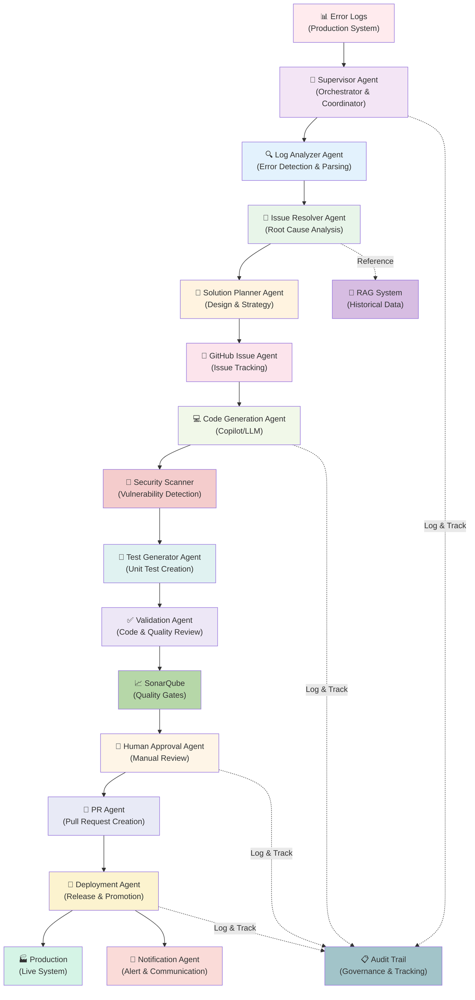
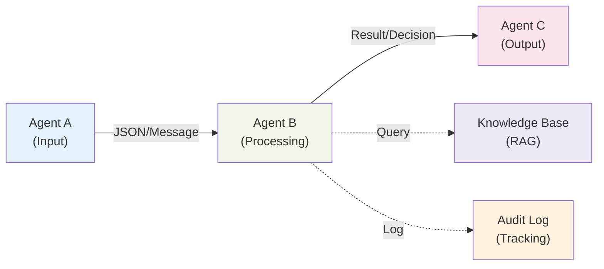
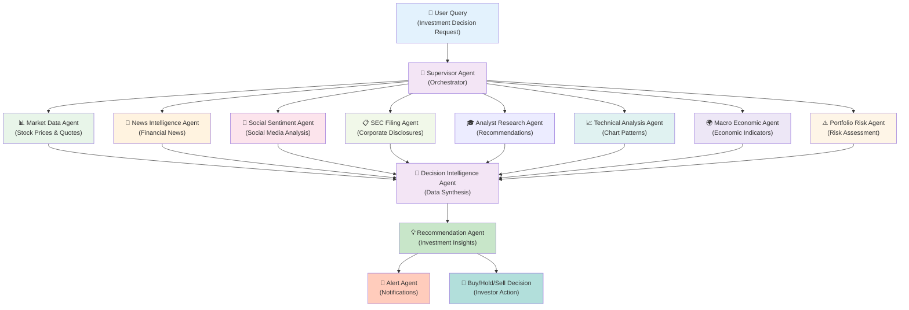
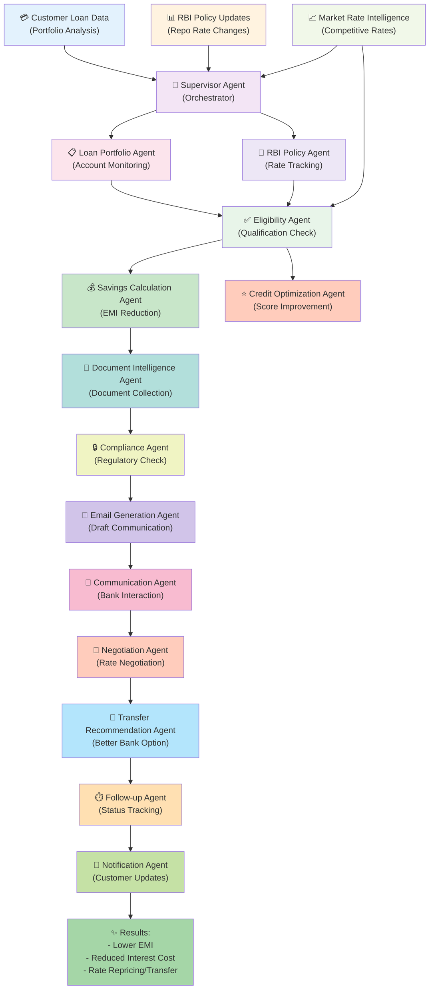

# Multi-Agent AI System Architectures

**Technology Architect Reference Document**

Contains two enterprise-grade agentic workflow designs for autonomous software engineering and intelligent customer support systems.

---

## 1. Autonomous Software Engineering Agentic Pipeline

### Objective

Automatically analyze production errors, identify root causes, generate fixes, validate through tests, create pull requests, deploy, and notify developers.

### Core Agents

| Agent # | Agent Name                     | Responsibility                          |
| ------- | ------------------------------ | --------------------------------------- |
| 1       | **Log Analyzer Agent**         | Parse and analyze production error logs |
| 2       | **Issue Resolver Agent**       | Determine issue type and severity       |
| 3       | **Solution Planner Agent**     | Design solution approach                |
| 4       | **GitHub Issue Creator Agent** | Create GitHub issues with details       |
| 5       | **Code Generation Agent**      | Generate code fixes (Copilot/LLM)       |
| 6       | **Unit Test Generator Agent**  | Create unit tests for fixes             |
| 7       | **Validation Agent**           | Validate code and tests                 |
| 8       | **Notification Agent**         | Send alerts to developers               |
| 9       | **Human Approval Agent**       | Route to human for approval             |
| 10      | **PR Agent**                   | Create and manage pull requests         |
| 11      | **Deployment Agent**           | Deploy fixes to production              |
| 12      | **Supervisor Agent**           | Orchestrate entire workflow             |

### Workflow Pipeline

```
Error Logs → Analysis → Root Cause → Solution Planning → GitHub Issue →
Code Generation → Unit Testing → Validation → Human Approval → PR Creation →
Deployment → Notification
```

### Key Enhancements

- 🔍 **RAG-based Historical Incident Lookup:** Learn from past incidents
- ↩️ **Automated Rollback:** Revert failed deployments automatically
- 🔒 **Security Scanning:** Detect vulnerabilities in generated code
- ✅ **SonarQube Quality Gates:** Enforce code quality standards
- 📋 **Audit Trail & Governance:** Track all changes and approvals
- 👤 **Human-in-the-Loop Approvals:** Critical changes require human review

---

### Architecture Diagram



### Data Flow & Components

1. **Error Detection** → Logs are captured from production systems
2. **Analysis** → Supervisor orchestrates analysis agents
3. **Root Cause** → Issue Resolver determines problem source
4. **Planning** → Solution Planner designs fix approach
5. **Issue Tracking** → GitHub issue created with context
6. **Code Generation** → LLM generates fix code
7. **Security Check** → Scan for vulnerabilities
8. **Testing** → Generate and run unit tests
9. **Quality Gates** → SonarQube validates code quality
10. **Human Approval** → Manual review before deployment
11. **PR Creation** → Pull request auto-created
12. **Deployment** → Deploy to production with monitoring
13. **Notification** → Alert teams of changes
14. **Audit Trail** → Log all actions for compliance

### Agent Communication Pattern



### Key Features

- **Autonomous Execution:** Minimal human intervention after initial trigger
- **Error Recovery:** Automated rollback on deployment failures
- **Intelligent Learning:** RAG-based system learns from historical incidents
- **Quality Assurance:** Multi-layer validation and testing
- **Compliance & Governance:** Full audit trail of all changes
- **Scalability:** Handle multiple concurrent incidents
- **Extensibility:** Easy to add new agents and workflows

---

## 2. Real-Time Stock Intelligence Parallel Multi-Agent System

### Business Problem

Investors need real-time insights combining stock prices, market news, social sentiment, analyst recommendations, SEC filings, macroeconomic indicators, and portfolio risk analysis.

### Architecture Style

**Parallel Multi-Agent Workflow** - Multiple agents execute simultaneously, aggregating data from various sources.

### Core Agents

| Agent # | Agent Name                      | Responsibility                          |
| ------- | ------------------------------- | --------------------------------------- |
| 1       | **Supervisor Agent**            | Coordinate all parallel agents          |
| 2       | **Market Data Agent**           | Fetch real-time stock prices and quotes |
| 3       | **News Intelligence Agent**     | Aggregate financial news and updates    |
| 4       | **Social Sentiment Agent**      | Analyze sentiment from social media     |
| 5       | **SEC Filing Agent**            | Monitor SEC filings and disclosures     |
| 6       | **Analyst Research Agent**      | Collect analyst recommendations         |
| 7       | **Technical Analysis Agent**    | Perform technical analysis and patterns |
| 8       | **Macro Economic Agent**        | Track macroeconomic indicators          |
| 9       | **Portfolio Risk Agent**        | Calculate portfolio risk metrics        |
| 10      | **Decision Intelligence Agent** | Synthesize data into insights           |
| 11      | **Recommendation Agent**        | Generate investment recommendations     |
| 12      | **Alert Agent**                 | Send real-time alerts                   |

### Workflow Pipeline

```
User Query → Supervisor Agent → Parallel Execution (Market Data, News,
Sentiment, SEC Filing, Analyst, Technical, Macro, Risk) → Decision Intelligence
Agent → Recommendation Agent → Buy/Hold/Sell Decision
```

### Architecture Diagram



### Key Features

- 📡 **Real-time Market Monitoring:** Continuous data feeds from multiple sources
- 🤖 **AI-Driven Insights:** Machine learning models for pattern recognition
- 📊 **Sentiment Analysis:** Social media and news sentiment tracking
- 🔮 **Predictive Analytics:** Forecast price movements
- 💼 **Portfolio Risk Assessment:** Real-time risk metrics
- ⚡ **Event-Driven Alerts:** Immediate notifications on significant events
- 🔄 **Parallel Processing:** Execute agents concurrently for faster results
- 📉 **Comprehensive Analysis:** Combine multiple data sources for accuracy

---

## 3. AI Loan Interest Optimization & Repricing Agentic Platform

### Business Problem

Customers continue paying higher interest rates on loans even after RBI repo rate reductions because they do not actively request interest rate repricing or loan transfers. Automated system can identify and act on these opportunities.

### Objective

Automatically monitor loan accounts, detect opportunities for interest rate reduction, calculate savings, generate communications, and engage banks on behalf of customers with proper authorization.

### Core Agents

| Agent # | Agent Name                             | Responsibility                      |
| ------- | -------------------------------------- | ----------------------------------- |
| 1       | **Supervisor Agent**                   | Coordinate entire workflow          |
| 2       | **Loan Portfolio Agent**               | Monitor customer loan accounts      |
| 3       | **RBI Policy Agent**                   | Track RBI rate changes and policies |
| 4       | **Eligibility Analysis Agent**         | Determine refinancing eligibility   |
| 5       | **Savings Calculation Agent**          | Calculate potential EMI savings     |
| 6       | **Document Intelligence Agent**        | Gather required documents           |
| 7       | **Compliance Agent**                   | Ensure regulatory compliance        |
| 8       | **Email Generation Agent**             | Draft communications to banks       |
| 9       | **Communication Agent**                | Manage customer-bank interactions   |
| 10      | **Negotiation Agent**                  | Negotiate better rates              |
| 11      | **Follow-up Agent**                    | Track request status                |
| 12      | **Customer Notification Agent**        | Update customer on progress         |
| 13      | **Market Rate Intelligence Agent**     | Track market interest rates         |
| 14      | **Loan Transfer Recommendation Agent** | Suggest loan transfers              |
| 15      | **Credit Score Optimization Agent**    | Improve credit profile              |

### Workflow Pipeline

```
Loan Data + RBI Updates → Eligibility Analysis → Savings Calculation →
Document Collection → Email Generation → Bank Communication → Negotiation →
Follow-Up → Customer Notification
```

### Architecture Diagram



### Business Benefits

- 💰 **Lower EMI:** Reduced monthly payments through rate repricing
- 💳 **Reduced Interest Cost:** Save thousands over loan tenure
- 🤖 **Automated Repricing:** No manual effort from customer
- 🔄 **Loan Transfer Recommendations:** Switch to better banks
- 📊 **Better Financial Planning:** Improved cash flow
- ⚡ **Proactive Monitoring:** Always identify opportunities
- 📈 **Credit Score Optimization:** Build better credit profile
- ✅ **Compliance Assurance:** Regulatory requirements met

### Key Features

- **Intelligent Monitoring:** Continuous tracking of repo rates and eligibility
- **Automated Opportunity Detection:** Identify repricing windows
- **Personalized Recommendations:** Customized strategies per customer
- **Multi-Bank Engagement:** Negotiate with multiple lenders
- **Document Automation:** Auto-gather required paperwork
- **Customer Communication:** Regular updates and transparency
- **Compliance Management:** Adhere to RBI and banking regulations
- **Success Tracking:** Monitor actual savings achieved

---

## Comparison of All Three Architectures

| Aspect               | Software Engineering    | Stock Intelligence      | Loan Optimization        |
| -------------------- | ----------------------- | ----------------------- | ------------------------ |
| **Domain**           | DevOps/Engineering      | Finance/Investment      | Finance/Banking          |
| **Workflow Type**    | Sequential Pipeline     | Parallel Multi-Agent    | Sequential Pipeline      |
| **Automation Level** | High (with approvals)   | Medium (advisory)       | High (with compliance)   |
| **Decision Speed**   | Minutes-Hours           | Real-time               | Days-Weeks               |
| **Primary Goal**     | Bug Fixes & Deployment  | Investment Insights     | Cost Optimization        |
| **Number of Agents** | 12                      | 12                      | 15                       |
| **Key Complexity**   | Code Quality & Testing  | Data Aggregation        | Compliance & Negotiation |
| **Success Metric**   | Deployment Success Rate | Recommendation Accuracy | Savings Achieved         |

---

## Common Architecture Patterns

### 1. Sequential Pipeline Pattern

Used when tasks must execute in order (Software Engineering pipeline).

### 2. Parallel Multi-Agent Pattern

Used when agents can work independently (Stock Intelligence system).

### 3. Hybrid Pattern

Used when some tasks are sequential and some are parallel (Loan Optimization).

### 4. Agent Communication Methods

- **Synchronous:** Agent A waits for Agent B to complete
- **Asynchronous:** Agent A queues work for Agent B
- **Pub/Sub:** Agents subscribe to events and react
- **Shared State:** Agents read/write to common database

---

## Conclusion

These three enterprise-grade agentic architectures demonstrate how AI agents can be orchestrated for complex business problems:

1. **Autonomous Software Engineering** - Automate routine code fixes and deployments
2. **Real-Time Stock Intelligence** - Parallel data aggregation for investment decisions
3. **Loan Optimization** - Proactive financial management for customers

Each architecture showcases different workflow patterns, agent interactions, and business value. The choice of pattern depends on domain requirements, latency needs, and complexity of inter-agent dependencies.
