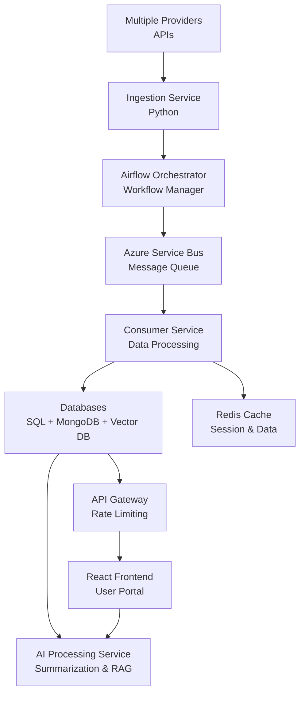
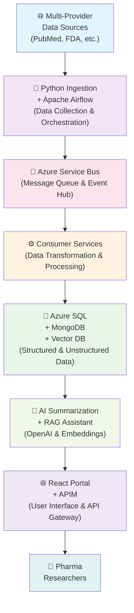

# Pharma Research Platform - System Design

## Overview

A multi-tenant platform that aggregates research data from multiple providers, offering real-time data ingestion, AI-powered summarization, and an intelligent assistant for pharmaceutical research professionals.

---

## Step 1: Understanding the Problem & Defining the Scope

### Business Goal

Build a multi-tenant Pharma Research Platform that aggregates research data from multiple providers into a single portal.

### Core Features

- **Provider Integration:** Connect to multiple research data providers seamlessly
- **Subscription Management:** Manage customer subscriptions and access levels
- **Real-time Data Ingestion:** Continuously ingest research data from providers
- **Article Search:** Full-text search across millions of research articles
- **AI Summarization:** Automatically summarize research articles using AI
- **RAG-Based AI Assistant:** Retrieve Augmented Generation assistant for intelligent queries

### Key Requirements

- **Scalability:** Handle millions of articles and thousands of concurrent users
- **Security:** Ensure data protection with encryption and access controls
- **High Availability:** Maintain 99.9% uptime with automatic failover
- **Multi-Tenancy:** Isolate data and resources for multiple customers
- **Near Real-Time Data Delivery:** Ensure minimal latency in data delivery

### Constraints

- **Different Provider APIs:** Each provider has unique API structure and authentication
- **Varying Data Formats:** Data comes in different formats (JSON, XML, CSV, etc.)
- **Healthcare Compliance:** Must comply with HIPAA, GDPR, and other healthcare regulations
- **Large Data Volumes:** Handle millions of research articles and metadata

---

## Step 2: Estimating Scale & Identifying Bottlenecks

### Scale

- **Data Volume:** Millions of research articles across multiple providers
- **Customer Base:** Thousands of customers across pharmaceutical companies
- **Provider Integrations:** 10-50+ research data providers
- **Concurrent Users:** 5K-10K concurrent users during peak hours
- **Daily Data Ingestion:** 1M+ new articles per day

### Traffic Patterns

- **Continuous Ingestion Jobs:** Real-time data ingestion from providers
- **AI Queries:** Thousands of AI summarization and search queries per day
- **Article Searches:** Heavy search traffic during business hours
- **Customer Portal Access:** Peak usage during 9 AM - 6 PM business hours

### Potential Bottlenecks

| Bottleneck                   | Impact                         | Solution                                          |
| ---------------------------- | ------------------------------ | ------------------------------------------------- |
| **Provider API Rate Limits** | Slow data ingestion            | Queue management, retry logic, provider switching |
| **Database Performance**     | Slow queries and searches      | Indexing, sharding, read replicas, caching        |
| **Message Queue Throughput** | Delayed data processing        | Topic partitioning, multiple consumers            |
| **AI Model Latency**         | Slow summarization and queries | Model caching, batching, async processing         |
| **Vector Search Operations** | Slow semantic search           | Distributed vector DB, index optimization         |
| **Network Bandwidth**        | Slow data transfer             | Compression, CDN, edge caching                    |

### Capacity Planning

- **Distributed Consumers:** Multiple consumer instances for parallel processing
- **Scalable Databases:** Sharding strategy for horizontal scaling
- **Kubernetes Autoscaling:** Auto-scale pods based on CPU/memory metrics
- **Service Bus Partitioning:** Partition topics for increased throughput
- **Cache Layer:** Redis for frequently accessed data
- **CDN:** Global edge distribution for static assets

---

## Step 3: High-Level Design: Services, APIs & Communication

### Core Services Architecture

### Data Flow

1. **Multi-Provider Data Sources** → Multiple research data providers
2. **Python Ingestion + Airflow** → Ingest and orchestrate data pipelines
3. **Azure Service Bus** → Distribute work to consumers
4. **Consumer Services** → Process and transform data
5. **Azure SQL + MongoDB + Vector DB** → Store structured and unstructured data
6. **AI Summarization + RAG Assistant** → Generate insights
7. **React Portal + APIM** → Deliver to end users

### AI Layer

- **Article Summarization:** Extract key findings and insights from research articles
- **Embeddings:** Convert text to vector representations for semantic search
- **Vector Search:** Find similar articles and relevant information
- **RAG-Based Chat Assistant:** Retrieve relevant articles and generate contextual responses

### Communication Patterns

- **REST APIs:** Synchronous requests for user operations and searches
- **Asynchronous Messaging:** Azure Service Bus for data processing workflows
- **Webhooks:** Provider notifications for new data availability
- **WebSockets:** Real-time updates for dashboard and search results

---

## Step 4: Making Tech & Infra Decisions Strategically

### Technology Choices

| Component                   | Technology                      | Rationale                                                     |
| --------------------------- | ------------------------------- | ------------------------------------------------------------- |
| **Data Ingestion**          | Python (FastAPI)                | High performance, easy integration, data processing libraries |
| **Orchestration**           | Apache Airflow                  | Workflow management, DAG-based scheduling, monitoring         |
| **Messaging**               | Azure Service Bus               | Scalable, reliable, built-in partitioning, dead-letter queues |
| **Consumer Services**       | Python (FastAPI/Celery)         | Async task processing, distributed workers                    |
| **Frontend**                | React + TypeScript              | Component reusability, type safety, rich UI                   |
| **Primary Database**        | Azure SQL                       | ACID compliance, scalability, compliance certifications       |
| **NoSQL Database**          | MongoDB                         | Flexible schema for varying data formats                      |
| **Vector Database**         | Azure Cosmos DB + Vector Search | Semantic search, embeddings storage                           |
| **AI Models**               | OpenAI API                      | State-of-the-art models, managed service                      |
| **Container Orchestration** | Kubernetes                      | Autoscaling, self-healing, declarative management             |
| **Authentication**          | Azure AD + OAuth2               | Enterprise SSO, security, multi-tenancy                       |
| **Monitoring**              | Application Insights            | Comprehensive telemetry, alerts, dashboards                   |

### Scalability Strategy

- **Horizontal Scaling:** Add more consumer pods to process messages in parallel
- **Consumer Groups:** Use Service Bus consumer groups for independent message streams
- **Database Sharding:** Partition data by customer/provider for horizontal scaling
- **Read Replicas:** Distribute read-heavy queries across replicas
- **Autoscaling Clusters:** Kubernetes HPA scales pods based on metrics
- **Caching Layer:** Redis caches frequent queries and session data

### Reliability & Security

- **Retry Mechanisms:** Exponential backoff for failed operations
- **Dead Letter Queue (DLQ):** Capture failed messages for analysis
- **Circuit Breaker:** Prevent cascading failures in dependent services
- **Data Encryption:** TLS for transit, AES-256 for at-rest data
- **Azure Key Vault:** Secure key and secret management
- **RBAC:** Role-based access control for data and operations
- **Audit Logging:** Track all data access and modifications

### Observability & DevOps

- **Application Insights:** APM, dependency tracking, performance metrics
- **Centralized Logging:** Azure Monitor Logs for aggregated logging
- **Health Checks:** Regular service health verification
- **CI/CD Pipelines:** Automated testing and deployment
- **Blue-Green Deployments:** Zero-downtime releases
- **Alerts & Notifications:** Proactive issue detection and notification

---

## One-Line Architecture Summary

---

## Key Design Decisions

### 1. Multi-Tenancy

Use customer ID as partition key in databases and Service Bus topics to ensure data isolation and security.

### 2. Asynchronous Processing

Decouple ingestion from processing using message queues for better scalability and resilience.

### 3. Hybrid Database Approach

Use SQL for structured data (subscriptions, users) and MongoDB for flexible article metadata.

### 4. AI as a Service

Leverage OpenAI API instead of self-hosted models to reduce infrastructure complexity.

### 5. Event-Driven Architecture

Use events to trigger workflows, enabling loose coupling between services.

---

## Conclusion

This system design provides a scalable, secure, and maintainable architecture for a multi-tenant Pharma Research Platform. The design leverages modern cloud services, microservices architecture, and AI capabilities to deliver a powerful research aggregation platform that meets enterprise-grade requirements for healthcare and pharmaceutical organizations.
