# Enterprise Architecture Projects

This folder contains complete, production-grade architecture designs suitable for technology architect, solution architect, or lead engineer interview presentations.

---

## Project 1: Pharma Research Intelligence Platform

This is a strong **enterprise-level Healthcare/Pharma Research Data Platform architecture** and is exactly the type of project that can be presented in a **Technology Architect, Solution Architect, or Lead Engineer** interview.

### Project Overview

#### Project Name

**Pharma Research Intelligence Platform**

#### Business Objective

Provide pharmaceutical research articles, clinical trial reports, drug intelligence, market research reports, and healthcare insights from multiple premium data providers to subscribed customers through a unified platform.

Customers purchase subscriptions for different providers and receive real-time research content directly inside the portal.

**Key Features:**

- AI-powered article summarization
- AI Assistant Chat with RAG
- Provider-based subscription management
- Multi-tenant architecture
- Real-time data ingestion
- Enterprise-grade security and scalability

---

## High-Level Architecture Diagram

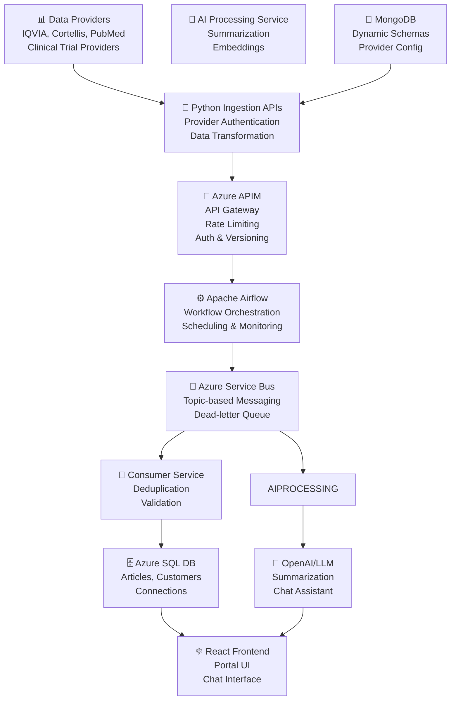

---

## Complete User Flow

### Step 1: Provider Configuration

Admin configures provider in the system.

**Supported Providers:**

- IQVIA
- Cortellis
- PubMed
- Pharma Intelligence
- Clinical Trial Provider
- And more...

Each provider has different:

- Authentication methods
- API endpoints
- Data formats
- Scheduling frequency

**Configuration Example:**

```json
{
  "providerId": "IQVIA",
  "apiKey": "*****",
  "endpoint": "https://provider-api.example.com",
  "frequency": "1hr",
  "status": "Active",
  "credentials": {
    "authType": "OAuth2",
    "scope": "research:read"
  }
}
```

Configuration stored in **MongoDB** for flexibility.

---

### Step 2: Create Connection

Customer creates a connection to one or more providers.

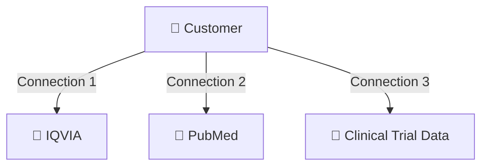

A customer can create **unlimited connections**.

**Connection Example:**

```json
{
  "customerId": 1001,
  "connectionName": "Clinical Research",
  "providerId": "PubMed",
  "status": "Active",
  "subscriptionTier": "Premium",
  "createdAt": "2024-01-15T10:30:00Z"
}
```

---

### Why MongoDB for Connections?

Connection schema varies significantly **provider to provider**.

**Provider A Schema:**

```json
{
  "apikey": "123",
  "region": "US"
}
```

**Provider B Schema:**

```json
{
  "username": "abc",
  "password": "xyz",
  "tenant": "company1",
  "environment": "production"
}
```

**Why MongoDB?**

- ✅ Dynamic schemas
- ✅ No schema migration required
- ✅ Flexible field structure
- ✅ Horizontal scalability
- ✅ Document-oriented storage

---

### Step 3: Data Ingestion Layer

Python microservice handles ingestion with three main responsibilities:

#### Authentication

```python
token = provider.login()
```

#### Fetch Data

```python
articles = provider.fetch_articles(token, filters={
    'category': 'oncology',
    'date_range': 'last_30_days'
})
```

#### Transform to Common Schema

**Provider A Response:**

```json
{
  "title": "New Drug Efficacy Study",
  "body": "..."
}
```

**Provider B Response:**

```json
{
  "article_name": "New Drug Efficacy Study",
  "content": "..."
}
```

**Normalized Schema:**

```json
{
  "id": "ART-2024-001",
  "title": "New Drug Efficacy Study",
  "content": "...",
  "author": "Dr. Smith",
  "publishDate": "2024-01-15",
  "source": "IQVIA",
  "category": "oncology",
  "summary": null
}
```

**Ingestion Service Architecture:**

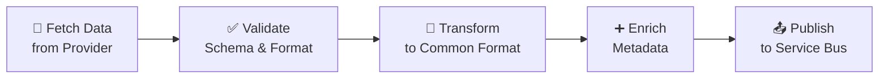

---

### Step 4: Airflow Orchestration

Apache Airflow orchestrates the entire data pipeline.

**Responsibilities:**

- ✅ Scheduling (hourly, daily, weekly)
- ✅ Retry logic (with exponential backoff)
- ✅ Monitoring & alerting
- ✅ Dependency management
- ✅ Parallel processing

**Example DAG Structure:**

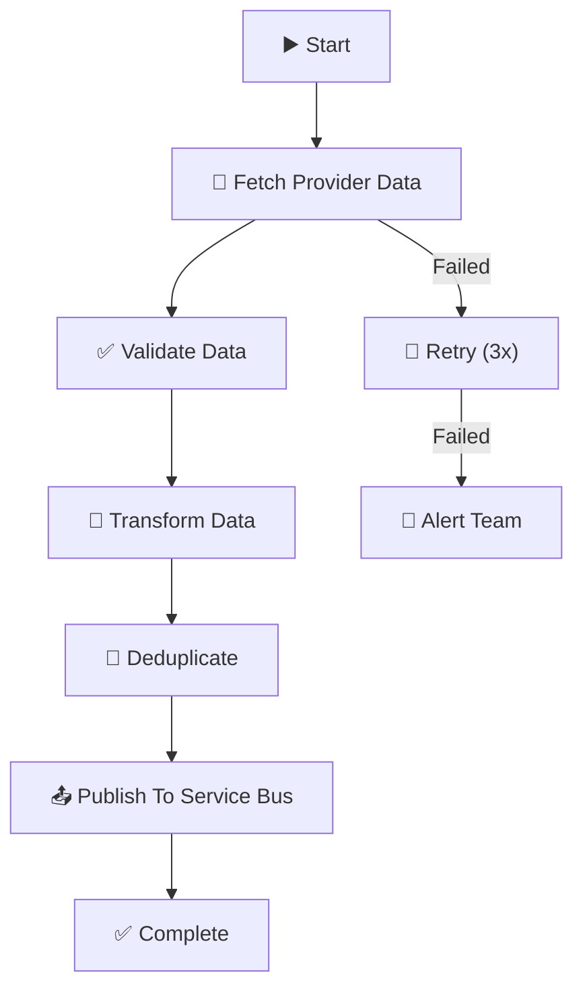

**Benefits:**

- Automatic retry on failures
- Parallel processing of multiple providers
- Full visibility into job status
- Historical audit trail

---

### Step 5: Azure Service Bus - Topic-Based Architecture

Service Bus decouples producers from consumers using topic-based publish-subscribe.

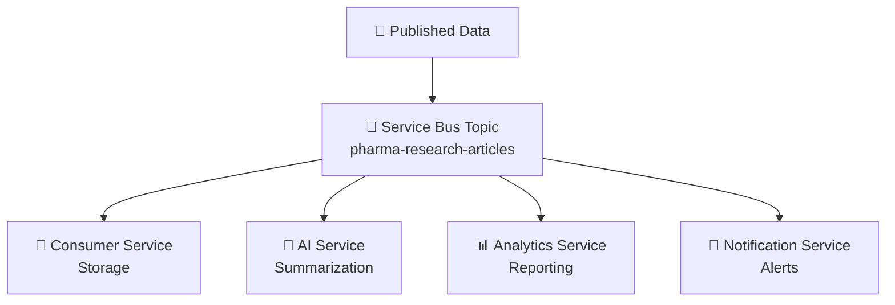

**Published Message Example:**

```json
{
  "messageId": "msg-12345",
  "articleId": "ART-2024-001",
  "provider": "IQVIA",
  "title": "New Drug Efficacy Study",
  "content": "...",
  "timestamp": "2024-01-15T10:30:00Z"
}
```

**Benefits:**

- ✅ Decoupled architecture (loose coupling)
- ✅ Reliability (guaranteed delivery)
- ✅ Dead-letter queue for failures
- ✅ Built-in scalability
- ✅ Session support

---

### Step 6: Consumer Service

Consumer subscribes to Service Bus topic and processes messages.

```python
while True:
    msg = receive_message()

    # Validate article
    if not validate_article(msg):
        move_to_dlq(msg)
        continue

    # Check for duplicates
    if is_duplicate(msg):
        skip_message(msg)
        continue

    # Store in database
    save_to_database(msg)
    complete_message(msg)
```

**Responsibilities:**

- ✅ Validate article structure
- ✅ Deduplication logic
- ✅ Store in SQL database
- ✅ Error handling
- ✅ Message acknowledgment

---

## Database Design

### ER Diagram

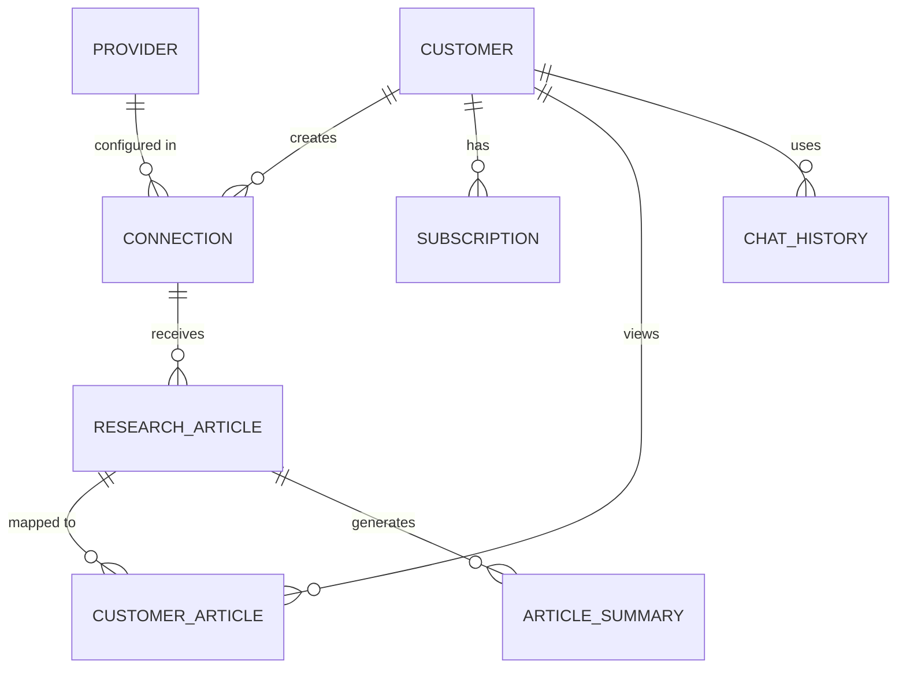

### Table Schemas

**Customer Table**

```sql
CREATE TABLE Customer (
    CustomerId INT PRIMARY KEY,
    Name NVARCHAR(100) NOT NULL,
    Email NVARCHAR(100) UNIQUE NOT NULL,
    SubscriptionType NVARCHAR(50),
    CreatedAt DATETIME DEFAULT GETDATE(),
    IsActive BIT DEFAULT 1
);
```

**Provider Table**

```sql
CREATE TABLE Provider (
    ProviderId INT PRIMARY KEY,
    ProviderName NVARCHAR(100) NOT NULL,
    ApiEndpoint NVARCHAR(500),
    AuthType NVARCHAR(50),
    Status NVARCHAR(20)
);
```

**Connection Table**

```sql
CREATE TABLE Connection (
    ConnectionId INT PRIMARY KEY,
    CustomerId INT NOT NULL,
    ProviderId INT NOT NULL,
    ConnectionName NVARCHAR(100),
    Status NVARCHAR(20),
    CreatedAt DATETIME DEFAULT GETDATE(),
    FOREIGN KEY (CustomerId) REFERENCES Customer(CustomerId),
    FOREIGN KEY (ProviderId) REFERENCES Provider(ProviderId)
);
```

**Research Article Table**

```sql
CREATE TABLE ResearchArticle (
    ArticleId INT PRIMARY KEY,
    ProviderId INT NOT NULL,
    Title NVARCHAR(500) NOT NULL,
    Content NVARCHAR(MAX),
    Summary NVARCHAR(1000),
    Author NVARCHAR(200),
    PublishDate DATETIME,
    SourceUrl NVARCHAR(500),
    Category NVARCHAR(100),
    CreatedAt DATETIME DEFAULT GETDATE(),
    FOREIGN KEY (ProviderId) REFERENCES Provider(ProviderId),
    INDEX idx_publishdate (PublishDate),
    INDEX idx_category (Category)
);
```

**Customer Article Mapping**

```sql
CREATE TABLE CustomerArticle (
    CustomerId INT NOT NULL,
    ArticleId INT NOT NULL,
    ConnectionId INT NOT NULL,
    ViewedAt DATETIME,
    PRIMARY KEY (CustomerId, ArticleId),
    FOREIGN KEY (CustomerId) REFERENCES Customer(CustomerId),
    FOREIGN KEY (ArticleId) REFERENCES ResearchArticle(ArticleId),
    FOREIGN KEY (ConnectionId) REFERENCES Connection(ConnectionId)
);
```

### Article Distribution Logic

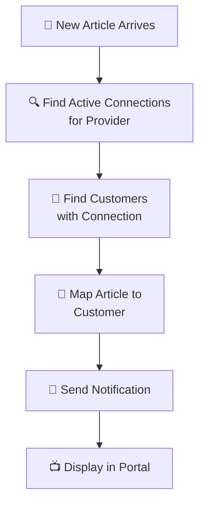

---

## AI Feature 1: Article Summarization

### Problem Statement

Research articles contain 20-50 pages of dense content. Customers need executive summaries.

### Architecture

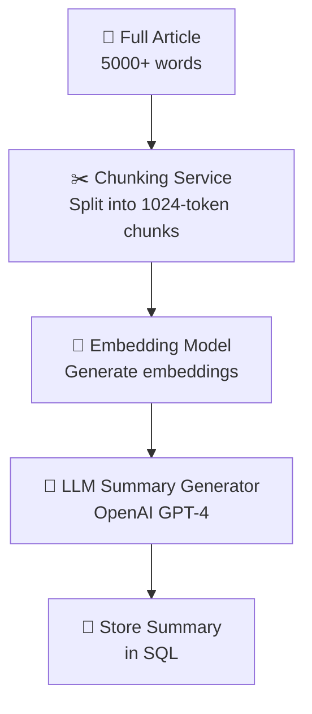

### Implementation

```python
class ArticleSummarizer:
    def __init__(self, openai_client):
        self.client = openai_client

    def summarize(self, article: str) -> str:
        # Chunk the article
        chunks = self.chunk_text(article, chunk_size=1024)

        # Generate summary
        prompt = f"""Summarize the following medical research article in 5-7 bullet points:

{article}

Focus on:
- Key findings
- Methodology
- Clinical implications
- Study limitations
- Future research directions
        """

        response = self.client.chat.completions.create(
            model="gpt-4",
            messages=[{"role": "user", "content": prompt}],
            temperature=0.7
        )

        return response.choices[0].message.content
```

### Example

**Original Article:** 5000 word clinical trial report

**Generated Summary:**

- ✓ Study evaluated efficacy of new oncology drug in 500 patients
- ✓ Primary endpoint: 65% response rate vs 40% control
- ✓ Methodology: Randomized, double-blind, Phase 3 trial
- ✓ Safety profile: Well-tolerated with manageable side effects
- ✓ Implication: Potential approval candidate for FDA
- ✓ Limitation: Limited long-term follow-up data
- ✓ Future: Extended follow-up study planned for Q3 2024

---

## AI Feature 2: Pharma AI Assistant - RAG Architecture

### Purpose

Customer asks natural language questions about pharma research content.

### Example Queries

```
"Show recent oncology studies from IQVIA"
"Summarize diabetes research from last month"
"Top clinical trials in cancer therapy"
"Compare drug efficacy across providers"
"What's new in immunotherapy research?"
```

### RAG Architecture

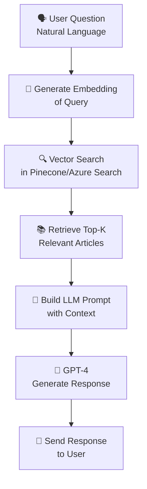

### Chat Flow

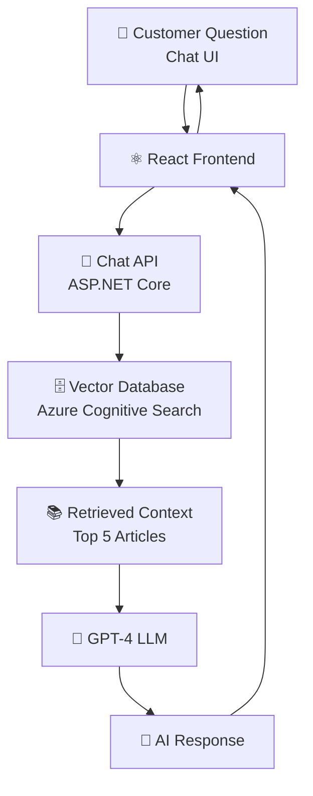

### Implementation

```python
class PharmaAIAssistant:
    def __init__(self, vector_store, openai_client):
        self.vector_store = vector_store
        self.openai_client = openai_client

    async def answer(self, question: str, customer_id: int):
        # Get customer's accessible articles
        customer_connections = await self.get_customer_connections(customer_id)

        # Generate embedding for question
        question_embedding = await self.embed(question)

        # Vector search for relevant articles
        relevant_articles = await self.vector_store.search(
            query_embedding=question_embedding,
            filters={'customer_id': customer_id},
            top_k=5
        )

        # Build context
        context = "\n\n".join([
            f"Article: {a['title']}\n{a['summary']}"
            for a in relevant_articles
        ])

        # Generate response
        prompt = f"""You are a pharmaceutical research expert.
Answer the following question based on the provided research articles:

Question: {question}

Context from Research Articles:
{context}

Provide a comprehensive answer with specific references to studies mentioned."""

        response = self.openai_client.chat.completions.create(
            model="gpt-4",
            messages=[{"role": "user", "content": prompt}],
            temperature=0.7
        )

        return response.choices[0].message.content
```

---

## Azure Services Used

### 1. Azure API Management (APIM)

Serves as the **API Gateway** for all backend services.

**Responsibilities:**

- 🔐 Authentication & Authorization
- 🚦 Rate limiting & throttling
- 📋 API versioning
- 📊 Monitoring & analytics
- 📝 Request/response transformation

```
┌─────────────┐
│   Client    │
└──────┬──────┘
       │
       v
┌─────────────────────┐
│   Azure APIM        │
│ ┌─────────────────┐ │
│ │ Rate Limiting   │ │
│ │ Auth            │ │
│ │ Versioning      │ │
│ │ Logging         │ │
│ └─────────────────┘ │
└──────┬──────────────┘
       │
       v
┌──────────────────────────────┐
│  Backend Services            │
└──────────────────────────────┘
```

### 2. Azure Key Vault

Centralized **secrets management**.

**Stored Secrets:**

- Provider API keys
- Database connection strings
- OpenAI API keys
- Certificates & certificates
- Connection strings

**Benefits:**

- No secrets in code
- Automatic rotation
- Audit logging
- RBAC

### 3. Azure Application Insights

**Monitoring & Observability**

Track:

- API latency & response times
- Error rates & exceptions
- Request volume
- User activity & engagement
- Custom business metrics

### 4. Azure Static Web Apps

Hosts **React Frontend**

**Benefits:**

- Built-in CDN
- SSL/TLS certificates
- Global distribution
- Automatic deployments

---

## Microservice Architecture

### Project Structure

```
pharma-research-platform/
│
├── python-ingestion-service/
│   └── src/
│       ├── api/
│       │   ├── provider_controller.py
│       │   ├── connection_controller.py
│       │   └── health_controller.py
│       │
│       ├── services/
│       │   ├── ingestion_service.py
│       │   ├── provider_adapter.py
│       │   ├── data_transformer.py
│       │   ├── airflow_service.py
│       │   └── servicebus_service.py
│       │
│       ├── repositories/
│       │   ├── article_repository.py
│       │   ├── provider_repository.py
│       │   └── connection_repository.py
│       │
│       ├── models/
│       │   ├── article.py
│       │   ├── provider.py
│       │   └── connection.py
│       │
│       ├── common/
│       │   ├── logger.py
│       │   ├── constants.py
│       │   └── exceptions.py
│       │
│       └── app.py
│
├── consumer-service/
│   └── src/
│       ├── services/
│       │   ├── message_consumer.py
│       │   ├── article_validator.py
│       │   └── deduplication_service.py
│       └── app.py
│
├── ai-processing-service/
│   └── src/
│       ├── services/
│       │   ├── summarization_service.py
│       │   ├── embedding_service.py
│       │   └── rag_service.py
│       └── app.py
│
├── react-frontend/
│   ├── src/
│   │   ├── components/
│   │   │   ├── ArticleList.tsx
│   │   │   ├── SearchBar.tsx
│   │   │   ├── ChatAssistant.tsx
│   │   │   └── ProviderManager.tsx
│   │   │
│   │   ├── services/
│   │   │   ├── api.ts
│   │   │   ├── chatService.ts
│   │   │   └── authService.ts
│   │   │
│   │   └── App.tsx
│   │
│   └── package.json
│
├── docker-compose.yml
├── k8s-manifests/
│   ├── deployment.yaml
│   ├── service.yaml
│   └── configmap.yaml
│
└── README.md
```

---

## Scalability & Performance Design

### Horizontal Scaling

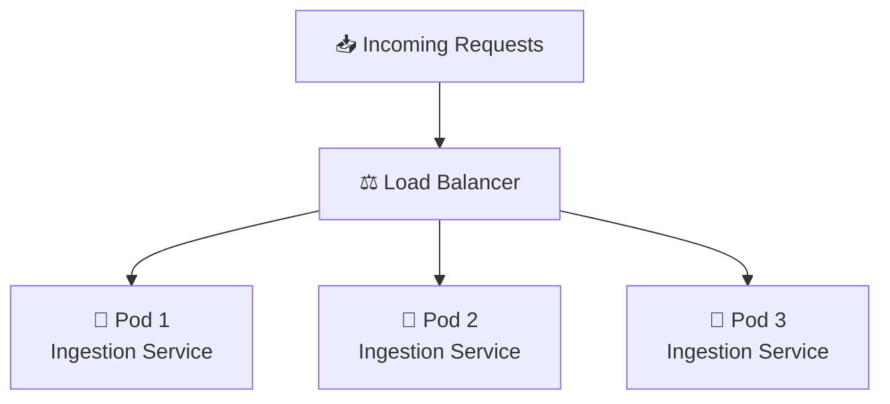

### Consumer Group Scaling

```
Topic: pharma-research-articles
│
├── Consumer 1 → Process messages 0-33%
├── Consumer 2 → Process messages 33-66%
└── Consumer 3 → Process messages 66-100%
```

### Database Scaling

- **Azure SQL:**
  - Read replicas for heavy read workloads
  - Indexing strategy
  - Query optimization

- **MongoDB:**
  - Sharding by `customerId`
  - Replication sets
  - Connection pooling

---

## Security Architecture

### Authentication & Authorization

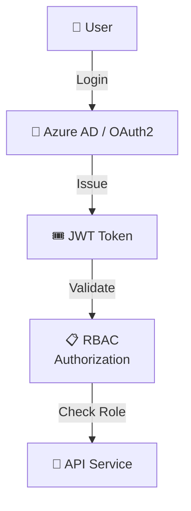

**Roles:**

- 🔴 Admin - Full system access
- 🟡 Provider Admin - Provider configuration
- 🟢 Customer - Access own subscriptions

### Encryption

**At Rest:**

- Azure SQL TDE (Transparent Data Encryption)
- MongoDB encryption
- Blob storage encryption

**In Transit:**

- TLS 1.2+ for all connections
- HTTPS for APIs
- Encrypted service bus messages

### Secrets Management

- All secrets in **Azure Key Vault**
- No hardcoded credentials
- Automatic key rotation
- Audit logging

---

## CI/CD Pipeline

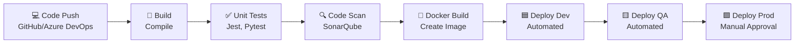

**Pipeline Steps:**

1. Code compile
2. Unit tests
3. Code quality scanning
4. Docker image build
5. Push to container registry
6. Deploy to Dev environment
7. Smoke tests
8. Deploy to QA
9. Integration tests
10. Manual approval
11. Deploy to Production
12. Health checks & monitoring

---

## Interview Summary (2-Minute Elevator Pitch)

> Designed and implemented a **multi-tenant Pharma Research Intelligence Platform** that ingests healthcare research data from multiple premium providers including IQVIA, Cortellis, and PubMed.
>
> **Data Pipeline:** Python-based ingestion services standardized provider-specific formats, orchestrated workflows through Apache Airflow with retry logic and monitoring, and published events to Azure Service Bus topics for downstream consumption.
>
> **Data Management:** Processed data was persisted into Azure SQL Database while dynamic provider configurations and customer connections were maintained in MongoDB due to schema flexibility.
>
> **API & Gateway:** Exposed APIs through Azure APIM with authentication, rate limiting, and versioning. Secured all secrets using Azure Key Vault.
>
> **Frontend:** Customers accessed content through a React application hosted on Azure Static Web Apps, enabling subscription management to multiple providers.
>
> **AI Capabilities:** Implemented AI-powered article summarization using OpenAI GPT-4 and built a RAG-based AI Assistant enabling users to query pharma research data conversationally with vector embeddings.
>
> **Operations:** Entire platform deployed through automated CI/CD pipelines, monitored using Application Insights, and designed for horizontal scalability using Kubernetes with consumer groups handling parallel message processing.
>
> **Security:** Implemented OAuth2/Azure AD authentication, RBAC-based authorization, encryption at rest and in transit, and enterprise-grade secret management, ensuring compliance with healthcare data requirements.

---

## Key Architecture Highlights for Interviews

✅ **Multi-Tenancy** - Isolated customer data, shared infrastructure
✅ **Event-Driven** - Loosely coupled services via Service Bus
✅ **Scalability** - Horizontal scaling with Kubernetes & parallel processing
✅ **Reliability** - Retry logic, dead-letter queues, health checks
✅ **Security** - OAuth2, RBAC, encryption, secrets management
✅ **AI/ML** - RAG architecture, LLM integration, embeddings
✅ **Cloud-Native** - Azure services, microservices, containerized
✅ **Observability** - Monitoring, logging, alerting
✅ **Data Transformation** - Complex ETL with provider adaptation
✅ **Enterprise-Grade** - CI/CD, high availability, audit trails
