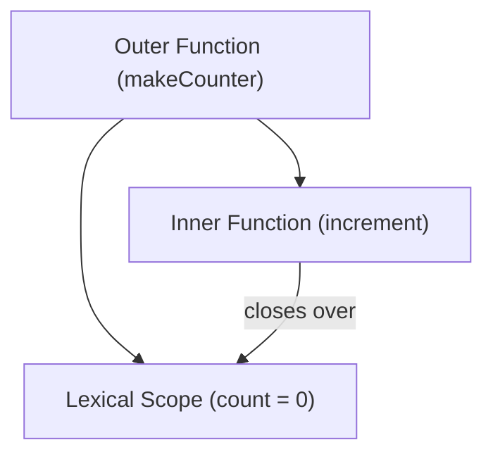
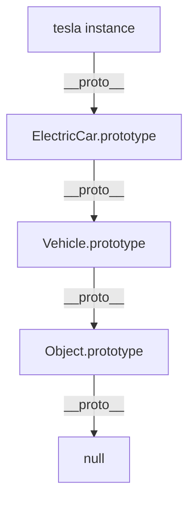
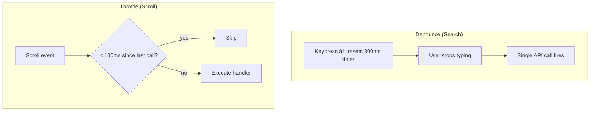

```mermaid
graph LR
    Pending["⏳ Pending"]
    Fulfilled["✅ Fulfilled"]
    Rejected["❌ Rejected"]

    Pending -->|resolve| Fulfilled
    Pending -->|reject| Rejected
    Fulfilled -->|.then| NextThen["Next .then()"]
    Rejected -->|.catch| Handler["Error Handler"]
```

```mermaid
graph TD
    CallStack["📞 Call Stack"]
    WebAPIs["🌐 Web APIs (setTimeout, fetch)"]
    MicroQueue["âš¡ Microtask Queue (Promises)"]
    MacroQueue["📋 Macro Task Queue (setTimeout)"]
    EventLoop["🔄 Event Loop"]

    CallStack -->|async op| WebAPIs
    WebAPIs -->|callback ready| MacroQueue
    WebAPIs -->|promise resolves| MicroQueue
    EventLoop -->|"Stack empty? drain microtasks first"| MicroQueue
    EventLoop -->|"Then pick next macro task"| MacroQueue
    MicroQueue --> CallStack
    MacroQueue --> CallStack
```

```mermaid
graph TD
    subgraph Observer
        Emitter["📢 EventEmitter.emit('login')"]
        L1["👂 Logger callback"]
        L2["👂 Analytics callback"]
        L3["👂 UI callback"]
        Emitter --> L1
        Emitter --> L2
        Emitter --> L3
    end
```

# JavaScript Interview Questions & Answers

## 1. Closures

### Question
What is a closure and how does it work?

### Answer
A closure is a function that retains access to its lexical scope even when executed outside that scope.

```javascript
function makeCounter() {
  let count = 0; // enclosed variable

  return {
    increment() { count++; },
    decrement() { count--; },
    getCount()  { return count; }
  };
}

const counter = makeCounter();
counter.increment();
counter.increment();
console.log(counter.getCount()); // 2
```

### Real-World Example - Private Cart State

```javascript
function createCart() {
  const items = []; // private - not accessible outside

  return {
    addItem(product) {
      items.push(product);
    },
    removeItem(id) {
      const idx = items.findIndex(i => i.id === id);
      if (idx !== -1) items.splice(idx, 1);
    },
    getTotal() {
      return items.reduce((sum, i) => sum + i.price, 0);
    },
    getItems() {
      return [...items]; // return copy - protect internal state
    }
  };
}

const cart = createCart();
cart.addItem({ id: 1, name: "Laptop", price: 999 });
cart.addItem({ id: 2, name: "Mouse",  price: 25  });
console.log(cart.getTotal()); // 1024
```

### Diagram



---

## 2. Prototypes & Prototype Chain

### Question
How does the JavaScript prototype chain work?

### Answer
Every JS object has a hidden `[[Prototype]]` link. Property lookups walk up the chain until `null`.

```javascript
function Animal(name) {
  this.name = name;
}
Animal.prototype.speak = function () {
  return `${this.name} makes a noise.`;
};

function Dog(name) {
  Animal.call(this, name);
}
Dog.prototype = Object.create(Animal.prototype);
Dog.prototype.constructor = Dog;
Dog.prototype.bark = function () {
  return `${this.name} barks!`;
};

const dog = new Dog("Rex");
console.log(dog.speak()); // inherited from Animal
console.log(dog.bark());  // own method
```

### Real-World Example - ES6 Class (syntax sugar over prototypes)

```javascript
class Vehicle {
  constructor(make, model, year) {
    this.make  = make;
    this.model = model;
    this.year  = year;
  }
  getInfo() {
    return `${this.year} ${this.make} ${this.model}`;
  }
  startEngine() { return "Engine started"; }
}

class ElectricCar extends Vehicle {
  constructor(make, model, year, range) {
    super(make, model, year);
    this.range = range;
  }
  startEngine() { return "Silent electric motor started"; }
  getRange()    { return `Range: ${this.range} km`; }
}

const tesla = new ElectricCar("Tesla", "Model 3", 2024, 580);
console.log(tesla.getInfo());      // 2024 Tesla Model 3
console.log(tesla.startEngine());  // Silent electric motor started
```

### Diagram



---

## 3. `this` Keyword & Binding

### Question
Explain the `this` keyword and the four binding rules.

### Answer

```javascript
// 1. Default binding - global / undefined (strict)
function showThis() { console.log(this); }
showThis(); // window (sloppy) | undefined (strict)

// 2. Implicit binding - left of the dot
const user = {
  name: "Alice",
  greet() { return `Hi, I'm ${this.name}`; }
};
user.greet(); // "Hi, I'm Alice"

// 3. Explicit binding - call / apply / bind
function greet(greeting) { return `${greeting}, ${this.name}`; }
greet.call({ name: "Bob" }, "Hello");    // Hello, Bob
greet.apply({ name: "Carol" }, ["Hey"]); // Hey, Carol
const boundGreet = greet.bind({ name: "Dave" });
boundGreet("Hi"); // Hi, Dave

// 4. new binding
function Person(name) { this.name = name; }
const p = new Person("Eve");
console.log(p.name); // Eve
```

### Real-World Example - Arrow Function Captures `this`

```javascript
class Timer {
  constructor() { this.seconds = 0; }

  // Arrow function captures `this` from constructor scope
  start() {
    this.interval = setInterval(() => {
      this.seconds++;
      console.log(`Elapsed: ${this.seconds}s`);
    }, 1000);
  }

  stop() { clearInterval(this.interval); }
}

const t = new Timer();
t.start();
setTimeout(() => t.stop(), 5000);
```

---

## 4. Promises & Async/Await

### Question
Explain Promises and how async/await simplifies them.

### Answer

```javascript
// Promise states: pending → fulfilled | rejected
const fetchData = (url) =>
  new Promise((resolve, reject) => {
    setTimeout(() => {
      if (url) resolve({ data: "result" });
      else reject(new Error("URL required"));
    }, 1000);
  });

// async/await - cleaner syntax, same semantics
async function loadUser(id) {
  try {
    const res  = await fetch(`/api/users/${id}`);
    const user = await res.json();
    return user;
  } catch (err) {
    console.error("Failed:", err.message);
    throw err;
  }
}
```

### Real-World Example - Parallel API Calls

```javascript
async function loadDashboard(userId) {
  // All requests start at the same time
  const [user, orders, notifications] = await Promise.all([
    fetch(`/api/users/${userId}`).then(r => r.json()),
    fetch(`/api/orders?userId=${userId}`).then(r => r.json()),
    fetch(`/api/notifications/${userId}`).then(r => r.json())
  ]);
  return { user, orders, notifications };
}

// Promise.allSettled - don't fail if one rejects
async function loadWidgets(ids) {
  const results = await Promise.allSettled(
    ids.map(id => fetch(`/api/widget/${id}`).then(r => r.json()))
  );
  return results.map(r => r.status === "fulfilled" ? r.value : null);
}
```

### Diagram



---

## 5. Event Loop, Callback Queue & Microtask Queue

### Question
Explain the JavaScript Event Loop and execution order.

### Answer

```javascript
console.log("1 - start");

setTimeout(() => console.log("4 - setTimeout"), 0); // Macro task

Promise.resolve().then(() => console.log("3 - Promise microtask"));

console.log("2 - end");

// Output: 1, 2, 3, 4
// Microtasks (Promises) always run BEFORE macro tasks (setTimeout)
```

### Real-World Example - UI Update Timing

```javascript
async function saveAndRefresh(formData) {
  console.log("Saving...");           // sync - runs immediately

  await fetch("/api/save", {
    method: "POST",
    body: JSON.stringify(formData)
  });
  // Resumes as a microtask after await resolves
  // Runs BEFORE any pending setTimeout callbacks
  updateUI("Save successful");
}
```

### Diagram



---

## 6. Scope, Hoisting & `let` / `const` / `var`

### Question
What is hoisting and how do `var`, `let`, and `const` differ?

### Answer

```javascript
// var - hoisted AND initialized to undefined
console.log(a); // undefined (no error)
var a = 5;

// let/const - hoisted but NOT initialized (Temporal Dead Zone)
// console.log(b); // ReferenceError
let b = 10;

// var has function scope; let/const have block scope
function demo() {
  if (true) {
    var x = 1;  // visible in whole function
    let y = 2;  // block only
  }
  console.log(x); // 1
  // console.log(y); // ReferenceError
}
```

### Real-World Example - Loop Variable Bug

```javascript
// ❌ Bug with var - all handlers share the same i
for (var i = 0; i < 3; i++) {
  setTimeout(() => console.log(i), 100); // prints 3, 3, 3
}

// ✅ Fixed with let - each iteration gets its own i
for (let i = 0; i < 3; i++) {
  setTimeout(() => console.log(i), 100); // prints 0, 1, 2
}
```

---

## 7. ES6+ Features

### Question
Explain key ES6+ features with practical examples.

### Answer - Destructuring

```javascript
const user = { name: "Alice", age: 28, address: { city: "Mumbai" } };

// Object destructuring with rename + default
const { name, age, address: { city }, role = "User" } = user;

// Array destructuring
const [first, , third, ...rest] = [1, 2, 3, 4, 5];

// Function parameter destructuring
function renderUser({ name, role = "Guest", avatar = "/default.png" }) {
  return `<div>${name} (${role})</div>`;
}
```

### Answer - Spread & Rest

```javascript
// Spread - expand iterable
const defaults = { theme: "light", lang: "en" };
const userPrefs = { ...defaults, theme: "dark" }; // override theme

// Merge arrays without mutation
const merged = [...arr1, ...arr2];

// Rest - collect remaining arguments
function sum(first, ...others) {
  return others.reduce((acc, n) => acc + n, first);
}
sum(1, 2, 3, 4); // 10
```

### Real-World Example - Config Merging

```javascript
const defaultConfig = {
  apiUrl: "https://api.example.com",
  timeout: 5000,
  headers: { "Content-Type": "application/json" }
};

function createApiClient(overrides = {}) {
  return {
    ...defaultConfig,
    ...overrides,
    // Deep merge headers only
    headers: { ...defaultConfig.headers, ...overrides.headers }
  };
}

const client = createApiClient({
  apiUrl: "https://staging.example.com",
  headers: { Authorization: "Bearer token123" }
});
```

---

## 8. Higher-Order Functions - map, filter, reduce

### Question
Explain higher-order functions with real-world examples.

### Answer

```javascript
const orders = [
  { id: 1, product: "Laptop",   price: 999, qty: 1, status: "delivered" },
  { id: 2, product: "Mouse",    price: 25,  qty: 2, status: "pending"   },
  { id: 3, product: "Monitor",  price: 350, qty: 1, status: "delivered" },
  { id: 4, product: "Keyboard", price: 75,  qty: 3, status: "pending"   }
];

// map - transform each element
const summaries = orders.map(o => ({
  id:    o.id,
  total: o.price * o.qty,
  label: `${o.product} x${o.qty}`
}));

// filter - keep matching elements
const delivered = orders.filter(o => o.status === "delivered");

// reduce - accumulate to a single value
const revenue = orders
  .filter(o => o.status === "delivered")
  .reduce((sum, o) => sum + o.price * o.qty, 0);
// 999 + 350 = 1349

// Chain all three: group revenue by status
const report = orders
  .map(o => ({ ...o, total: o.price * o.qty }))
  .reduce((acc, o) => {
    acc[o.status] = (acc[o.status] || 0) + o.total;
    return acc;
  }, {});
// { delivered: 1349, pending: 275 }
```

---

## 9. Currying & Function Composition

### Question
What is currying and function composition?

### Answer

```javascript
// Currying - transform f(a, b, c) into f(a)(b)(c)
const multiply = a => b => a * b;
const double  = multiply(2);
const triple  = multiply(3);

double(5); // 10
triple(5); // 15

// Practical: reusable validator factory
const isInRange = (min, max) => value => value >= min && value <= max;
const isValidAge   = isInRange(0, 120);
const isValidScore = isInRange(0, 100);

isValidAge(25);    // true
isValidScore(105); // false

// pipe - left-to-right function composition
const pipe = (...fns) => x => fns.reduce((v, f) => f(v), x);

const processUser = pipe(
  user => ({ ...user, name: user.name.trim() }),
  user => ({ ...user, email: user.email.toLowerCase() }),
  user => ({ ...user, age: parseInt(user.age, 10) }),
  user => ({ ...user, isAdult: user.age >= 18 })
);

processUser({ name: "  Alice ", email: "ALICE@EXAMPLE.COM", age: "25" });
// { name: "Alice", email: "alice@example.com", age: 25, isAdult: true }
```

---

## 10. Memoization

### Question
What is memoization and when should you use it?

### Answer

```javascript
function memoize(fn) {
  const cache = new Map();
  return function (...args) {
    const key = JSON.stringify(args);
    if (cache.has(key)) return cache.get(key);
    const result = fn.apply(this, args);
    cache.set(key, result);
    return result;
  };
}

// Fibonacci without memoization - O(2^n)
// With memoization - O(n) — each value computed once
const fastFib = memoize(function fib(n) {
  if (n <= 1) return n;
  return fastFib(n - 1) + fastFib(n - 2);
});
```

### Real-World Example - API Response Cache with TTL

```javascript
function createCachedFetch(ttlMs = 60_000) {
  const cache = new Map();

  return async function cachedFetch(url, options) {
    const key = `${url}:${JSON.stringify(options)}`;
    const hit = cache.get(key);

    if (hit && Date.now() - hit.timestamp < ttlMs) {
      return hit.data; // serve from cache within TTL
    }

    const res  = await fetch(url, options);
    const data = await res.json();
    cache.set(key, { data, timestamp: Date.now() });
    return data;
  };
}

const cachedFetch = createCachedFetch(30_000); // 30 s TTL
const user = await cachedFetch("/api/users/1");
const userAgain = await cachedFetch("/api/users/1"); // cache hit
```

---

## 11. Debouncing & Throttling

### Question
What is the difference between debouncing and throttling?

### Answer

```javascript
// DEBOUNCE - wait until triggers stop for `delay` ms, then fire once
function debounce(fn, delay) {
  let timerId;
  return function (...args) {
    clearTimeout(timerId);
    timerId = setTimeout(() => fn.apply(this, args), delay);
  };
}

// THROTTLE - fire at most once every `limit` ms
function throttle(fn, limit) {
  let lastCall = 0;
  return function (...args) {
    const now = Date.now();
    if (now - lastCall >= limit) {
      lastCall = now;
      return fn.apply(this, args);
    }
  };
}
```

### Real-World Example

```javascript
// Search box - API call only after 300 ms of no typing
const searchInput = document.getElementById("search");
const debouncedSearch = debounce(async (query) => {
  if (!query.trim()) return;
  const results = await fetch(`/api/search?q=${encodeURIComponent(query)}`).then(r => r.json());
  renderResults(results);
}, 300);

searchInput.addEventListener("input", e => debouncedSearch(e.target.value));

// Scroll - update progress bar at most every 100 ms
const throttledScroll = throttle(() => {
  const pct = (window.scrollY / document.body.scrollHeight) * 100;
  document.getElementById("progress").style.width = `${pct}%`;
}, 100);

window.addEventListener("scroll", throttledScroll);
```

### Diagram



---

## 12. Call, Apply & Bind

### Question
What is the difference between `call`, `apply`, and `bind`?

### Answer

```javascript
const greet = function (greeting, punctuation) {
  return `${greeting}, ${this.name}${punctuation}`;
};
const user = { name: "Alice" };

greet.call(user, "Hello", "!");    // "Hello, Alice!" - args listed
greet.apply(user, ["Hey", "."]);   // "Hey, Alice."   - args as array
const greetAlice = greet.bind(user, "Hi");
greetAlice("?");                   // "Hi, Alice?"    - returns new fn
```

### Real-World Example

```javascript
class Logger {
  constructor(prefix) { this.prefix = prefix; }
  log(message) { console.log(`[${this.prefix}] ${message}`); }
}

class ApiService {
  constructor() {
    this.logger = new Logger("API");
    // bind so Logger's `this` is preserved when passed as a callback
    this.log = this.logger.log.bind(this.logger);
  }

  async fetchUser(id) {
    this.log(`Fetching user ${id}`);
    const res = await fetch(`/api/users/${id}`);
    this.log(`Fetched user ${id}`);
    return res.json();
  }
}
```

---

## 13. Shallow vs Deep Copy

### Question
Explain the difference between shallow and deep copy.

### Answer

```javascript
const original = {
  name: "Alice",
  address: { city: "Mumbai" },
  hobbies: ["reading", "coding"]
};

// Shallow copy - nested references are SHARED
const shallow = { ...original };
shallow.name = "Bob";           // OK - primitive, original unchanged
shallow.address.city = "Delhi"; // ❌ MUTATES original.address.city

// Deep copy options
const deep1 = JSON.parse(JSON.stringify(original)); // loses Date/fn/undefined
const deep2 = structuredClone(original);            // modern, handles most types
```

### Real-World Example - Immutable State Update

```javascript
// Redux-style reducer - never mutate state directly
function cartReducer(state, action) {
  switch (action.type) {
    case "UPDATE_QTY":
      return {
        ...state,
        items: state.items.map(item =>
          item.id === action.id
            ? { ...item, qty: action.qty }
            : item
        )
      };
    case "REMOVE_ITEM":
      return {
        ...state,
        items: state.items.filter(item => item.id !== action.id)
      };
    default:
      return state;
  }
}
```

---

## 14. Design Patterns

### Question
Explain Module, Singleton, and Observer patterns in JavaScript.

### Answer

```javascript
// MODULE PATTERN - encapsulate private state via IIFE
const AuthModule = (() => {
  let _token = null; // private

  return {
    login(token)       { _token = token; },
    logout()           { _token = null; },
    getToken()         { return _token; },
    isAuthenticated()  { return !!_token; }
  };
})();

// SINGLETON - exactly one instance
class DatabaseConnection {
  constructor() {
    if (DatabaseConnection._instance) {
      return DatabaseConnection._instance;
    }
    this.connectionId = Math.random().toString(36).slice(2);
    DatabaseConnection._instance = this;
  }
  query(sql) { return `[${this.connectionId}] ${sql}`; }
}
const db1 = new DatabaseConnection();
const db2 = new DatabaseConnection();
console.log(db1 === db2); // true

// OBSERVER PATTERN - pub/sub
class EventEmitter {
  constructor() { this.listeners = {}; }

  on(event, cb)  { (this.listeners[event] ??= []).push(cb); }
  off(event, cb) {
    this.listeners[event] = (this.listeners[event] || []).filter(fn => fn !== cb);
  }
  emit(event, data) {
    (this.listeners[event] || []).forEach(cb => cb(data));
  }
}

const emitter = new EventEmitter();
emitter.on("login", user => console.log(`Welcome, ${user.name}`));
emitter.on("login", user => trackAnalytics("login", user.id));
emitter.emit("login", { name: "Alice", id: 42 });
```

### Diagram



---

## 15. Event Delegation

### Question
What is event delegation and why is it useful?

### Answer

```javascript
// ❌ One listener per element - expensive, misses dynamic elements
document.querySelectorAll(".btn").forEach(btn =>
  btn.addEventListener("click", handleClick)
);

// ✅ One listener on parent - handles ALL children including future ones
document.getElementById("order-list")
  .addEventListener("click", (event) => {
    const btn  = event.target.closest("[data-action]");
    if (!btn) return;

    const action = btn.dataset.action;
    const id     = btn.closest("[data-id]").dataset.id;

    if (action === "cancel") cancelOrder(id);
    if (action === "reorder") reorderItem(id);
    if (action === "track")   trackOrder(id);
  });
```

### Real-World Example - Dynamic Table Rows

```javascript
class DataTable {
  constructor(tableId) {
    this.table = document.getElementById(tableId);
    // ONE listener handles current AND future rows
    this.table.addEventListener("click", (e) => {
      const row    = e.target.closest("tr[data-id]");
      const action = e.target.dataset.action;
      if (!row || !action) return;
      this[action]?.(row.dataset.id);
    });
  }

  delete(id)    { /* remove row from DOM + API */ }
  edit(id)      { /* open edit modal */ }
  duplicate(id) { /* clone row */ }

  addRow(data) {
    const tr = document.createElement("tr");
    tr.dataset.id = data.id;
    tr.innerHTML = `
      <td>${data.name}</td>
      <td>
        <button data-action="edit">Edit</button>
        <button data-action="delete">Delete</button>
      </td>`;
    this.table.tBodies[0].appendChild(tr);
    // No new listener needed - delegation covers it automatically
  }
}
```

---

## 16. Generators & Iterators

### Question
What are generators and when are they useful?

### Answer

```javascript
// Generator - function that can pause (yield) and resume
function* idGenerator(start = 1) {
  while (true) yield start++;
}

const getId = idGenerator();
console.log(getId.next().value); // 1
console.log(getId.next().value); // 2
console.log(getId.next().value); // 3

// Finite generator
function* range(start, end, step = 1) {
  for (let i = start; i < end; i += step) yield i;
}

for (const n of range(0, 10, 2)) console.log(n); // 0 2 4 6 8
```

### Real-World Example - Paginated API Fetcher

```javascript
async function* fetchAllPages(baseUrl, pageSize = 20) {
  let page = 1;
  let hasMore = true;

  while (hasMore) {
    const res  = await fetch(`${baseUrl}?page=${page}&size=${pageSize}`);
    const data = await res.json();
    yield data.items;            // lazy - only fetches next page when iterated
    hasMore = data.hasNextPage;
    page++;
  }
}

// Process page by page - memory efficient for large datasets
for await (const page of fetchAllPages("/api/products")) {
  await processPage(page);
}
```

---

## 17. Proxy & Reflect

### Question
What are Proxy and Reflect used for?

### Answer

```javascript
const handler = {
  get(target, prop) {
    console.log(`Getting ${prop}`);
    return Reflect.get(target, prop);
  },
  set(target, prop, value) {
    if (prop === "age" && typeof value !== "number") {
      throw new TypeError("age must be a number");
    }
    return Reflect.set(target, prop, value);
  }
};

const person = new Proxy({ name: "Alice", age: 30 }, handler);
person.age = "old"; // TypeError
```

### Real-World Example - Reactive Store

```javascript
function createReactiveStore(initialState) {
  const subscribers = new Map();

  const state = new Proxy({ ...initialState }, {
    set(target, prop, value) {
      const old = target[prop];
      Reflect.set(target, prop, value);
      (subscribers.get(prop) || []).forEach(cb => cb(value, old));
      return true;
    }
  });

  return {
    state,
    watch(prop, callback) {
      if (!subscribers.has(prop)) subscribers.set(prop, []);
      subscribers.get(prop).push(callback);
    }
  };
}

const store = createReactiveStore({ count: 0 });
store.watch("count", (newVal, old) => console.log(`${old} → ${newVal}`));
store.state.count = 5; // logs "0 → 5"
```

---

## 18. Memory Leaks - Prevention & Detection

### Question
What causes memory leaks in JavaScript and how do you prevent them?

### Answer

```javascript
// 1. Forgotten event listeners
class Component {
  constructor() {
    this._onClick = this._handleClick.bind(this);
    document.addEventListener("click", this._onClick);
  }
  _handleClick() { /* ... */ }
  destroy() {
    document.removeEventListener("click", this._onClick); // ✅ clean up
  }
}

// 2. Uncleaned timers
class PollingService {
  start() { this._id = setInterval(() => this.poll(), 5000); }
  stop()  { clearInterval(this._id); } // ✅ always clear
  poll()  { fetch("/api/updates"); }
}

// 3. Large closures holding unnecessary data
// ❌ - bigData stays alive because result closes over it
function process(bigData) {
  const result = transform(bigData);
  return () => result.summary; // bigData kept in memory
}
// ✅ - extract only what you need
function process(bigData) {
  const summary = transform(bigData).summary;
  return () => summary; // bigData can be GC'd
}

// 4. Detached DOM - use WeakMap so GC can collect when node is removed
const domData = new WeakMap();
const el = document.querySelector("#widget");
domData.set(el, { clicks: 0 }); // GC'd automatically when el is removed
```

---

## 19. LocalStorage vs SessionStorage vs Cookies

### Question
Compare client-side storage options.

### Answer

| Feature | localStorage | sessionStorage | Cookies |
|---|---|---|---|
| Lifetime | Until cleared | Tab session | Expiry date |
| Capacity | ~5 MB | ~5 MB | ~4 KB |
| Sent to server | No | No | Yes (every request) |
| Access | JS only | JS only | JS + Server |

```javascript
// localStorage - persists across sessions
localStorage.setItem("theme", "dark");
const theme = localStorage.getItem("theme");
localStorage.removeItem("theme");

// sessionStorage - cleared when tab closes
sessionStorage.setItem("formDraft", JSON.stringify(formData));
const draft = JSON.parse(sessionStorage.getItem("formDraft") || "{}");

// Secure cookie best practices (set by server)
// Set-Cookie: token=abc; HttpOnly; Secure; SameSite=Strict; Max-Age=3600
// Never store sensitive tokens in localStorage (XSS risk)
```

---

## 20. Error Handling

### Question
How do you handle errors properly in JavaScript?

### Answer

```javascript
// Custom error classes
class ValidationError extends Error {
  constructor(field, message) {
    super(message);
    this.name = "ValidationError";
    this.field = field;
  }
}

class ApiError extends Error {
  constructor(status, message) {
    super(message);
    this.name  = "ApiError";
    this.status = status;
  }
}

// Async error handling with retry
async function fetchWithRetry(url, maxRetries = 3) {
  let lastError;
  for (let attempt = 1; attempt <= maxRetries; attempt++) {
    try {
      const res = await fetch(url);
      if (!res.ok) throw new ApiError(res.status, `HTTP ${res.status}`);
      return await res.json();
    } catch (err) {
      lastError = err;
      if (err instanceof ApiError && err.status < 500) throw err; // don't retry 4xx
      if (attempt < maxRetries) {
        await new Promise(r => setTimeout(r, 1000 * attempt)); // exponential back-off
      }
    }
  }
  throw lastError;
}

// Global unhandled rejection handler
window.addEventListener("unhandledrejection", (event) => {
  console.error("Unhandled promise rejection:", event.reason);
  reportToMonitoring(event.reason);
  event.preventDefault();
});
```

---

## Interview Level Summary

### Junior
| Topic | Key Points |
|---|---|
| Closures | Lexical scope, private state |
| Hoisting | `var` vs `let`/`const`, TDZ |
| Promises | `.then/.catch`, async/await |
| DOM | querySelector, event listeners |

### Mid-Level
| Topic | Key Points |
|---|---|
| Event Loop | Microtask vs Macro task order |
| Functional Programming | map/filter/reduce, currying, pipe |
| Design Patterns | Module, Singleton, Observer |
| Debounce/Throttle | When and how to apply |

### Senior
| Topic | Key Points |
|---|---|
| Prototype Chain | Custom inheritance, `Object.create` |
| Proxy & Reflect | Metaprogramming, reactive stores |
| Generators | Lazy iteration, async pipelines |
| Memory Management | Leak detection, WeakMap/WeakRef |

