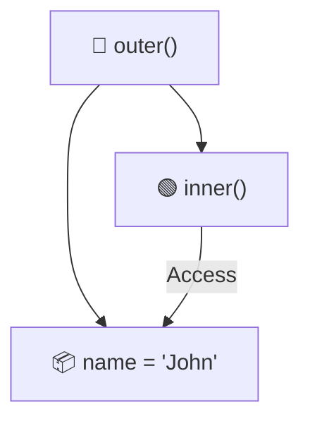
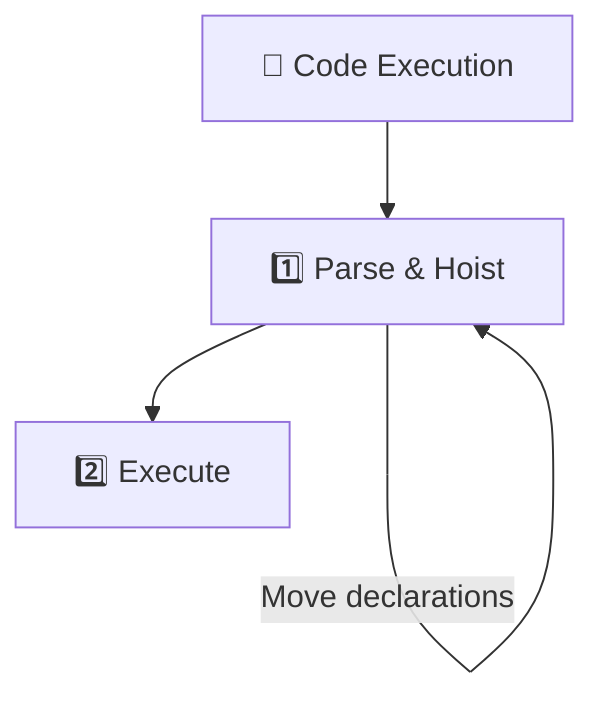
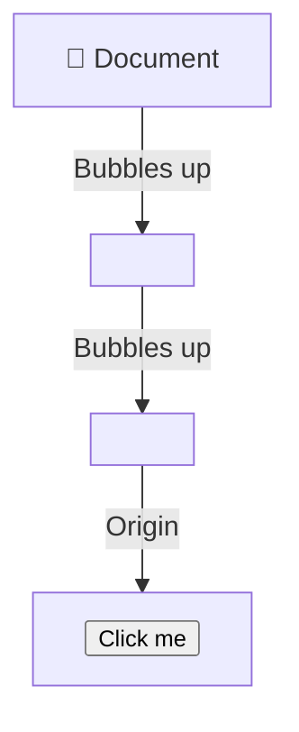
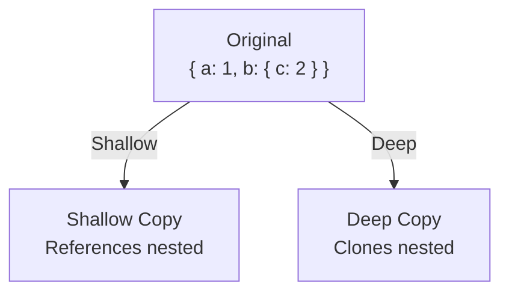
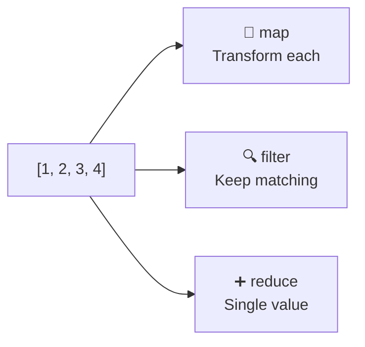
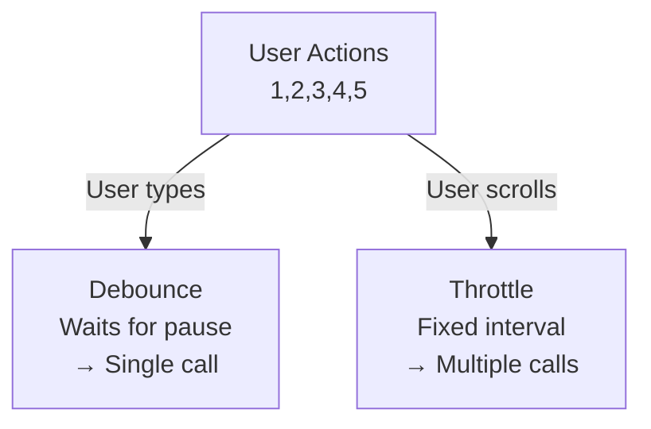

# JavaScript Interview Questions

## Overview

This folder contains comprehensive interview questions for JavaScript developers, covering ES6+, Core concepts, DOM manipulation, and modern JavaScript frameworks.

## Topics Covered

### Core JavaScript

- **Data Types** - Primitives, Objects, Type coercion
- **Scope & Closure** - Function scope, Block scope, Closure patterns
- **Hoisting** - Variable and function hoisting
- **Prototypes** - Prototype chain, Inheritance
- **this Keyword** - Context binding, Arrow functions
- **Callbacks** - Function callbacks, Callback hell
- **Promises** - Promise states, Chaining
- **Async/Await** - Asynchronous operations
- **Error Handling** - Try/catch, Error types

### ES6+ Features

- **Arrow Functions** - Syntax, Differences from regular functions
- **Destructuring** - Object and array destructuring
- **Spread Operator** - Array/object spreading
- **Rest Parameters** - Variadic functions
- **Template Literals** - String interpolation
- **Classes** - ES6 classes, Inheritance
- **Modules** - Import/Export, Module patterns
- **Generators** - Generator functions, Iterators
- **Symbols** - Unique identifiers
- **Proxy & Reflect** - Metaprogramming

### DOM Manipulation

- **DOM Selection** - getElementById, querySelector
- **DOM Traversal** - Accessing parent, children, siblings
- **DOM Modification** - Creating, modifying, deleting elements
- **Event Handling** - Event listeners, Event delegation
- **Event Bubbling** - Event flow, Stopping propagation
- **Window Object** - Global properties and methods
- **LocalStorage & SessionStorage** - Client-side storage

### Functional Programming

- **First-class Functions** - Functions as values
- **Higher-order Functions** - Functions that return functions
- **Pure Functions** - No side effects
- **Immutability** - Working with immutable data
- **Function Composition** - Combining functions
- **map, filter, reduce** - Array methods
- **Currying** - Partial application
- **Memoization** - Caching results

### Advanced Concepts

- **Shallow vs Deep Copy** - Object cloning strategies
- **Call, Apply, Bind** - Context manipulation
- **Event Loop** - Synchronous vs asynchronous
- **Callback Queue** - Task execution order
- **Microtask Queue** - Promise execution
- **Web APIs** - Timers, Fetch, etc.
- **Design Patterns** - Module, Singleton, Observer
- **Memory Leaks** - Prevention and detection

### Performance

- **Debouncing** - Reducing function calls
- **Throttling** - Rate limiting
- **Lazy Loading** - On-demand loading
- **Code Splitting** - Bundling strategies
- **Optimization** - Performance best practices

## Interview Levels

### Junior Developer

- Basic syntax
- DOM manipulation
- Event handling
- Simple algorithms
- ES6 basics

### Mid-Level Developer

- Closures
- Promises & async/await
- Functional programming
- Design patterns
- Performance optimization
- Testing basics

### Senior Developer

- Architecture patterns
- Advanced metaprogramming
- Custom hooks (if React)
- State management
- System design
- Performance tuning
- Leadership

---

## Key Competencies

✅ Strong fundamentals  
✅ ES6+ mastery  
✅ Asynchronous programming  
✅ DOM APIs  
✅ Functional programming  
✅ Problem-solving  
✅ Performance optimization  
✅ Code quality

## Recommended Learning Path

1. Master core JavaScript first
2. Understand scope and closure
3. Learn async/await patterns
4. Study ES6+ features
5. Practice functional programming
6. Optimize for performance
7. Learn design patterns

## Resources

- **MDN Web Docs:** https://developer.mozilla.org/en-US/docs/Web/JavaScript/
- **JavaScript.info:** https://javascript.info/
- **ES6+ Features:** https://es6-features.org/

---

**Note:** This folder will be populated with detailed interview questions and answers for JavaScript positions.

---

# JavaScript Interview Questions & Answers

## 1. Closure

### Question

What is a closure and provide a real-world example?

### Answer

A closure is a function that has access to variables from another function's scope even after that function has finished executing.

```javascript
function outer() {
  const name = "John"; // Outer function variable

  function inner() {
    console.log(name); // Accesses outer function's variable
  }

  return inner;
}

const greeting = outer();
greeting(); // Output: "John"
```

### Mermaid Diagram



### Real-World Example

**Scenario:** Event handling with private counters

```javascript
function createCounter() {
  let count = 0; // Private variable

  return {
    increment: function () {
      count++;
      return count;
    },
    decrement: function () {
      count--;
      return count;
    },
    getCount: function () {
      return count;
    },
  };
}

const counter = createCounter();
console.log(counter.increment()); // 1
console.log(counter.increment()); // 2
console.log(counter.decrement()); // 1
// count variable cannot be accessed directly - it's private!
```

---

## 2. Hoisting

### Question

Explain JavaScript hoisting with examples?

### Answer

Hoisting is JavaScript's behavior of moving declarations to the top of their scope before execution.

### Variable Hoisting

```javascript
console.log(x); // undefined (hoisted but not initialized)
var x = 5;
console.log(x); // 5

// Equivalent to:
// var x;
// console.log(x); // undefined
// x = 5;
// console.log(x); // 5
```

### Function Hoisting

```javascript
sayHi(); // "Hello!" - Function is hoisted
function sayHi() {
  console.log("Hello!");
}

greet(); // ❌ TypeError - greet is not a function
const greet = () => {
  console.log("Hi!");
};
```

### Mermaid Diagram



### Real-World Issue

```javascript
// Before refactoring - works but confusing
console.log(count); // undefined
var count = 0;

// Better approach - explicit declaration
var count; // Declare at top
console.log(count); // undefined
count = 0;
```

---

## 3. Spread vs Rest Operator

### Question

Difference between Spread and Rest operators?

### Answer

| Feature  | Spread              | Rest               |
| -------- | ------------------- | ------------------ |
| Purpose  | Expand array/object | Collect arguments  |
| Syntax   | `...array`          | `...args`          |
| Position | Right side of =     | Function parameter |
| Use Case | Copy, merge         | Function params    |

### Spread Examples

```javascript
// Array spread
const arr1 = [1, 2, 3];
const arr2 = [...arr1, 4, 5]; // [1, 2, 3, 4, 5]

// Object spread
const obj1 = { a: 1, b: 2 };
const obj2 = { ...obj1, c: 3 }; // { a: 1, b: 2, c: 3 }
```

### Rest Examples

```javascript
function sum(...numbers) {
  return numbers.reduce((a, b) => a + b, 0);
}

sum(1, 2, 3, 4); // 10
```

### Real-World Example

```javascript
// Rest - collecting function arguments
function mergeObjects(target, ...sources) {
  return Object.assign(target, ...sources);
}

const result = mergeObjects({ a: 1 }, { b: 2 }, { c: 3 });
// { a: 1, b: 2, c: 3 }
```

---

## 4. Event Bubbling & Event Delegation

### Question

Explain event bubbling and event delegation with example?

### Answer

**Event Bubbling:** Events propagate from child to parent elements.



### Event Bubbling Example

```javascript
document.addEventListener("click", (e) => {
  console.log("Document clicked");
});

document.querySelector(".container").addEventListener("click", (e) => {
  console.log("Container clicked");
});

document.querySelector("button").addEventListener("click", (e) => {
  console.log("Button clicked");
});

// Click button → Output:
// Button clicked
// Container clicked
// Document clicked
```

### Event Delegation

```javascript
// Instead of attaching listeners to each button
const container = document.querySelector(".container");

container.addEventListener("click", (e) => {
  if (e.target.tagName === "BUTTON") {
    console.log("Button clicked:", e.target.textContent);
  }
});

// Now ANY button click in container will be handled!
```

### Real-World Example

```javascript
// E-commerce product list
const productList = document.querySelector(".product-list");

productList.addEventListener("click", (e) => {
  if (e.target.classList.contains("add-to-cart")) {
    const productId = e.target.dataset.productId;
    addToCart(productId);
  } else if (e.target.classList.contains("view-details")) {
    const productId = e.target.dataset.productId;
    viewDetails(productId);
  }
});

// Single listener handles 100+ products!
```

---

## 5. Currying

### Question

What is currying and provide a real-world example?

### Answer

Currying is a technique that converts a function with multiple arguments into a sequence of functions, each taking a single argument.

```javascript
// Normal function
function add(a, b, c) {
  return a + b + c;
}
add(1, 2, 3); // 6

// Curried function
function curriedAdd(a) {
  return function (b) {
    return function (c) {
      return a + b + c;
    };
  };
}
curriedAdd(1)(2)(3); // 6
```

### With Closures

```javascript
const curriedMultiply = (a) => (b) => a * b;

const double = curriedMultiply(2);
const triple = curriedMultiply(3);

console.log(double(5)); // 10
console.log(triple(5)); // 15
```

### Real-World Example

```javascript
// API call with curried function
const fetchData =
  (baseURL) =>
  (endpoint) =>
  (method = "GET") => {
    return `${method} request to ${baseURL}${endpoint}`;
  };

const apiCall = fetchData("https://api.example.com");
const getUsers = apiCall("/users");
const getUsersGet = getUsers("GET");

console.log(getUsersGet);
// GET request to https://api.example.com/users
```

---

## 6. Shallow Copy vs Deep Copy

### Question

Explain shallow copy vs deep copy with examples?

### Answer

### Shallow Copy

```javascript
const original = { a: 1, b: { c: 2 } };
const shallow = { ...original };

shallow.a = 10; // Doesn't affect original
shallow.b.c = 20; // ❌ AFFECTS ORIGINAL!

console.log(original); // { a: 1, b: { c: 20 } }
```

### Deep Copy

```javascript
const original = { a: 1, b: { c: 2 } };
const deep = JSON.parse(JSON.stringify(original));

deep.b.c = 20; // ✅ Doesn't affect original

console.log(original); // { a: 1, b: { c: 2 } }
```

### Mermaid Comparison



### Real-World Example

```javascript
// User profile cloning
const user = {
  name: "John",
  address: {
    city: "NYC",
    zip: "10001",
  },
};

// Wrong way - shallow copy
const userCopy1 = { ...user };
userCopy1.address.city = "LA"; // Affects original!

// Correct way - deep copy
const userCopy2 = JSON.parse(JSON.stringify(user));
userCopy2.address.city = "LA"; // Safe!

console.log(user.address.city); // 'NYC' ✅
```

---

## 7. Map vs Filter vs Reduce

### Question

Explain map, filter, and reduce with examples?

### Answer

### Map

```javascript
const numbers = [1, 2, 3, 4];
const squared = numbers.map((n) => n * n);
console.log(squared); // [1, 4, 9, 16]
```

### Filter

```javascript
const numbers = [1, 2, 3, 4, 5];
const evens = numbers.filter((n) => n % 2 === 0);
console.log(evens); // [2, 4]
```

### Reduce

```javascript
const numbers = [1, 2, 3, 4];
const sum = numbers.reduce((acc, n) => acc + n, 0);
console.log(sum); // 10
```

### Mermaid Comparison



### Real-World Example

```javascript
// E-commerce cart calculation
const items = [
  { name: "Shirt", price: 20, qty: 2 },
  { name: "Pants", price: 50, qty: 1 },
  { name: "Shoes", price: 80, qty: 1 },
];

// Map: Get total per item
const totals = items.map((item) => item.price * item.qty);
// [40, 50, 80]

// Filter: Items over $40
const expensive = items.filter((item) => item.price * item.qty > 40);
// [{ name: 'Pants', ... }, { name: 'Shoes', ... }]

// Reduce: Total cart value
const cartTotal = items.reduce((sum, item) => sum + item.price * item.qty, 0);
// 170
```

---

## 8. Memoization

### Question

What is memoization and provide a real-world example?

### Answer

Memoization caches function results to avoid redundant calculations.

```javascript
// Without memoization
function fibonacci(n) {
  if (n <= 1) return n;
  return fibonacci(n - 1) + fibonacci(n - 2);
}

fibonacci(40); // Very slow!

// With memoization
function memoizedFibonacci() {
  const cache = {};

  return function fib(n) {
    if (n in cache) return cache[n];
    if (n <= 1) return n;

    cache[n] = fib(n - 1) + fib(n - 2);
    return cache[n];
  };
}

const fib = memoizedFibonacci();
fib(40); // Instantly fast!
```

### Real-World Example

```javascript
// API response caching
function createMemoizedFetch() {
  const cache = {};

  return async function fetchData(url) {
    if (url in cache) {
      console.log("Cache hit!");
      return cache[url];
    }

    console.log("Fetching from API...");
    const response = await fetch(url);
    const data = await response.json();
    cache[url] = data;
    return data;
  };
}

const memoFetch = createMemoizedFetch();
await memoFetch("/api/users"); // Fetches
await memoFetch("/api/users"); // Cache hit!
```

---

## 9. Debouncing vs Throttling

### Question

Explain debouncing vs throttling with examples?

### Answer

| Feature   | Debouncing      | Throttling         |
| --------- | --------------- | ------------------ |
| Purpose   | Wait until done | Limit frequency    |
| Use Case  | Search, resize  | Scroll, mouse move |
| Execution | After delay     | Every N ms         |

### Debouncing

```javascript
function debounce(func, delay) {
  let timeout;
  return function (...args) {
    clearTimeout(timeout);
    timeout = setTimeout(() => func(...args), delay);
  };
}

// Search on input
const searchAPI = debounce((query) => {
  console.log("Searching:", query);
}, 500);

// Type "hello" - fires once, not 5 times!
```

### Throttling

```javascript
function throttle(func, limit) {
  let inThrottle;
  return function (...args) {
    if (!inThrottle) {
      func(...args);
      inThrottle = true;
      setTimeout(() => (inThrottle = false), limit);
    }
  };
}

// Scroll event - fires max every 1000ms
window.addEventListener(
  "scroll",
  throttle(() => {
    console.log("Scrolling");
  }, 1000),
);
```

### Mermaid Comparison



### Real-World Example

```javascript
// Search box - debounce
const handleSearch = debounce((value) => {
  // Call API only once per 500ms
  searchUsers(value);
}, 500);

// Window resize - throttle
window.addEventListener(
  "resize",
  throttle(() => {
    // Recalculate layout max every 1000ms
    recalculateLayout();
  }, 1000),
);
```
