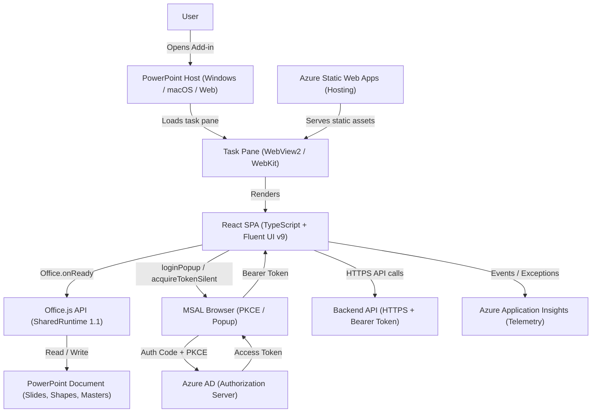
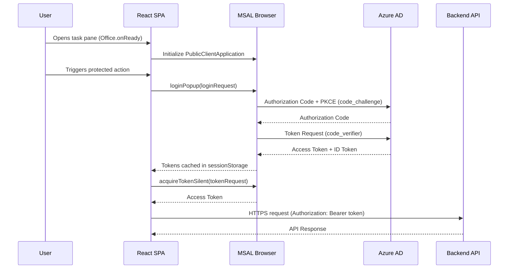
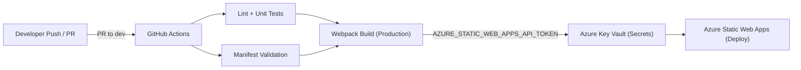
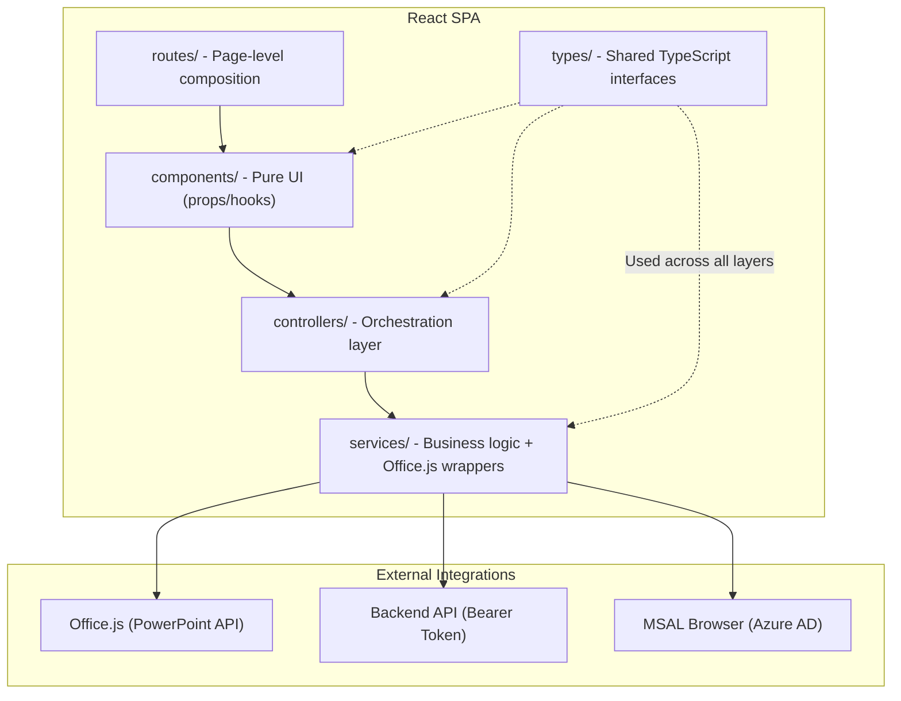

# PowerPresent 3 - Frontend Architecture

**Prepared by:** Brijesh Rawat

**Date:** 04/11/2025

**Version:** V1.0

**Scope:** Frontend-only (PowerPoint Office Add-in)

## 1. Summary

PowerPresent 3 is a Microsoft PowerPoint Office Add-in implemented as a React single-page application (SPA) integrated with Office.js. The frontend runs as a task pane OR Dialog within PowerPoint across Windows, macOS, and the web. Authentication is handled in the SPA using Azure AD via MSAL (PKCE, popup), and the SPA communicates exclusively with a backend API using Bearer tokens. The solution is hosted on Azure Static Web Apps (SWA) and delivered via a GitHub Actions pipeline. This document defines the boilerplate frontend architecture, authentication flow, CI/CD, folder structure, manifest details, security controls (including CSP), telemetry, accessibility, performance, testing, and implementation roadmap. All decisions are explicit and non-ambiguous.

## 2. Goals & Non-Goals

### Goals:

- Deliver a clear and scalable frontend architecture for a PowerPoint Office Add-in (React + TypeScript + Fluent UI v9).
- Implement deterministic authentication using Azure AD (MSAL Browser, Authorization Code Flow with PKCE) and call backend APIs with Bearer tokens.
- Provide an explicit CI/CD approach using GitHub Actions to deploy to Azure Static Web Apps.
- Document minimum supported platforms, manifest configuration, security (CSP, token storage), and telemetry (Azure Application Insights).
- Establish coding standards, testing strategy, and performance practices suitable for enterprise delivery.

### Non-Goals:

- Backend/API design.
- Microsoft Graph direct access from the frontend (all Graph calls occur only through the backend).
- AppSource listing and commercial marketplace assets.

## 3. Target Platforms & Minimum Versions

- **PowerPoint for Windows** (Microsoft 365): Version 2302 (Build 16130) or later.
- **PowerPoint for macOS** (Microsoft 365): Version 16.73 or later.
- **PowerPoint for the Web**: Latest version as provided by Microsoft 365.
- **Office.js Requirement Sets**: SharedRuntime 1.1; Common API baseline used by Yo Office template.
- **Runtime Engines**: Edge WebView2 (Windows), WebKit (macOS).

## 4. Solution Architecture

The frontend is a React SPA rendered in the PowerPoint Task Pane. Office.js provides interaction with the PowerPoint document. MSAL Browser manages Azure AD auth; access tokens (audience: backend API) are attached to HTTPS calls to the API. Static assets are hosted on Azure Static Web Apps. The manifest points to SWA-hosted pages for the task pane and commands.

**Figure 1: Frontend Architecture**

```
User → PowerPoint (Task Pane) → React SPA → Office.js → PowerPoint Document
React SPA → MSAL (Azure AD) → Acquire Access Token (PKCE)
React SPA → Backend API (HTTPS, Bearer token)
Hosting: Azure Static Web Apps (SWA)
```

## 5. Authentication Flow (SPA → API)

1. User opens the PowerPresent 3 task pane inside PowerPoint.
2. SPA initializes (Office.onReady) and configures MSAL Browser (clientId, authority, redirectUri).
3. On first protected action, SPA triggers MSAL login (popup) and completes Authorization Code Flow with PKCE.
4. MSAL caches tokens in sessionStorage. No secrets are stored in the client.
5. When calling the backend, SPA acquires an access token for scope: `api://<BACKEND_API_APP_ID>/access_as_user` (exact scope provided by client).
6. SPA sends HTTPS requests to the backend API with `Authorization: Bearer <access_token>`.
7. The frontend never calls Microsoft Graph directly.

**Figure 2: Sequence Diagram**

```
PowerPoint Host → SPA → MSAL (loginPopup) → Azure AD (authorize/token) → MSAL cache → SPA → Backend API (Bearer)
```

## 6. CI/CD Pipeline

- **Trigger:** Pull Request to dev → build, lint, unit tests, manifest validation.
- **Trigger:** Push to dev → development build, manifest validation, deploy to Azure Static Web Apps.
- **Secrets:** Stored in Azure Key Vault and referenced by GitHub Actions. SWA deployment uses `AZURE_STATIC_WEB_APPS_API_TOKEN`.
- **Note:** The actual YAML is maintained in the repository. This document specifies the pipeline stages and responsibilities.

## 7. Project Structure

```
powerpresent3-addin
├── .eslintrc.json                  # ESLint rules for TypeScript/React and Office Add-ins
├── .gitignore                      # Git ignore patterns
├── .hintrc                         # Webhint configuration for best practices
├── .vscode/                        # VS Code workspace config
│   ├── extensions.json             # Recommended extensions
│   └── tasks.json                  # Local run/build tasks
├── assets/                         # Static assets for packaging/tests (icons, templates)
│   ├── icon-*.png                  # Placeholder brand icons (16/32/64/80/128)
│   ├── Layouts.potx                # Template master (reference)
│   └── logo-filled.png             # Logo asset
├── babel.config.json               # Babel presets (used by Webpack)
├── commands.html                   # Commands page (if separate runtime)
├── manifest.json                   # Optional JSON manifest (dev tooling)
├── manifest.xml                    # Office Add-in manifest (authoritative)
├── package-lock.json               # Locked dependencies
├── package.json                    # Scripts and dependencies (Webpack 5, React, Fluent UI v9)
├── public/                         # Public web assets served by SWA
│   ├── assets/                     # Theme images, templates and backgrounds
│   ├── cover/                      # Cover thumbnails for UI
│   ├── icons/                      # UI icons
│   └── index.html                  # Task pane entry HTML
├── README.md                       # Project overview and local dev instructions
├── src/                            # Application source
│   ├── App.tsx                     # App shell (React)
│   ├── AppRouter.tsx               # Router configuration
│   ├── commands/                   # Office command handlers and HTML
│   │   ├── commands.html           # HTML for commands runtime
│   │   └── commands.ts             # Command functions (e.g., showTaskPane)
│   ├── components/                 # React components (feature-oriented)
│   │   └── Start/Themes/           # Theming feature components
│   │       ├── Category/           # Category card/list
│   │       ├── MetaDataForm/       # Metadata form UI
│   │       ├── SelectCover/        # Cover selection UI
│   │       ├── Themes.module.scss  # Scoped styles for Themes
│   │       └── Themes.tsx          # Themes feature root
│   ├── controllers/                # View-model/controller layer (thin orchestration)
│   │   ├── ThemesController.ts     # Business orchestration for themes (non-UI)
│   │   └── ThemesController.tsx    # Controller with minimal UI if needed
│   ├── main.tsx                    # SPA bootstrap (Office.onReady, React root)
│   ├── routes/                     # Route-level components
│   │   ├── CoverRoute.tsx          # Cover selection route
│   │   └── ThemesRoute.tsx         # Themes main route
│   ├── services/                   # Application services
│   │   ├── BackgroundGenerator.ts  # Background generation helpers
│   │   ├── CommonTemplateService.ts# Common template ops
│   │   ├── office/                 # Office/PowerPoint-specific service layer
│   │   │   ├── MasterSlideService.ts   # Master slide interactions
│   │   │   ├── PowerPointService.ts    # PowerPoint API wrappers
│   │   │   └── RibbonActionHandler.ts  # Ribbon action mapping
│   │   ├── PowerPointService.ts    # (Legacy/alias) PowerPoint service
│   │   ├── TemplateFileService.ts  # Read/parse template files (e.g., potx, json)
│   │   ├── TemplateGenerator.ts    # Generate content/templates programmatically
│   │   ├── TemplateLoader.ts       # Load templates from public/assets
│   │   └── ThemesService.ts        # Theme catalog + operations
│   ├── types/                      # Shared TypeScript types
│   │   ├── CommonTemplate.ts       # Template models
│   │   └── Global.d.ts             # Global typing (Office.js)
│
├── test/                           # Test harness and specs
│   └── test-themes-controller.js   # Example test
│
├── tsconfig.json                   # TypeScript config
└── webpack.config.js               # Webpack 5 bundler config
```

### Layer Responsibilities:

- **components/**: Pure UI, state via props/hooks; no Office.js calls directly.
- **controllers/**: Orchestrate UI intents → call services; minimal logic in components.
- **services/**: Business logic and integration (Office.js wrappers, template loaders).
- **routes/**: Page-level composition and navigation.
- **commands/**: Ribbon/command handlers that call into services.
- **types/**: Centralized interfaces/enums for compile-time safety.

## 8. Manifest (PowerPoint Host)

- **DisplayName**: PowerPresent 3
- **ShortDescription**: [To be filled]
- **LongDescription**: [To be filled]
- **Publisher**: HL
- **DefaultLocale**: en-US
- **Hosts**: PowerPoint
- **Requirement Sets**: SharedRuntime 1.1, Common API
- **Permissions**: ReadWriteDocument
- **AppDomains**: `https://<SWA_DOMAIN>`, `https://login.microsoftonline.com`, `https://aadcdn.msftauth.net`, `https://dc.services.visualstudio.com`, `https://<API_DOMAIN>`

## 9. Security Controls

- **HTTPS-only** endpoints (SWA and backend API).
- **CSP meta tag** enforcing strict origins (SWA, Microsoft Identity domains, App Insights, API domain).
- **MSAL token cache** in sessionStorage; no long-term persistence; no secrets in code.
- **Input sanitization** for any dynamic HTML; avoid innerHTML; use React escaping.
- **Feature flags** retrieved from Azure App Configuration and allowed CORS origin.

## 10. Telemetry (Azure Application Insights)

- Enable App Insights Browser SDK in SPA.
- Use connection string provided by client (per environment).
- Pseudonymize user identifiers (hash AAD oid); no PII collection.
- Track page views, custom events, exceptions, and dependency calls (API latency).

## 11. Testing Strategy

- **Unit**: Jest + React Testing Library for components and utils.
- **Integration**: Office.js helpers for command handlers (mock Office context where feasible).
- **CI gates**: lint, unit tests, manifest validation.

## 12. Coding Standards & Conventions

- TypeScript strict mode; avoid `any`.
- ESLint + Prettier enforced in CI.
- Component/file naming: PascalCase components, kebab-case files where applicable.
- Conventional Commits and semantic versioning for releases.

## 13. Performance (Optional)

- **Code splitting**: lazy-load feature routes/components.
- **Defer Office.js-heavy operations** until user action (post-initialize).
- **Use Webpack production mode**, tree-shaking, and asset compression.
- **Monitor bundle size**; investigate regressions with webpack-bundle-analyzer.

## 14. Accessibility & UX (Optional)

- **WCAG 2.1 AA** targets all task pane screens.
- **Fluent UI v9 components** for built-in ARIA and keyboard support.
- **Respect Office theme**; provide high-contrast styles.

## 15. Roadmap

- **v0.1**: Boilerplate, manifest, task pane shell, ribbon commands.
- **v0.2**: MSAL integration (popup), API client wiring, feature flags.

## 16. Limitations of Office.js – Office.js PowerPoint: Shapes and Master Slide Limitations

### 1. Shapes API – Capabilities & Limitations

#### ✅ What Office.js Can Do

The PowerPoint JavaScript API allows limited shape manipulation on slides, layouts, and masters, but far less than VSTO. Supported capabilities include:

- Insert and retrieve shapes (rectangles, ovals, lines, text boxes)
- Access shape properties (height, width, left, top, rotation, name)
- Read and modify text in shapes
- Delete shapes
- Apply basic text formatting (color, size, bold, italic)

#### ❌ What Office.js Cannot Do

- No advanced shape formatting (fill color, shadow, gradient)
- No grouping or ungrouping of shapes
- No z-order control (bring forward, send backward)
- No connectors or animation control
- No events or interaction listeners
- Limited positioning and no snapping

### 2. Master Slides and Layouts – Limitations

#### ✅ What Office.js Can Do

- Access active presentation and slides
- Retrieve or insert slides using existing layouts
- Duplicate slides

#### ❌ What Office.js Cannot Do

- Cannot access or modify master slides (Slide Master, Layout Master)
- Cannot add or edit placeholders
- Cannot edit master-level styles (background, title fonts, logo)
- Cannot create or delete master layouts
- Cannot access theme elements (colors, fonts)

### 3. Comparison: Office.js vs VSTO

| Feature                            | Office.js  | VSTO (COM Add-in) |
| ---------------------------------- | ---------- | ----------------- |
| Create & delete shapes             | ✅         | ✅                |
| Format shape (color, line, shadow) | ❌         | ✅                |
| Group/ungroup shapes               | ❌         | ✅                |
| Read/write text                    | ✅         | ✅                |
| Access master slides               | ❌         | ✅                |
| Modify placeholders/layouts        | ❌         | ✅                |
| Apply slide layouts                | ⚠️ Limited | ✅                |
| Add images                         | ✅         | ✅                |
| Animations                         | ❌         | ✅                |

### 4. Future Enhancements (Microsoft Roadmap)

Microsoft continues to expand the PowerPoint JavaScript API, but as of 2025:

- Shape formatting, themes, and master slide access are still not supported.
- Newer APIs allow shape enumeration, slide duplication, and rich text manipulation.

### 5. Summary

| Area                             | Status                 | Notes                         |
| -------------------------------- | ---------------------- | ----------------------------- |
| Shape creation & text            | ✅ Supported           | Basic geometry + text only    |
| Shape formatting                 | ❌ Not supported       | No color, fill, effects       |
| Master slide access              | ❌ Not supported       | Cannot edit or read           |
| Layout application               | ⚠️ Partially supported | Only apply predefined layouts |
| Animations, placeholders, events | ❌ Not supported       | Requires VSTO or manual UI    |

---

## 17. Project Challenges & Mitigation

### Challenge 1: EMF File Format Not Supported in Office.js

| Field                         | Details                                                  |
| ----------------------------- | -------------------------------------------------------- |
| **Solution**                  | Convert EMF files into SVG format for compatibility.     |
| **Status**                    | Pending                                                  |
| **Comments**                  | SVG is widely supported and scalable.                    |
| **Workaround**                | Use vector editing tools to export EMF as SVG.           |
| **Mitigation Recommendation** | Standardize all image assets to SVG during design phase. |

### Challenge 2: Office.js API Does Not Support Master Slides

| Field                         | Details                                                                                               |
| ----------------------------- | ----------------------------------------------------------------------------------------------------- |
| **Solution**                  | Use a predefined template presentation and insert slides via Base64.                                  |
| **Status**                    | In Progress                                                                                           |
| **Comments**                  | Office.js cannot modify master slides directly.                                                       |
| **Workaround**                | Import PPTX with embedded master, use hidden objects, swatch mapping, and layout-specific PPTX files. |
| **Mitigation Recommendation** | Design master slides with embedded logic and hidden elements to simulate theme control.               |

### Challenge 3: Office.js Has Limited API Support for Shapes

| Field                         | Details                                                                      |
| ----------------------------- | ---------------------------------------------------------------------------- |
| **Solution**                  | Limited shape manipulation available.                                        |
| **Status**                    | In Progress                                                                  |
| **Comments**                  | Complex shapes may not be supported.                                         |
| **Workaround**                | Use basic shapes or pre-rendered images.                                     |
| **Mitigation Recommendation** | Design slides using supported shape types and avoid complex vector graphics. |

### Challenge 4: Office.js Ribbon Icons Must Be SVG or PNG

| Field                         | Details                                                  |
| ----------------------------- | -------------------------------------------------------- |
| **Solution**                  | Client must provide icons in supported formats.          |
| **Status**                    | Pending                                                  |
| **Comments**                  | Only SVG and PNG are supported for ribbon customization. |
| **Workaround**                | Request assets from client in correct format.            |
| **Mitigation Recommendation** | Include icon format requirements in design guidelines.   |

---

### Office.js Technical Considerations & Limitations

#### Limitations

- Office.js cannot directly import POTX files (PowerPoint template files).
- It cannot interact with master layouts, theme swatches, or native PowerPoint tools relying on master slide configurations.
- Office.js can only access objects present in the active slide canvas, even if they originate from the master slide.
- Interaction with the file structure is limited to what is exposed via Custom XML parts.

#### Mitigation Strategies

- Importing a PPTX file brings in master slides and theme data. Hidden objects with embedded logic can be duplicated onto live slides.
- Use hidden objects in master slides to create a mapping system for swatch colors and positions.
- Package specific slide layouts as separate PPTX files and hard-code dropdown menu to import them as layout substitutes.
- Use dual-object mapping for theme swatch synchronization: one object tied to native swatch, another hard-coded to hex color.

---

## 18. Architecture Diagram

### Figure 1: High-Level Frontend Architecture



### Figure 2: Authentication Sequence



### Figure 3: CI/CD Pipeline



### Figure 4: Frontend Layer Architecture



---

## Appendix

### A) MSAL Configuration (SPA – PKCE, popup)

```javascript
const msalConfig = {
  auth: {
    clientId: "<CLIENT_ID>",
    authority: "https://login.microsoftonline.com/<TENANT_ID>",
    redirectUri: "<APP_BASE_URL>/auth/callback",
  },
  cache: {
    cacheLocation: "sessionStorage",
    storeAuthStateInCookie: false,
  },
  system: {
    allowRedirectInIframe: false,
  },
};

// Example: Acquire token for backend API scope and call API
const loginRequest = { scopes: ["api://<BACKEND_API_APP_ID>/access_as_user"] };
const tokenRequest = { scopes: ["api://<BACKEND_API_APP_ID>/access_as_user"] };
const msalInstance = new PublicClientApplication(msalConfig);
await msalInstance.initialize();
await msalInstance.loginPopup(loginRequest);
const account = msalInstance.getAllAccounts()[0];
const result = await msalInstance.acquireTokenSilent({
  ...tokenRequest,
  account,
});
const accessToken = result.accessToken;
const res = await fetch("<API_BASE_URL>/v1/endpoint", {
  headers: { Authorization: `Bearer ${accessToken}` },
});
```

### B) CSP Meta Tag (strict)

```html
<meta
  http-equiv="Content-Security-Policy"
  content="default-src 'self' https://<SWA_DOMAIN>; script-src 'self' 'unsafe-inline'; style-src 'self' 'unsafe-inline'; img-src 'self' data:; connect-src 'self' https://<API_DOMAIN> https://dc.services.visualstudio.com; frame-ancestors 'self' https://*.office.com https://*.office365.com; frame-src 'self'; font-src 'self' data:; child-src 'self'; object-src 'none'; base-uri 'self'; form-action 'self' https://login.microsoftonline.com; upgrade-insecure-requests"
/>
```

### C) Manifest AppDomains (add to manifest.xml)

```xml
https://<SWA_DOMAIN>, https://login.microsoftonline.com, https://aadcdn.msftauth.net, https://dc.services.visualstudio.com, https://<API_DOMAIN>
```
