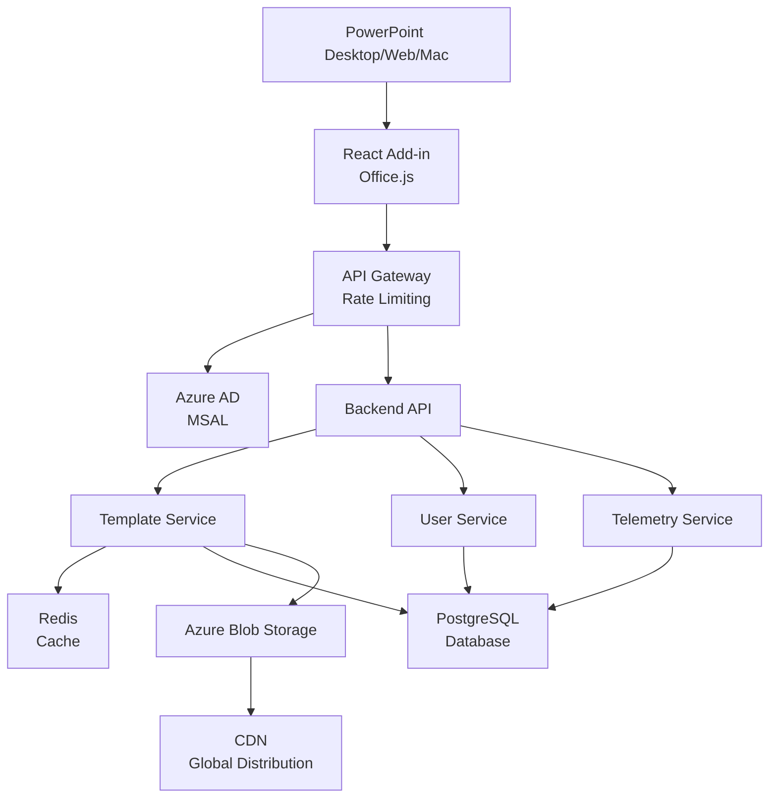

# PowerPoint Office Add-in - System Design

## Overview

This document outlines the system design for a PowerPoint Office Add-in that enables users to generate, manage, and apply presentation templates/themes directly within PowerPoint.

---

## Step 1: Understanding the Problem & Defining the Scope

### Functional Requirements

Build a PowerPoint Office Add-in that allows users to:

- Generate and create new presentation templates with custom themes and layouts
- Manage and organize templates across multiple organizations
- Apply presentation templates/themes directly within PowerPoint
- Customize fonts, colors, logos, and master slides
- Share templates with team members and across organizations

### Non-Functional Requirements

- **Security:** Ensure data protection with encryption, secure authentication, and authorization
- **Cross-Platform Compatibility:** Support Windows, Mac, and Web versions of PowerPoint
- **High Availability:** Maintain 99.9% uptime with automatic failover capabilities
- **Responsiveness:** Ensure fast UI interactions and sub-200ms API response times
- **Maintainability:** Clean code architecture with comprehensive logging and monitoring

### Constraints

- **Office.js Limitations:** Cannot directly manipulate Master Slides; must work within Office.js APIs
- **No Direct Master Slide Manipulation:** Limited access to underlying PowerPoint object model
- **Azure AD Authentication Requirement:** Must use Azure AD/MSAL for enterprise compliance
- **Microsoft Ecosystem Dependencies:** Must integrate with Microsoft Graph API, SharePoint, and OneDrive
- **File Size Limits:** PowerPoint files have storage and performance limitations

---

## Step 2: Estimating Scale & Identifying Bottlenecks

### Estimating Traffic

Support enterprise users accessing the add-in simultaneously across multiple organizations:

- **User Base:** 100K+ enterprise users across multiple organizations
- **Concurrent Users:** 5K-10K concurrent add-in sessions during peak hours
- **Daily API Calls:** 1M+ API calls per day
- **Peak Traffic:** Business hours (9 AM - 6 PM) and before major presentation deadlines

### Identifying Bottlenecks

- **Authentication Service Latency:** Slow token generation and validation can delay add-in initialization
- **API Response Times:** Database queries for template retrieval can be slow during peak usage
- **Office.js Execution Limits:** Template application is constrained by Office.js performance and context switching
- **Large Template Asset Downloads:** Downloading template assets with high-quality images can be slow
- **Database Query Performance:** Complex queries for template search and filtering can cause bottlenecks
- **Telemetry Storage:** High volume of telemetry data can overwhelm storage systems

### Capacity Planning

Plan for scalable infrastructure to handle growing demand:

- **API Infrastructure:** Autoscaling backend services (10-100 servers based on load)
- **Static Asset Hosting:** CDN with global edge locations for template asset delivery
- **Database Infrastructure:** Read replicas and sharding strategy for horizontal scaling
- **Cache Layer:** Redis cluster for session management and data caching
- **Telemetry Storage:** Time-series database with retention and archival policies
- **Future Growth:** Plan for 10x growth in users and traffic over next 3 years

---

## Step 3: High-Level Design: Services, APIs & Communication

### Core Services

The system consists of the following core services:

- **React Frontend:** User interface for the PowerPoint add-in
- **Authentication Service:** Azure AD/MSAL integration for secure user authentication
- **Backend API:** Main application logic and service orchestration
- **Template Management Service:** CRUD operations and template lifecycle management
- **Telemetry Service:** Analytics, logging, and performance monitoring

### API Design

Design comprehensive APIs for:

- **Authentication APIs:** User login, token refresh, logout, and permission checks
- **Template Retrieval APIs:** Fetch templates, search, filter, and list operations
- **Presentation Generation APIs:** Create presentations from templates
- **Feature Flags APIs:** Control feature rollouts and A/B testing
- **User Settings APIs:** Store and retrieve user preferences and configurations

### Communication Patterns

- **REST APIs:** For synchronous requests (template retrieval, user settings, authentication)
- **Event-Based Telemetry:** Asynchronous collection of analytics and usage data
- **Real-time Notifications:** WebSocket connections for live updates and collaboration

### Service Interaction

- **Frontend communicates with Backend APIs** using Bearer token authentication
- **Backend handles business logic**, database operations, and external integrations
- **Backend services communicate** with Azure AD for authentication and authorization
- **Telemetry services** collect and store usage data for analytics

---

## Step 4: Making Tech & Infra Decisions Strategically

### Tech Stack Decisions

- **Frontend:** React + TypeScript for type safety and component reusability
- **Add-in Framework:** Office.js for native PowerPoint integration
- **Backend:** Node.js/Python with Express/FastAPI for fast API development
- **Database:** PostgreSQL for ACID compliance and scalability
- **Cache:** Redis for session management and data caching
- **Authentication:** Azure AD with MSAL.js for enterprise SSO
- **Cloud Provider:** Microsoft Azure for seamless integration with Office 365
- **Monitoring:** Application Insights for comprehensive telemetry

### Scalability & Availability

- **Horizontal Scaling:** Add more servers behind load balancer as demand increases
- **CDN-Backed Static Hosting:** Azure Static Web Apps for automatic scaling and global distribution
- **Autoscaling Backend Services:** Kubernetes cluster with auto-scaling based on CPU/memory metrics
- **Multi-Region Deployment:** Deploy across multiple Azure regions for geographic redundancy
- **Database Replication:** Primary + read replicas for read-heavy workloads
- **Cache Replication:** Redis cluster for distributed caching across regions

### Performance Considerations

- **Code Splitting:** Lazy load components and modules to reduce initial bundle size
- **Asset Optimization:** Compress images, use WebP format, minify CSS/JavaScript
- **API Caching:** Cache GET requests for 5-15 minutes using Redis
- **Minimizing Office.js Calls:** Batch operations to reduce context switching overhead
- **Database Optimization:** Use indexing, query optimization, and connection pooling
- **Progressive Loading:** Load template layouts before fetching all assets

### Trade-offs

- **Simpler Frontend Architecture vs. Advanced Customization:** Opt for maintainability and ease of development over highly customizable UIs for niche use cases

- **Predefined Templates vs. Dynamic Master Slide Editing:** Use predefined templates due to Office.js limitations, with advanced editing available via desktop export

- **Office.js Portability vs. VSTO Feature Richness:** Choose Office.js for cross-platform support (Web, Windows, Mac) even though VSTO offers more features

- **Monolithic Backend vs. Microservices:** Start with monolithic architecture for faster development, migrate to microservices when bottlenecks are identified

- **Centralized vs. Distributed Caching:** Use hybrid approach with centralized cache for consistency and local caching for performance

---

## Architecture Diagram

---

## Summary

This system design provides a comprehensive approach to building a scalable, secure, and maintainable PowerPoint Office Add-in. By systematically understanding requirements, estimating scale, designing architecture, and making informed technology decisions, we create a platform that can grow with user demands while maintaining high performance and reliability standards.
