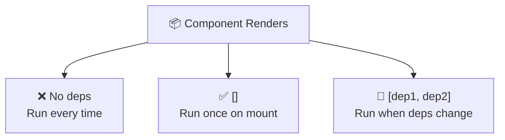
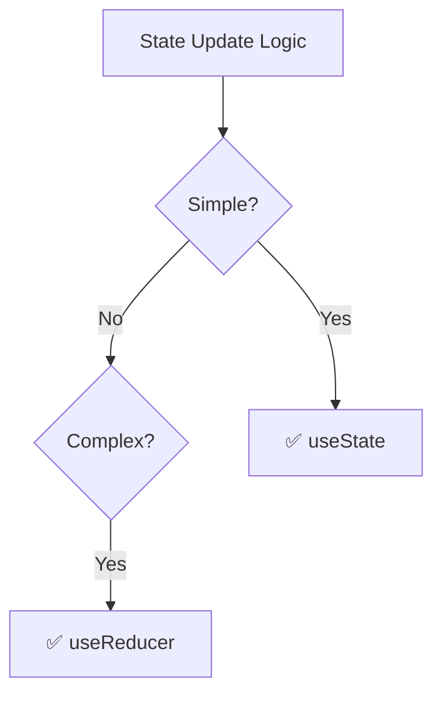
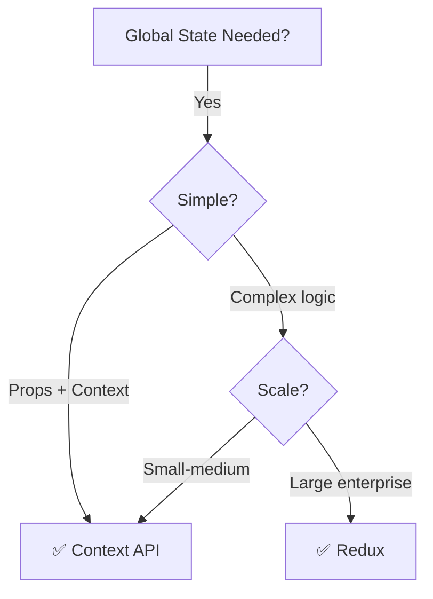
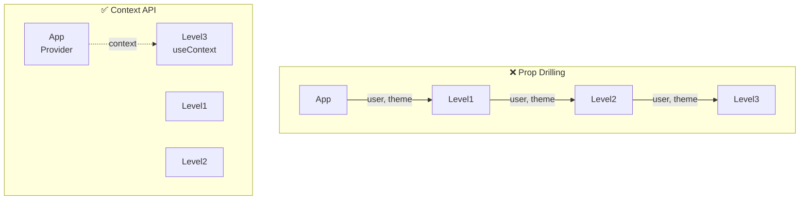

# React.js Interview Questions

## Overview

This folder contains comprehensive interview questions for React developers, covering React fundamentals, hooks, state management, performance optimization, and modern patterns.

## Topics Covered

### React Fundamentals

- **JSX** - Syntax extension, Compilation
- **Components** - Functional vs Class components
- **Props** - Passing data, Prop validation
- **State** - useState hook, State management
- **Rendering** - Virtual DOM, Reconciliation
- **Keys** - List rendering best practices
- **Events** - Event handling, Event delegation
- **Forms** - Controlled vs Uncontrolled components
- **Conditional Rendering** - if/else, Ternary, &&

### React Hooks

- **useState** - State management
- **useEffect** - Side effects, Cleanup
- **useContext** - Context API consumption
- **useReducer** - Complex state management
- **useCallback** - Memoizing callbacks
- **useMemo** - Memoizing values
- **useRef** - DOM references
- **useLayoutEffect** - Synchronous effects
- **Custom Hooks** - Creating reusable logic
- **Rules of Hooks** - Dependency arrays

### Context & State Management

- **Context API** - Props drilling solution
- **Redux** - Centralized state
- **Redux Toolkit** - Simplified Redux
- **Zustand** - Lightweight state manager
- **Recoil** - Atom-based state
- **MobX** - Observable state
- **Jotai** - Primitive state management

### Performance Optimization

- **React.memo** - Component memoization
- **Code Splitting** - Lazy loading
- **Suspense** - Async component loading
- **Profiling** - Performance analysis
- **Web Vitals** - Core metrics
- **Bundle Size** - Optimization
- **Image Optimization** - Lazy loading images
- **Virtualization** - Large list rendering

### Advanced Concepts

- **Render Props** - Component pattern
- **Higher-Order Components** - HOC pattern
- **Composition** - Component composition
- **Error Boundaries** - Error handling
- **Portals** - Rendering outside DOM
- **Fiber Architecture** - React internals
- **Concurrent Mode** - Future features
- **Server Components** - Next.js integration

### Routing

- **React Router** - Single page routing
- **Route Parameters** - Dynamic routes
- **Nested Routes** - Route hierarchy
- **Navigation** - useNavigate, Link
- **Lazy Routes** - Code splitting routes
- **Query Strings** - URL parameters

### Testing

- **Jest** - Testing framework
- **React Testing Library** - Component testing
- **Unit Tests** - Function testing
- **Integration Tests** - Component interaction
- **Mocking** - Mocking dependencies
- **Coverage** - Code coverage metrics

### Next.js / SSR

- **Server-Side Rendering** - SSR benefits
- **Static Generation** - Static HTML
- **Incremental Static Regeneration** - ISR
- **API Routes** - Backend routes
- **Middleware** - Request processing
- **Deployment** - Vercel deployment

### Best Practices

- **Clean Code** - Readability
- **DRY Principle** - Don't repeat yourself
- **SOLID Principles** - Code structure
- **Error Handling** - Graceful errors
- **Accessibility** - a11y standards
- **SEO** - Search engine optimization

## Interview Levels

### Junior Developer

- JSX syntax
- Functional components
- Props & state
- Basic hooks
- Event handling
- Simple styling

### Mid-Level Developer

- Advanced hooks
- Context API
- Performance optimization
- Custom hooks
- State management
- Testing
- Routing

### Senior Developer

- Architecture patterns
- Micro-frontends
- Advanced performance
- Next.js/SSR
- System design
- Team leadership
- Scale considerations

---

## Key Competencies

✅ JSX mastery  
✅ Hooks proficiency  
✅ State management  
✅ Performance optimization  
✅ Routing  
✅ Testing  
✅ TypeScript (optional)  
✅ Code quality

## Recommended Learning Path

1. Master React fundamentals
2. Learn hooks deeply
3. Understand Context API
4. Explore state management
5. Learn performance optimization
6. Study advanced patterns
7. Master routing
8. Learn testing
9. Explore Next.js

## Resources

- **React Docs:** https://react.dev/
- **React Hooks:** https://react.dev/reference/react/hooks
- **React Router:** https://reactrouter.com/
- **Next.js:** https://nextjs.org/
- **React Testing Library:** https://testing-library.com/react

---

**Note:** This folder will be populated with detailed interview questions and answers for React positions.

---

# React Interview Questions & Answers

## 1. Controlled vs Uncontrolled Components

### Question

What are controlled and uncontrolled components?

### Answer

**Controlled Component:** React state controls the form input value.

```jsx
function ControlledInput() {
  const [name, setName] = useState("");

  return <input value={name} onChange={(e) => setName(e.target.value)} />;
}
```

**Uncontrolled Component:** DOM controls the form input value.

```jsx
function UncontrolledInput() {
  const inputRef = useRef();

  return <input ref={inputRef} />;
}
```

### Comparison

| Feature    | Controlled  | Uncontrolled |
| ---------- | ----------- | ------------ |
| State      | React state | DOM state    |
| Updates    | Immediate   | On demand    |
| Testing    | Easy        | Harder       |
| Validation | Real-time   | Form submit  |

### Real-World Example

```jsx
// Search with real-time filtering
function SearchUsers() {
  const [search, setSearch] = useState("");
  const [results, setResults] = useState([]);

  useEffect(() => {
    if (search.length > 2) {
      fetchSearchResults(search).then(setResults);
    }
  }, [search]); // Controlled component enables this

  return (
    <>
      <input
        value={search}
        onChange={(e) => setSearch(e.target.value)}
        placeholder="Search users..."
      />
      <ul>
        {results.map((user) => (
          <li key={user.id}>{user.name}</li>
        ))}
      </ul>
    </>
  );
}
```

---

## 2. useEffect Dependency Arrays

### Question

Explain the difference between useEffect with different dependency arrays?

### Answer

```javascript
// 1. No dependency array - runs after EVERY render
useEffect(() => {
  console.log("Runs every render");
});

// 2. Empty dependency array [] - runs ONCE after mount
useEffect(() => {
  console.log("Runs once on mount");
}, []);

// 3. With dependencies - runs when deps change
useEffect(() => {
  console.log("Runs when userId changes");
}, [userId]);
```

### Mermaid Diagram



### Real-World Examples

```jsx
// 1. API call on component mount
useEffect(() => {
  fetchUserData(userId);
}, []); // ⚠️ Only runs on mount - DON'T FORGET!

// 2. Update title when user changes
useEffect(() => {
  document.title = `User: ${user.name}`;
}, [user.name]); // Runs when user.name changes

// 3. Cleanup function
useEffect(() => {
  const subscription = eventBus.subscribe("notification", alert);

  return () => {
    subscription.unsubscribe(); // Cleanup
  };
}, []); // Run once, cleanup on unmount
```

---

## 3. useReducer vs useState

### Question

When should you use useReducer over useState?

### Answer

**useState:** Simple state updates

```jsx
const [count, setCount] = useState(0);

setCount(count + 1); // Simple
```

**useReducer:** Complex state logic

```jsx
const [state, dispatch] = useReducer(reducer, initialState);

function reducer(state, action) {
  switch (action.type) {
    case "INCREMENT":
      return { ...state, count: state.count + 1 };
    case "DECREMENT":
      return { ...state, count: state.count - 1 };
    default:
      return state;
  }
}

dispatch({ type: "INCREMENT" });
```

### Decision Flow



### Real-World Example

```jsx
// Form with multiple fields - useReducer is cleaner
const initialState = {
  name: "",
  email: "",
  errors: {},
};

function formReducer(state, action) {
  switch (action.type) {
    case "SET_FIELD":
      return { ...state, [action.field]: action.value };
    case "SET_ERROR":
      return {
        ...state,
        errors: { ...state.errors, [action.field]: action.error },
      };
    case "RESET":
      return initialState;
    default:
      return state;
  }
}

function Form() {
  const [state, dispatch] = useReducer(formReducer, initialState);

  return (
    <form>
      <input
        value={state.name}
        onChange={(e) =>
          dispatch({
            type: "SET_FIELD",
            field: "name",
            value: e.target.value,
          })
        }
      />
      {state.errors.name && <span>{state.errors.name}</span>}
    </form>
  );
}
```

---

## 4. Context API vs Redux

### Question

When to use Context API vs Redux?

### Answer

| Feature     | Context API  | Redux     |
| ----------- | ------------ | --------- |
| Setup       | Simple       | Complex   |
| Boilerplate | Minimal      | Lots      |
| Performance | Slower       | Optimized |
| DevTools    | None         | Great     |
| Scale       | Small-medium | Large     |

### Context API Example

```jsx
const ThemeContext = React.createContext();

function App() {
  const [theme, setTheme] = useState("light");

  return (
    <ThemeContext.Provider value={{ theme, setTheme }}>
      <Header />
      <Content />
    </ThemeContext.Provider>
  );
}

function useTheme() {
  return useContext(ThemeContext);
}
```

### Redux Example

```javascript
// Action
const setTheme = (theme) => ({ type: "SET_THEME", payload: theme });

// Reducer
const themeReducer = (state = "light", action) => {
  if (action.type === "SET_THEME") return action.payload;
  return state;
};

// Store
const store = createStore(themeReducer);
```

### Decision Tree



### Real-World Example

```jsx
// Context API - Perfect for theme, auth, language
const AuthContext = createContext();

export function AuthProvider({ children }) {
  const [user, setUser] = useState(null);

  const login = async (email, password) => {
    const user = await api.login(email, password);
    setUser(user);
    localStorage.setItem("token", user.token);
  };

  return (
    <AuthContext.Provider value={{ user, login }}>
      {children}
    </AuthContext.Provider>
  );
}

// Use anywhere
function ProtectedRoute() {
  const { user } = useContext(AuthContext);
  return user ? <Dashboard /> : <Login />;
}
```

---

## 5. React.memo vs useMemo

### Question

Difference between React.memo and useMemo?

### Answer

**React.memo:** Memoize component to prevent re-renders

```jsx
const ExpensiveComponent = React.memo(({ data }) => {
  console.log("Rendering");
  return <div>{data}</div>;
});

// Only re-renders if `data` prop changes
```

**useMemo:** Memoize computed value

```jsx
const memoizedValue = useMemo(() => {
  return expensiveComputation(data);
}, [data]);
```

### Comparison Table

| Aspect   | React.memo | useMemo       |
| -------- | ---------- | ------------- |
| Memoizes | Component  | Value         |
| Prevents | Re-render  | Recomputation |
| Input    | Props      | Dependencies  |
| Output   | JSX        | Value         |

### Real-World Example

```jsx
// Parent component
function UserDashboard() {
  const [filter, setFilter] = useState("");
  const [sortBy, setSortBy] = useState("name");

  // Memoized computation
  const filteredUsers = useMemo(() => {
    console.log("Computing filtered users");
    return users
      .filter((u) => u.name.includes(filter))
      .sort((a, b) => a[sortBy].localeCompare(b[sortBy]));
  }, [filter, sortBy]);

  return (
    <>
      <input
        value={filter}
        onChange={(e) => setFilter(e.target.value)}
        placeholder="Filter..."
      />
      <UserList users={filteredUsers} />
    </>
  );
}

// Memoized child component
const UserList = React.memo(({ users }) => {
  console.log("Rendering UserList");
  return users.map((u) => <UserItem key={u.id} user={u} />);
});

// UserList only re-renders when filteredUsers changes
```

---

## 6. Prop Drilling vs Context API

### Question

What is prop drilling and how to solve it?

### Answer

**Prop Drilling Problem:**

```jsx
function App() {
  const user = { name: "John", theme: "dark" };
  return <Level1 user={user} theme={theme} />;
}

function Level1({ user, theme }) {
  return <Level2 user={user} theme={theme} />;
}

function Level2({ user, theme }) {
  return <Level3 user={user} theme={theme} />;
}

function Level3({ user, theme }) {
  return (
    <div>
      {user.name} - {theme}
    </div>
  );
}
```

**Solution with Context:**

```jsx
const AppContext = createContext();

function App() {
  const value = { user: { name: "John" }, theme: "dark" };

  return (
    <AppContext.Provider value={value}>
      <Level1 />
    </AppContext.Provider>
  );
}

function Level3() {
  const { user, theme } = useContext(AppContext);
  return (
    <div>
      {user.name} - {theme}
    </div>
  );
}
```

### Mermaid Comparison



---

## 7. Controlled Form Example

### Question

Build a controlled search form with real-time filtering?

### Answer

```jsx
function SearchForm() {
  const [query, setQuery] = useState("");
  const [results, setResults] = useState([]);
  const [isLoading, setIsLoading] = useState(false);

  useEffect(() => {
    if (query.length < 2) {
      setResults([]);
      return;
    }

    setIsLoading(true);

    // Debounce API call
    const timer = setTimeout(async () => {
      const data = await searchAPI(query);
      setResults(data);
      setIsLoading(false);
    }, 300);

    return () => clearTimeout(timer);
  }, [query]);

  return (
    <div>
      <input
        type="text"
        value={query}
        onChange={(e) => setQuery(e.target.value)}
        placeholder="Search fruits..."
      />

      {isLoading && <p>Loading...</p>}

      <ul>
        {results.map((result) => (
          <li key={result.id}>{result.name}</li>
        ))}
      </ul>
    </div>
  );
}
```

### Array Filtering Example

```jsx
const fruits = [
  "Banana",
  "Apple",
  "Orange",
  "Mango",
  "Pineapple",
  "Watermelon",
];

function FruitSearch() {
  const [search, setSearch] = useState("");

  const filtered = fruits.filter((fruit) =>
    fruit.toLowerCase().includes(search.toLowerCase()),
  );

  return (
    <>
      <input
        value={search}
        onChange={(e) => setSearch(e.target.value)}
        placeholder="Search fruits..."
      />
      <ul>
        {filtered.map((fruit, i) => (
          <li key={i}>{fruit}</li>
        ))}
      </ul>
    </>
  );
}
```

---

## 8. Todo Application Example

### Question

Build a todo application with add, delete, and complete functionality?

### Answer

```jsx
function TodoApp() {
  const [todos, setTodos] = useState([]);
  const [input, setInput] = useState("");

  const addTodo = () => {
    if (input.trim()) {
      setTodos([...todos, { id: Date.now(), text: input, completed: false }]);
      setInput("");
    }
  };

  const deleteTodo = (id) => {
    setTodos(todos.filter((todo) => todo.id !== id));
  };

  const toggleComplete = (id) => {
    setTodos(
      todos.map((todo) =>
        todo.id === id ? { ...todo, completed: !todo.completed } : todo,
      ),
    );
  };

  return (
    <div className="todo-app">
      <h1>My Todos</h1>

      <div className="input-section">
        <input
          value={input}
          onChange={(e) => setInput(e.target.value)}
          onKeyPress={(e) => e.key === "Enter" && addTodo()}
          placeholder="Add a new todo..."
        />
        <button onClick={addTodo}>Add</button>
      </div>

      <ul className="todo-list">
        {todos.map((todo) => (
          <li key={todo.id} className={todo.completed ? "completed" : ""}>
            <input
              type="checkbox"
              checked={todo.completed}
              onChange={() => toggleComplete(todo.id)}
            />
            <span>{todo.text}</span>
            <button onClick={() => deleteTodo(todo.id)}>Delete</button>
          </li>
        ))}
      </ul>

      <p>
        Total: {todos.length} | Completed:{" "}
        {todos.filter((t) => t.completed).length}
      </p>
    </div>
  );
}
```

---

## 9. On/Off Toggle Button

### Question

Create an ON/OFF button that toggles text?

### Answer

```jsx
function ToggleButton() {
  const [isOn, setIsOn] = useState(false);

  return (
    <button
      onClick={() => setIsOn(!isOn)}
      style={{
        backgroundColor: isOn ? "green" : "red",
        color: "white",
        padding: "10px 20px",
        fontSize: "16px",
        cursor: "pointer",
      }}
    >
      {isOn ? "ON" : "OFF"}
    </button>
  );
}
```

### Advanced Version with State

```jsx
function AdvancedToggle() {
  const [status, setStatus] = useState("OFF");

  const handleToggle = () => {
    setStatus(status === "OFF" ? "ON" : "OFF");
  };

  return (
    <div>
      <button
        onClick={handleToggle}
        className={`toggle ${status.toLowerCase()}`}
      >
        {status}
      </button>
      <p>Status: {status === "ON" ? "🟢 Online" : "🔴 Offline"}</p>
    </div>
  );
}
```

---

## 10. Conditional Rendering

### Question

How to render conditionally in React?

### Answer

```jsx
// 1. If/else
function Component({ isLoggedIn }) {
  if (isLoggedIn) {
    return <Dashboard />;
  }
  return <Login />;
}

// 2. Ternary operator
function Component({ isLoggedIn }) {
  return isLoggedIn ? <Dashboard /> : <Login />;
}

// 3. Logical && operator
function Component({ showMessage }) {
  return <div>{showMessage && <p>Hello!</p>}</div>;
}

// 4. Switch statement
function Component({ userRole }) {
  switch (userRole) {
    case "admin":
      return <AdminPanel />;
    case "user":
      return <UserDashboard />;
    default:
      return <GuestPage />;
  }
}
```

### Real-World Example

```jsx
function UserProfile({ userId }) {
  const [user, setUser] = useState(null);
  const [loading, setLoading] = useState(true);
  const [error, setError] = useState(null);

  useEffect(() => {
    fetchUser(userId)
      .then(setUser)
      .catch(setError)
      .finally(() => setLoading(false));
  }, [userId]);

  if (loading) return <div>Loading...</div>;
  if (error) return <div>Error: {error.message}</div>;
  if (!user) return <div>User not found</div>;

  return (
    <div>
      <h1>{user.name}</h1>
      <p>{user.email}</p>
    </div>
  );
}
```
