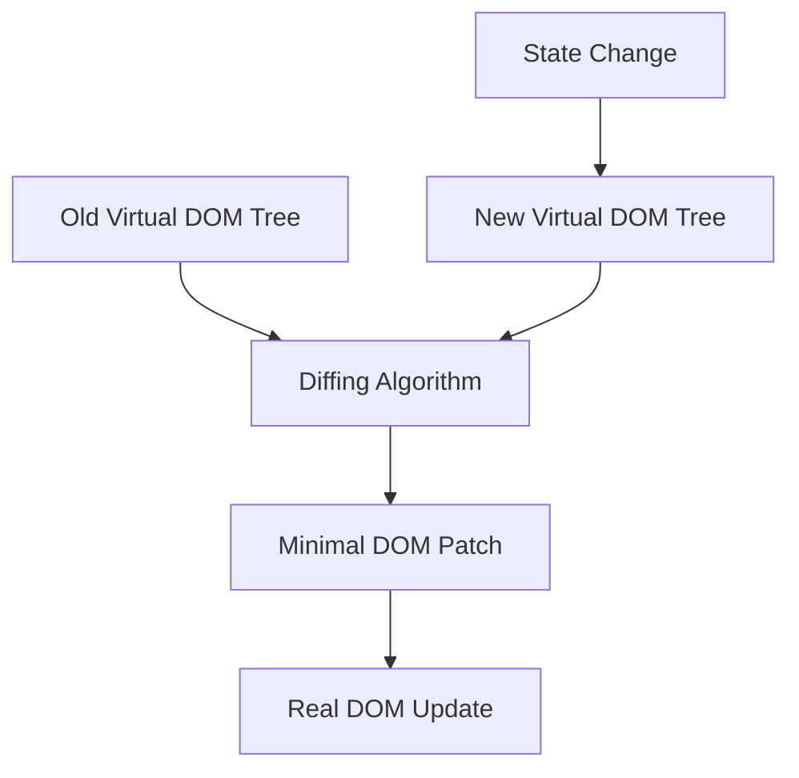
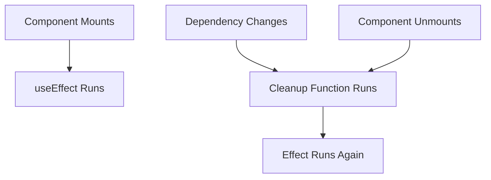
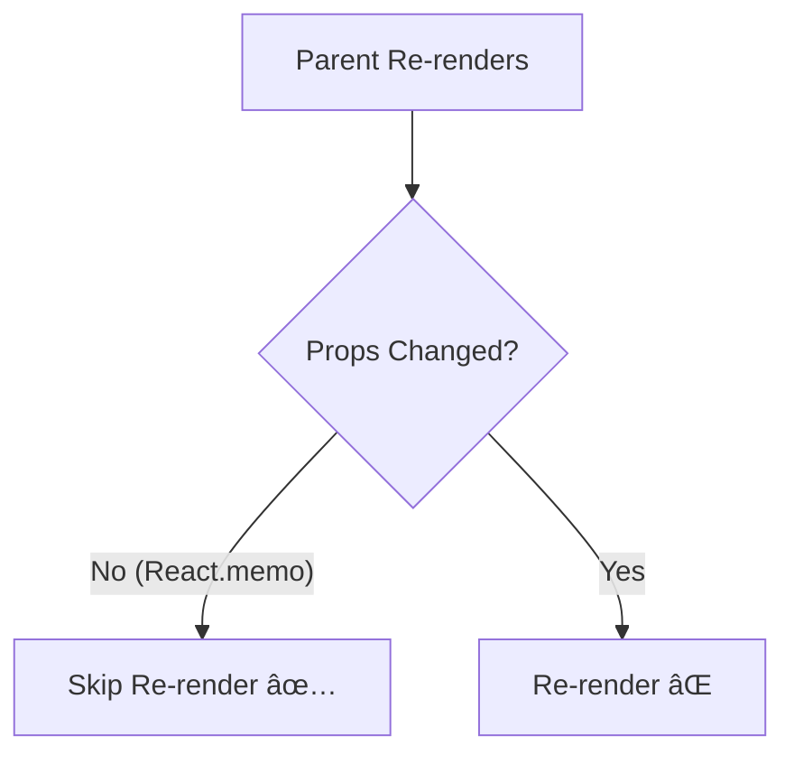
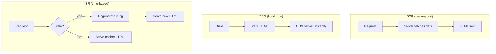

```mermaid
graph TD
    Component["⚛️ React Component"]
    Dispatch["dispatch(action)"]
    Reducer["📦 Slice Reducer"]
    Store["🗄️ Redux Store"]
    Selector["useSelector"]

    Component -->|user action| Dispatch
    Dispatch --> Reducer
    Reducer --> Store
    Store -->|re-render| Selector
    Selector --> Component
```

# React.js Interview Questions & Answers

## 1. Virtual DOM & Reconciliation

### Question
What is the Virtual DOM and how does React's reconciliation work?

### Answer
The Virtual DOM is a lightweight JavaScript representation of the real DOM. React uses it to batch and minimise actual DOM mutations.

```jsx
// React creates a virtual tree
const element = (
  <div className="card">
    <h2>Product</h2>
    <p>$99</p>
  </div>
);
// This compiles to:
// React.createElement("div", { className: "card" },
//   React.createElement("h2", null, "Product"),
//   React.createElement("p", null, "$99")
// )
```

### Reconciliation – Diffing Algorithm

React diffs the old virtual tree against the new one using three heuristics:
1. Different element types → destroy & rebuild subtree
2. Same element type → update only changed attributes
3. Lists → use `key` prop to match old and new nodes

### Real-World Example

```jsx
// ❌ No key – React re-renders entire list on any change
{items.map(item => <ProductCard name={item.name} />)}

// ✅ Stable key – React only re-renders changed nodes
{items.map(item => <ProductCard key={item.id} name={item.name} />)}
```

### Diagram



---

## 2. useState & State Management

### Question
How does `useState` work and what are common pitfalls?

### Answer

```jsx
import { useState } from "react";

function Counter() {
  const [count, setCount] = useState(0);

  // ❌ Wrong – directly mutating state
  // count++;

  // ✅ Correct – call setter
  return (
    <div>
      <p>Count: {count}</p>
      <button onClick={() => setCount(c => c + 1)}>+</button>
      <button onClick={() => setCount(c => c - 1)}>-</button>
      <button onClick={() => setCount(0)}>Reset</button>
    </div>
  );
}
```

### Real-World Example – Form State

```jsx
function CheckoutForm() {
  const [form, setForm] = useState({
    name: "",
    email: "",
    address: { street: "", city: "", zip: "" }
  });
  const [errors, setErrors] = useState({});
  const [submitting, setSubmitting] = useState(false);

  // Generic field updater – no need for one setter per field
  function handleChange(field, value) {
    setForm(prev => ({ ...prev, [field]: value }));
    setErrors(prev => ({ ...prev, [field]: undefined }));
  }

  async function handleSubmit(e) {
    e.preventDefault();
    setSubmitting(true);
    try {
      await submitOrder(form);
    } catch (err) {
      setErrors(err.fieldErrors || {});
    } finally {
      setSubmitting(false);
    }
  }

  return (
    <form onSubmit={handleSubmit}>
      <input
        value={form.name}
        onChange={e => handleChange("name", e.target.value)}
        placeholder="Full name"
      />
      {errors.name && <span className="error">{errors.name}</span>}
      <button disabled={submitting}>
        {submitting ? "Placing order…" : "Place Order"}
      </button>
    </form>
  );
}
```

---

## 3. useEffect – Side Effects & Cleanup

### Question
Explain `useEffect` and how to handle cleanups.

### Answer

```jsx
import { useState, useEffect } from "react";

function UserProfile({ userId }) {
  const [user, setUser]       = useState(null);
  const [loading, setLoading] = useState(true);
  const [error, setError]     = useState(null);

  useEffect(() => {
    let cancelled = false; // prevent state update on unmounted component

    async function loadUser() {
      try {
        setLoading(true);
        const res  = await fetch(`/api/users/${userId}`);
        const data = await res.json();
        if (!cancelled) setUser(data);
      } catch (err) {
        if (!cancelled) setError(err.message);
      } finally {
        if (!cancelled) setLoading(false);
      }
    }

    loadUser();

    // Cleanup – runs before next effect OR on unmount
    return () => { cancelled = true; };
  }, [userId]); // re-run whenever userId changes

  if (loading) return <Spinner />;
  if (error)   return <ErrorMessage msg={error} />;
  return <div>{user?.name}</div>;
}
```

### Real-World Example – WebSocket Connection

```jsx
function LiveOrderStatus({ orderId }) {
  const [status, setStatus] = useState("pending");

  useEffect(() => {
    const ws = new WebSocket(`wss://api.example.com/orders/${orderId}`);

    ws.onmessage = (event) => {
      const { orderStatus } = JSON.parse(event.data);
      setStatus(orderStatus);
    };

    ws.onerror = () => setStatus("error");

    // Cleanup closes the socket when component unmounts or orderId changes
    return () => ws.close();
  }, [orderId]);

  return <OrderBadge status={status} />;
}
```

### Diagram



---

## 4. useCallback & useMemo

### Question
When should you use `useCallback` and `useMemo`?

### Answer

```jsx
import { useState, useCallback, useMemo } from "react";

function ProductList({ products, onAddToCart }) {
  const [filter, setFilter] = useState("");
  const [sortBy, setSortBy] = useState("price");

  // useMemo – expensive computation, recompute only when deps change
  const filteredProducts = useMemo(() => {
    return products
      .filter(p => p.name.toLowerCase().includes(filter.toLowerCase()))
      .sort((a, b) => a[sortBy] > b[sortBy] ? 1 : -1);
  }, [products, filter, sortBy]);

  // useCallback – stable function reference for child props
  const handleAddToCart = useCallback((productId, qty = 1) => {
    onAddToCart(productId, qty);
  }, [onAddToCart]);

  return (
    <div>
      <input value={filter} onChange={e => setFilter(e.target.value)} />
      {filteredProducts.map(p => (
        <ProductCard
          key={p.id}
          product={p}
          onAdd={handleAddToCart}  // stable reference → no unnecessary re-render
        />
      ))}
    </div>
  );
}

// Wrap child in React.memo so it skips re-render when props haven't changed
const ProductCard = React.memo(({ product, onAdd }) => (
  <div>
    <h3>{product.name}</h3>
    <button onClick={() => onAdd(product.id)}>Add to Cart</button>
  </div>
));
```

---

## 5. useReducer – Complex State Management

### Question
When should you use `useReducer` instead of `useState`?

### Answer
Use `useReducer` when state transitions are complex, interdependent, or driven by defined action types.

```jsx
const initialState = {
  items: [],
  total: 0,
  discount: 0,
  loading: false
};

function cartReducer(state, action) {
  switch (action.type) {
    case "ADD_ITEM": {
      const exists = state.items.find(i => i.id === action.item.id);
      const items  = exists
        ? state.items.map(i => i.id === action.item.id ? { ...i, qty: i.qty + 1 } : i)
        : [...state.items, { ...action.item, qty: 1 }];
      return { ...state, items, total: calcTotal(items, state.discount) };
    }
    case "REMOVE_ITEM":
      const items = state.items.filter(i => i.id !== action.id);
      return { ...state, items, total: calcTotal(items, state.discount) };
    case "APPLY_DISCOUNT":
      return { ...state, discount: action.pct, total: calcTotal(state.items, action.pct) };
    case "CLEAR":
      return initialState;
    default:
      return state;
  }
}

function ShoppingCart() {
  const [cart, dispatch] = useReducer(cartReducer, initialState);

  return (
    <div>
      <p>Total: ${cart.total.toFixed(2)}</p>
      <button onClick={() => dispatch({ type: "APPLY_DISCOUNT", pct: 10 })}>
        Apply 10% Discount
      </button>
      <button onClick={() => dispatch({ type: "CLEAR" })}>
        Clear Cart
      </button>
    </div>
  );
}
```

---

## 6. useContext – Context API

### Question
How do you avoid prop-drilling with the Context API?

### Answer

```jsx
import { createContext, useContext, useState } from "react";

// 1. Create context with a sensible default
const AuthContext = createContext(null);

// 2. Provider wraps the subtree that needs access
export function AuthProvider({ children }) {
  const [user, setUser] = useState(null);

  async function login(credentials) {
    const data = await authService.login(credentials);
    setUser(data.user);
    localStorage.setItem("token", data.token);
  }

  function logout() {
    setUser(null);
    localStorage.removeItem("token");
  }

  return (
    <AuthContext.Provider value={{ user, login, logout, isLoggedIn: !!user }}>
      {children}
    </AuthContext.Provider>
  );
}

// 3. Custom hook – cleaner API + guards against usage outside provider
export function useAuth() {
  const ctx = useContext(AuthContext);
  if (!ctx) throw new Error("useAuth must be used within AuthProvider");
  return ctx;
}

// 4. Consume anywhere in the tree
function NavBar() {
  const { user, logout } = useAuth();
  return (
    <nav>
      {user ? (
        <>
          <span>Hi, {user.name}</span>
          <button onClick={logout}>Logout</button>
        </>
      ) : (
        <a href="/login">Login</a>
      )}
    </nav>
  );
}
```

### Diagram

```mermaid
graph TD
    App["App (AuthProvider)"]
    NavBar["NavBar"]
    Dashboard["Dashboard"]
    Profile["Profile"]
    Settings["Settings"]

    App --> NavBar
    App --> Dashboard
    Dashboard --> Profile
    Dashboard --> Settings

    AuthContext["AuthContext Value\n{ user, login, logout }"]
    AuthContext -.->|useAuth()| NavBar
    AuthContext -.->|useAuth()| Profile
    AuthContext -.->|useAuth()| Settings
```

---

## 7. Custom Hooks

### Question
How do you create and use custom hooks?

### Answer

```jsx
// Custom hook – useFetch
function useFetch(url) {
  const [data,    setData]    = useState(null);
  const [loading, setLoading] = useState(true);
  const [error,   setError]   = useState(null);

  useEffect(() => {
    let cancelled = false;

    fetch(url)
      .then(r => { if (!r.ok) throw new Error(`HTTP ${r.status}`); return r.json(); })
      .then(d => { if (!cancelled) setData(d); })
      .catch(e => { if (!cancelled) setError(e.message); })
      .finally(() => { if (!cancelled) setLoading(false); });

    return () => { cancelled = true; };
  }, [url]);

  return { data, loading, error };
}

// Usage
function ProductPage({ id }) {
  const { data: product, loading, error } = useFetch(`/api/products/${id}`);
  if (loading) return <Spinner />;
  if (error)   return <p>Error: {error}</p>;
  return <ProductDetail product={product} />;
}
```

### Real-World Example – useLocalStorage Hook

```jsx
function useLocalStorage(key, initialValue) {
  const [stored, setStored] = useState(() => {
    try {
      const item = localStorage.getItem(key);
      return item ? JSON.parse(item) : initialValue;
    } catch {
      return initialValue;
    }
  });

  function setValue(value) {
    try {
      const val = value instanceof Function ? value(stored) : value;
      setStored(val);
      localStorage.setItem(key, JSON.stringify(val));
    } catch (error) {
      console.error("localStorage write failed:", error);
    }
  }

  return [stored, setValue];
}

// Usage
function ThemeToggle() {
  const [theme, setTheme] = useLocalStorage("theme", "light");
  return (
    <button onClick={() => setTheme(t => t === "light" ? "dark" : "light")}>
      Switch to {theme === "light" ? "dark" : "light"} mode
    </button>
  );
}
```

---

## 8. React.memo, useCallback & Performance

### Question
How do you prevent unnecessary re-renders?

### Answer

```jsx
// Without optimisation – Child re-renders on every Parent render
function Parent() {
  const [count, setCount] = useState(0);
  const [name,  setName]  = useState("");

  // ❌ New function reference every render → ExpensiveList always re-renders
  const handleSelect = (id) => console.log("selected", id);

  return (
    <>
      <input value={name} onChange={e => setName(e.target.value)} />
      <button onClick={() => setCount(c => c + 1)}>Clicks: {count}</button>
      <ExpensiveList onSelect={handleSelect} />
    </>
  );
}

// With optimisation
function ParentOptimised() {
  const [count, setCount] = useState(0);
  const [name,  setName]  = useState("");

  // ✅ Stable reference – only recreated if deps change
  const handleSelect = useCallback((id) => console.log("selected", id), []);

  return (
    <>
      <input value={name} onChange={e => setName(e.target.value)} />
      <button onClick={() => setCount(c => c + 1)}>Clicks: {count}</button>
      <ExpensiveList onSelect={handleSelect} />
    </>
  );
}

// ✅ React.memo – skip re-render if props haven't changed
const ExpensiveList = React.memo(function ExpensiveList({ onSelect }) {
  console.log("ExpensiveList rendered");
  return <ul>{/* hundreds of rows */}</ul>;
});
```

### Diagram



---

## 9. Error Boundaries

### Question
What are error boundaries and how do you implement them?

### Answer

```jsx
// Error boundaries must be class components
class ErrorBoundary extends React.Component {
  state = { hasError: false, error: null };

  static getDerivedStateFromError(error) {
    return { hasError: true, error };
  }

  componentDidCatch(error, info) {
    // Log to monitoring service
    logErrorToService(error, info.componentStack);
  }

  render() {
    if (this.state.hasError) {
      return this.props.fallback || (
        <div className="error-ui">
          <h2>Something went wrong</h2>
          <button onClick={() => this.setState({ hasError: false, error: null })}>
            Try again
          </button>
        </div>
      );
    }
    return this.props.children;
  }
}

// Usage – wrap feature sections independently
function App() {
  return (
    <div>
      <ErrorBoundary fallback={<p>Header failed</p>}>
        <Header />
      </ErrorBoundary>

      <ErrorBoundary fallback={<p>Products failed to load</p>}>
        <ProductCatalogue />
      </ErrorBoundary>

      <ErrorBoundary fallback={<p>Checkout unavailable</p>}>
        <Checkout />
      </ErrorBoundary>
    </div>
  );
}
```

---

## 10. Code Splitting & Lazy Loading

### Question
How do you implement code splitting in React?

### Answer

```jsx
import { lazy, Suspense } from "react";
import { Routes, Route } from "react-router-dom";

// Each page is loaded only when the route is visited
const Home       = lazy(() => import("./pages/Home"));
const Dashboard  = lazy(() => import("./pages/Dashboard"));
const Profile    = lazy(() => import("./pages/Profile"));
const AdminPanel = lazy(() => import("./pages/AdminPanel"));

function App() {
  return (
    <Suspense fallback={<PageLoader />}>
      <Routes>
        <Route path="/"          element={<Home />} />
        <Route path="/dashboard" element={<Dashboard />} />
        <Route path="/profile"   element={<Profile />} />
        <Route path="/admin"     element={<AdminPanel />} />
      </Routes>
    </Suspense>
  );
}

// Lazy load a heavy component within a page
const RichTextEditor = lazy(() => import("./components/RichTextEditor"));

function PostEditor({ post }) {
  const [showEditor, setShowEditor] = useState(false);
  return (
    <div>
      <button onClick={() => setShowEditor(true)}>Edit Post</button>
      {showEditor && (
        <Suspense fallback={<div>Loading editor…</div>}>
          <RichTextEditor content={post.body} />
        </Suspense>
      )}
    </div>
  );
}
```

---

## 11. Redux Toolkit

### Question
How does Redux Toolkit simplify state management?

### Answer

```jsx
// store/cartSlice.js
import { createSlice, createAsyncThunk } from "@reduxjs/toolkit";

// Async thunk for API call
export const fetchProducts = createAsyncThunk(
  "products/fetchAll",
  async (_, { rejectWithValue }) => {
    try {
      const res = await fetch("/api/products");
      if (!res.ok) throw new Error(`HTTP ${res.status}`);
      return res.json();
    } catch (err) {
      return rejectWithValue(err.message);
    }
  }
);

const cartSlice = createSlice({
  name: "cart",
  initialState: { items: [], total: 0 },
  reducers: {
    addItem(state, action) {
      // Immer lets you "mutate" – it creates a new state under the hood
      const existing = state.items.find(i => i.id === action.payload.id);
      if (existing) {
        existing.qty++;
      } else {
        state.items.push({ ...action.payload, qty: 1 });
      }
      state.total = state.items.reduce((s, i) => s + i.price * i.qty, 0);
    },
    removeItem(state, action) {
      state.items = state.items.filter(i => i.id !== action.payload);
      state.total = state.items.reduce((s, i) => s + i.price * i.qty, 0);
    }
  }
});

export const { addItem, removeItem } = cartSlice.actions;
export default cartSlice.reducer;

// store/index.js
import { configureStore } from "@reduxjs/toolkit";
import cartReducer from "./cartSlice";

export const store = configureStore({
  reducer: { cart: cartReducer }
});

// Component usage
import { useSelector, useDispatch } from "react-redux";
import { addItem } from "../store/cartSlice";

function ProductCard({ product }) {
  const cartCount = useSelector(state => state.cart.items.length);
  const dispatch  = useDispatch();

  return (
    <div>
      <h3>{product.name}</h3>
      <button onClick={() => dispatch(addItem(product))}>
        Add to Cart ({cartCount})
      </button>
    </div>
  );
}
```

### Diagram



---

## 12. React Router – Routing & Navigation

### Question
How do you implement routing in React?

### Answer

```jsx
import { BrowserRouter, Routes, Route, Link, useNavigate, useParams } from "react-router-dom";

function App() {
  return (
    <BrowserRouter>
      <NavBar />
      <Routes>
        <Route path="/"                 element={<Home />} />
        <Route path="/products"         element={<Products />} />
        <Route path="/products/:id"     element={<ProductDetail />} />
        <Route path="/orders"           element={<ProtectedRoute><Orders /></ProtectedRoute>} />
        <Route path="*"                 element={<NotFound />} />
      </Routes>
    </BrowserRouter>
  );
}

// Route params
function ProductDetail() {
  const { id }                      = useParams();
  const { data: product, loading }  = useFetch(`/api/products/${id}`);
  if (loading) return <Spinner />;
  return <div>{product?.name}</div>;
}

// Programmatic navigation
function LoginPage() {
  const navigate = useNavigate();

  async function handleLogin(credentials) {
    await authService.login(credentials);
    navigate("/dashboard", { replace: true }); // replaces history entry
  }
  return <LoginForm onSubmit={handleLogin} />;
}

// Protected route wrapper
function ProtectedRoute({ children }) {
  const { isLoggedIn } = useAuth();
  return isLoggedIn ? children : <Navigate to="/login" replace />;
}
```

---

## 13. Next.js – SSR, SSG & ISR

### Question
Explain the rendering strategies in Next.js.

### Answer

```jsx
// 1. SERVER-SIDE RENDERING (SSR) – fresh data on every request
// app/products/[id]/page.tsx  (Next.js 13+ App Router)
export default async function ProductPage({ params }) {
  const product = await fetch(`https://api.example.com/products/${params.id}`, {
    cache: "no-store" // SSR – bypass cache
  }).then(r => r.json());

  return <ProductDetail product={product} />;
}

// 2. STATIC SITE GENERATION (SSG) – built once at build time
export default async function BlogPost({ params }) {
  const post = await fetch(`https://api.example.com/posts/${params.slug}`, {
    cache: "force-cache" // SSG – cache indefinitely
  }).then(r => r.json());

  return <Article post={post} />;
}

// Pre-render specific paths
export async function generateStaticParams() {
  const posts = await fetch("/api/posts").then(r => r.json());
  return posts.map(p => ({ slug: p.slug }));
}

// 3. INCREMENTAL STATIC REGENERATION (ISR) – regenerate every N seconds
export default async function PricePage({ params }) {
  const data = await fetch(`https://api.example.com/prices/${params.id}`, {
    next: { revalidate: 60 } // revalidate every 60 seconds
  }).then(r => r.json());

  return <PriceDisplay data={data} />;
}
```

### Diagram



---

## 14. Controlled vs Uncontrolled Components

### Question
What is the difference between controlled and uncontrolled components?

### Answer

```jsx
// CONTROLLED – React owns the state
function ControlledInput() {
  const [value, setValue] = useState("");

  return (
    <input
      value={value}
      onChange={e => setValue(e.target.value)}
      placeholder="Controlled"
    />
  );
}

// UNCONTROLLED – DOM owns the state, read via ref
function UncontrolledInput() {
  const inputRef = useRef(null);

  function handleSubmit() {
    console.log(inputRef.current.value); // read on demand
  }

  return (
    <>
      <input ref={inputRef} defaultValue="" placeholder="Uncontrolled" />
      <button onClick={handleSubmit}>Submit</button>
    </>
  );
}
```

### Real-World Example – File Upload (must be uncontrolled)

```jsx
function FileUpload({ onUpload }) {
  const fileInputRef = useRef(null);
  const [uploading, setUploading] = useState(false);

  async function handleUpload() {
    const file = fileInputRef.current.files[0];
    if (!file) return;

    setUploading(true);
    const formData = new FormData();
    formData.append("file", file);

    try {
      const res = await fetch("/api/upload", { method: "POST", body: formData });
      const { url } = await res.json();
      onUpload(url);
    } finally {
      setUploading(false);
    }
  }

  return (
    <div>
      <input ref={fileInputRef} type="file" accept="image/*" />
      <button onClick={handleUpload} disabled={uploading}>
        {uploading ? "Uploading…" : "Upload"}
      </button>
    </div>
  );
}
```

---

## 15. Higher-Order Components (HOC)

### Question
What is a Higher-Order Component and when should you use it?

### Answer

```jsx
// HOC – a function that takes a component and returns an enhanced component
function withAuth(WrappedComponent) {
  return function AuthenticatedComponent(props) {
    const { isLoggedIn, user } = useAuth();

    if (!isLoggedIn) return <Navigate to="/login" replace />;
    return <WrappedComponent {...props} user={user} />;
  };
}

function withLoading(WrappedComponent) {
  return function WithLoadingComponent({ loading, ...props }) {
    if (loading) return <Spinner />;
    return <WrappedComponent {...props} />;
  };
}

// Usage
const ProtectedDashboard    = withAuth(Dashboard);
const DashboardWithLoading  = withLoading(ProtectedDashboard);

// Modern alternative: custom hooks (preferred)
function Dashboard() {
  const { user } = useAuth();          // replaces withAuth
  const { data, loading } = useFetch("/api/dashboard"); // replaces withLoading
  if (loading) return <Spinner />;
  return <div>Welcome, {user.name}</div>;
}
```

---

## 16. React Testing with React Testing Library

### Question
How do you write tests for React components?

### Answer

```jsx
// ProductCard.test.jsx
import { render, screen, fireEvent, waitFor } from "@testing-library/react";
import userEvent from "@testing-library/user-event";
import { ProductCard } from "./ProductCard";

describe("ProductCard", () => {
  const mockProduct = {
    id: 1,
    name: "Laptop",
    price: 999,
    inStock: true
  };

  it("renders product name and price", () => {
    render(<ProductCard product={mockProduct} onAdd={jest.fn()} />);
    expect(screen.getByText("Laptop")).toBeInTheDocument();
    expect(screen.getByText("$999")).toBeInTheDocument();
  });

  it("calls onAdd with product id when Add to Cart is clicked", async () => {
    const mockOnAdd = jest.fn();
    const user = userEvent.setup();

    render(<ProductCard product={mockProduct} onAdd={mockOnAdd} />);
    await user.click(screen.getByRole("button", { name: /add to cart/i }));

    expect(mockOnAdd).toHaveBeenCalledWith(mockProduct.id);
  });

  it("disables Add to Cart when out of stock", () => {
    render(<ProductCard product={{ ...mockProduct, inStock: false }} onAdd={jest.fn()} />);
    expect(screen.getByRole("button", { name: /add to cart/i })).toBeDisabled();
  });

  it("loads and shows product on async fetch", async () => {
    global.fetch = jest.fn().mockResolvedValue({
      ok: true,
      json: async () => mockProduct
    });

    render(<ProductPage id={1} />);
    expect(screen.getByRole("progressbar")).toBeInTheDocument(); // loading

    await waitFor(() => expect(screen.getByText("Laptop")).toBeInTheDocument());
  });
});
```

---

## Interview Level Summary

### Junior
| Topic | Key Points |
|---|---|
| JSX & Components | Functional components, props, state |
| Virtual DOM | Diffing, keys in lists |
| useState/useEffect | Basic hooks, dependency arrays |
| Forms | Controlled inputs, submit handling |

### Mid-Level
| Topic | Key Points |
|---|---|
| Hooks | useCallback, useMemo, useReducer |
| Context API | Provider pattern, custom hooks |
| Performance | React.memo, code splitting |
| React Router | Dynamic routes, protected routes |

### Senior
| Topic | Key Points |
|---|---|
| Redux Toolkit | Slices, thunks, selectors |
| Next.js | SSR vs SSG vs ISR trade-offs |
| Error Boundaries | Class component catch mechanism |
| Testing | RTL, user-event, mocking |

