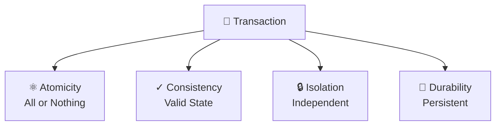
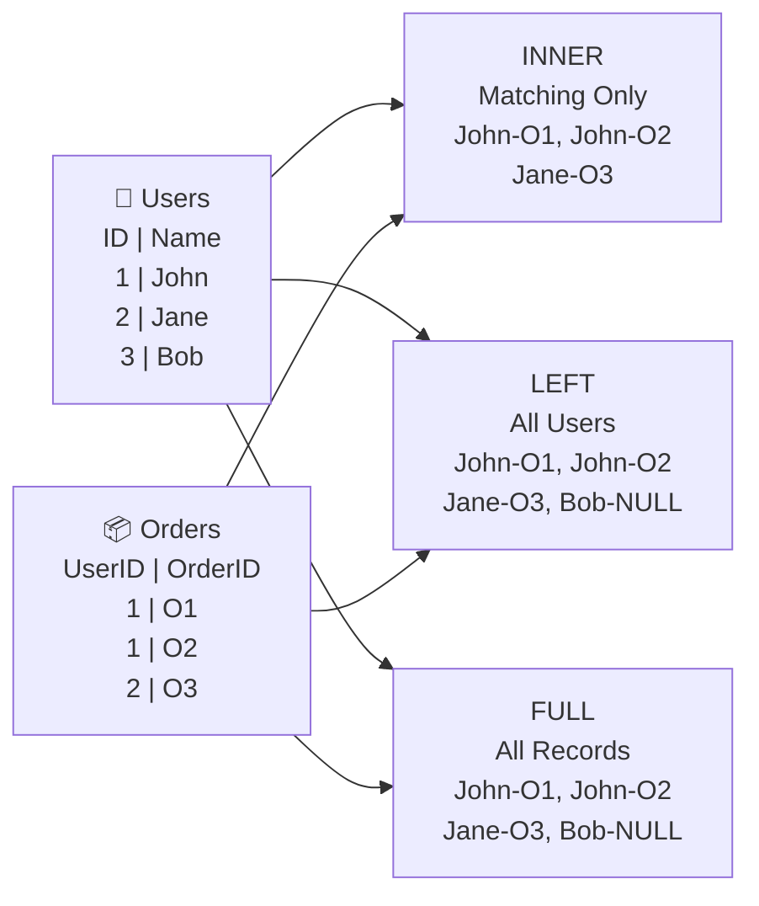
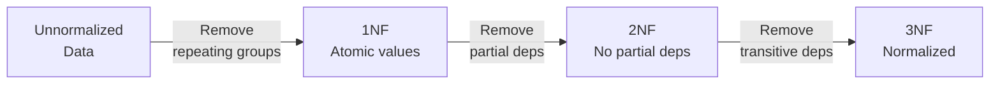
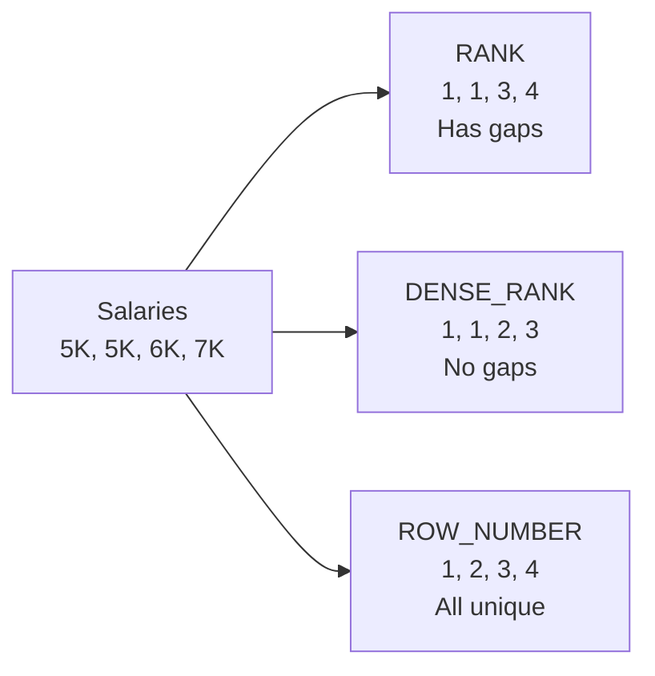

# SQL Interview Questions

## Overview

This folder contains comprehensive interview questions for SQL developers, covering SQL fundamentals, query optimization, database design, and advanced SQL concepts.

## Topics Covered

### SQL Fundamentals

- **SELECT Statement** - Retrieving data
- **WHERE Clause** - Filtering conditions
- **AND, OR, NOT** - Logical operators
- **ORDER BY** - Sorting results
- **DISTINCT** - Removing duplicates
- **LIMIT/OFFSET** - Pagination
- **NULL Handling** - IS NULL, IS NOT NULL
- **LIKE & Wildcards** - Pattern matching
- **IN & BETWEEN** - Range queries
- **Data Types** - INT, VARCHAR, DATE, etc.

### JOIN Operations

- **INNER JOIN** - Intersection of tables
- **LEFT JOIN** - Left table + matching right
- **RIGHT JOIN** - Right table + matching left
- **FULL OUTER JOIN** - All records from both tables
- **CROSS JOIN** - Cartesian product
- **Self JOIN** - Joining table with itself
- **Multiple JOINs** - Complex joins
- **JOIN Conditions** - ON vs WHERE

### Aggregate Functions

- **COUNT()** - Count records
- **SUM()** - Sum of values
- **AVG()** - Average value
- **MIN() / MAX()** - Minimum/Maximum
- **GROUP BY** - Grouping results
- **HAVING** - Filtering groups
- **PARTITION BY** - Window functions

### Subqueries & CTE

- **Subqueries** - Nested queries
- **Scalar Subqueries** - Single value
- **Table Subqueries** - Multiple rows/cols
- **Correlated Subqueries** - Reference outer query
- **CTE (Common Table Expressions)** - WITH clause
- **Recursive CTE** - Hierarchical data

### Advanced SQL

- **UNION / UNION ALL** - Combining queries
- **INTERSECT** - Common records
- **EXCEPT** - Difference between sets
- **CASE Statement** - Conditional logic
- **COALESCE** - Handling NULL values
- **String Functions** - CONCAT, SUBSTRING, etc.
- **Date Functions** - GETDATE, DATEADD, etc.
- **Math Functions** - ROUND, FLOOR, CEIL, etc.

### Stored Procedures & Functions

- **Stored Procedures** - Reusable SQL code
- **Parameters** - Input/output parameters
- **Return Values** - Procedure results
- **User-Defined Functions** - Custom functions
- **Scalar Functions** - Single value return
- **Table-Valued Functions** - Multiple rows/cols
- **Triggers** - Automatic actions

### Database Design

- **Normalization** - 1NF, 2NF, 3NF, BCNF
- **Entity Relationships** - One-to-one, One-to-many
- **Primary Keys** - Unique identifiers
- **Foreign Keys** - Referential integrity
- **Indexes** - Query performance
- **Constraints** - UNIQUE, CHECK, DEFAULT
- **Data Integrity** - Maintaining consistency

### Performance Optimization

- **Query Optimization** - Execution plans
- **Indexing** - B-tree, Hash indexes
- **Clustered vs Non-clustered** - Index types
- **Query Plans** - EXPLAIN, Execution analysis
- **Slow Query Debugging** - SLOW LOG
- **Joins Optimization** - JOIN strategies
- **Aggregation Optimization** - GROUP BY performance
- **Caching** - Query result caching

### Advanced Concepts

- **Transactions** - ACID properties
- **Isolation Levels** - Consistency levels
- **Locking** - Preventing conflicts
- **Deadlocks** - Detection and resolution
- **Views** - Virtual tables
- **Materialized Views** - Precomputed results
- **Partitioning** - Large table optimization
- **Replication** - Data duplication

### Database Administration

- **Backup & Recovery** - Data safety
- **User Management** - Permissions
- **Security** - Encryption, Authentication
- **Monitoring** - Performance metrics
- **Maintenance** - Index rebuilding
- **Scaling** - Horizontal/Vertical

## Interview Levels

### Junior Developer

- Basic SELECT, WHERE
- Simple JOINs
- Basic aggregate functions
- ORDER BY, GROUP BY
- Simple subqueries
- Basic indexing

### Mid-Level Developer

- Complex JOINs
- Window functions
- CTEs
- Stored procedures
- Query optimization
- Database design
- Transactions

### Senior Developer

- Advanced optimization
- Partitioning strategies
- Replication design
- Performance tuning
- Architecture design
- Scaling strategies
- Leadership

---

## Key Competencies

✅ SQL mastery  
✅ Query optimization  
✅ Database design  
✅ Indexing strategies  
✅ Transaction handling  
✅ Performance tuning  
✅ Problem-solving  
✅ Database security

## Popular SQL Databases

- **MySQL** - Open source, web applications
- **PostgreSQL** - Advanced, enterprise
- **SQL Server** - Microsoft, enterprise
- **Oracle** - Large-scale, enterprise
- **SQLite** - Lightweight, embedded
- **MariaDB** - MySQL alternative

## Recommended Learning Path

1. Master SELECT, WHERE, JOINs
2. Learn aggregate functions
3. Study database design
4. Optimize queries
5. Learn stored procedures
6. Understand transactions
7. Master indexing
8. Study security

## Resources

- **SQL Tutorial:** https://www.w3schools.com/sql/
- **PostgreSQL Docs:** https://www.postgresql.org/docs/
- **MySQL Docs:** https://dev.mysql.com/doc/
- **SQL Server Docs:** https://learn.microsoft.com/en-us/sql/

---

**Note:** This folder will be populated with detailed interview questions and answers for SQL and Database positions.

---

# SQL Interview Questions & Answers

## 1. ACID Properties

### Question

Explain ACID properties in database transactions?

### Answer

**A - Atomicity:** All or nothing

- Either all operations complete or none do
- No partial transactions

**C - Consistency:** Data integrity

- Database moves from one valid state to another
- Constraints maintained

**I - Isolation:** Concurrent transactions don't interfere

- Each transaction is independent
- Prevents dirty reads, phantom reads

**D - Durability:** Committed data persists

- Once committed, data survives failures
- Stored in persistent storage

### Mermaid Diagram



### Real-World Example

```sql
-- Money transfer transaction
BEGIN TRANSACTION;

-- Debit account A
UPDATE accounts SET balance = balance - 100 WHERE id = 1;

-- Credit account B
UPDATE accounts SET balance = balance + 100 WHERE id = 2;

COMMIT; -- All or nothing!
```

---

## 2. JOINs (INNER, LEFT, RIGHT, FULL)

### Question

Explain different types of JOINs with examples?

### Answer

### INNER JOIN

Returns only matching records from both tables.

```sql
SELECT u.name, o.order_id
FROM users u
INNER JOIN orders o ON u.id = o.user_id;
```

### LEFT JOIN

All records from left table + matching from right.

```sql
SELECT u.name, o.order_id
FROM users u
LEFT JOIN orders o ON u.id = o.user_id;
-- Returns users with NULL orders
```

### RIGHT JOIN

All records from right table + matching from left.

```sql
SELECT u.name, o.order_id
FROM users u
RIGHT JOIN orders o ON u.id = o.user_id;
```

### FULL OUTER JOIN

All records from both tables.

```sql
SELECT u.name, o.order_id
FROM users u
FULL OUTER JOIN orders o ON u.id = o.user_id;
```

### Mermaid Comparison



### Real-World Example

```sql
-- E-commerce: Find customers and their orders
SELECT
  c.customer_name,
  COUNT(o.order_id) as total_orders,
  SUM(o.amount) as total_spent
FROM customers c
LEFT JOIN orders o ON c.id = o.customer_id
GROUP BY c.id, c.customer_name
ORDER BY total_spent DESC;

-- Returns all customers, even those with 0 orders
```

---

## 3. GROUP BY and HAVING

### Question

Explain GROUP BY and HAVING with examples?

### Answer

**GROUP BY:** Aggregate data by groups
**HAVING:** Filter groups (like WHERE for aggregates)

```sql
-- Sales by product
SELECT
  product_id,
  COUNT(*) as sales_count,
  SUM(amount) as total_revenue
FROM sales
GROUP BY product_id
HAVING SUM(amount) > 1000; -- Only products with revenue > 1000
```

### Difference: WHERE vs HAVING

```sql
-- WHERE: Filter rows BEFORE grouping
SELECT
  product_id,
  SUM(amount) as total
FROM sales
WHERE year = 2024            -- Filters rows
GROUP BY product_id
HAVING SUM(amount) > 1000;   -- Filters groups
```

### Real-World Example

```sql
-- Find departments with average salary > $50,000
SELECT
  department,
  AVG(salary) as avg_salary,
  COUNT(*) as employee_count
FROM employees
GROUP BY department
HAVING AVG(salary) > 50000
ORDER BY avg_salary DESC;
```

---

## 4. Common Table Expressions (CTE)

### Question

Explain CTEs with examples?

### Answer

CTE (WITH clause) creates temporary result set.

```sql
-- Simple CTE
WITH high_earners AS (
  SELECT id, name, salary
  FROM employees
  WHERE salary > 100000
)
SELECT * FROM high_earners;

-- CTE in JOIN
WITH sales_summary AS (
  SELECT customer_id, SUM(amount) as total_spent
  FROM orders
  GROUP BY customer_id
)
SELECT c.name, ss.total_spent
FROM customers c
JOIN sales_summary ss ON c.id = ss.customer_id;
```

### Recursive CTE Example

```sql
-- Find all subordinates in organization hierarchy
WITH RECURSIVE employees_hierarchy AS (
  -- Base case: Start with CEO
  SELECT id, name, manager_id, 1 as level
  FROM employees
  WHERE manager_id IS NULL

  UNION ALL

  -- Recursive case: Get subordinates
  SELECT e.id, e.name, e.manager_id, eh.level + 1
  FROM employees e
  JOIN employees_hierarchy eh ON e.manager_id = eh.id
)
SELECT * FROM employees_hierarchy
ORDER BY level, name;
```

---

## 5. Normalization (1NF, 2NF, 3NF)

### Question

Explain database normalization forms?

### Answer

### First Normal Form (1NF)

- No repeating groups
- Atomic values only

```sql
-- ❌ Not 1NF - repeating phones
CREATE TABLE users_bad (
  id INT,
  name VARCHAR(100),
  phones VARCHAR(100) -- '123-456, 789-012'
);

-- ✅ 1NF - atomic values
CREATE TABLE users (
  id INT,
  name VARCHAR(100)
);

CREATE TABLE phones (
  id INT,
  user_id INT,
  phone VARCHAR(20)
);
```

### Second Normal Form (2NF)

- Must be 1NF
- No partial dependencies

```sql
-- ❌ Not 2NF - partial dependency
CREATE TABLE orders_bad (
  order_id INT,
  product_id INT,
  customer_name VARCHAR(100), -- Depends on order_id, not product_id
  PRIMARY KEY (order_id, product_id)
);

-- ✅ 2NF
CREATE TABLE orders (
  order_id INT PRIMARY KEY,
  customer_id INT
);

CREATE TABLE order_items (
  order_id INT,
  product_id INT,
  PRIMARY KEY (order_id, product_id)
);
```

### Third Normal Form (3NF)

- Must be 2NF
- No transitive dependencies

```sql
-- ❌ Not 3NF - transitive dependency
CREATE TABLE students_bad (
  student_id INT,
  name VARCHAR(100),
  department_id INT,
  department_name VARCHAR(100) -- Depends on department_id, not student_id
);

-- ✅ 3NF
CREATE TABLE students (
  student_id INT PRIMARY KEY,
  name VARCHAR(100),
  department_id INT
);

CREATE TABLE departments (
  department_id INT PRIMARY KEY,
  department_name VARCHAR(100)
);
```

### Mermaid Progression



---

## 6. Indexes (Clustered vs Non-clustered)

### Question

Explain clustered and non-clustered indexes?

### Answer

| Feature     | Clustered         | Non-Clustered |
| ----------- | ----------------- | ------------- |
| Count       | 1 per table       | Multiple      |
| Primary Key | Usually yes       | No            |
| Sort Order  | Defines row order | Separate      |
| Speed       | Faster            | Slower        |
| Storage     | Inherent          | Extra         |

### Clustered Index Example

```sql
-- Creates clustered index on user_id
CREATE CLUSTERED INDEX idx_user_id
ON users(id);

-- Rows sorted physically by id
-- Much faster searches on id
```

### Non-Clustered Index

```sql
-- Creates non-clustered index on email
CREATE NONCLUSTERED INDEX idx_email
ON users(email);

-- Separate B-tree structure pointing to clustered index
-- Faster email searches without sorting all data
```

### Real-World Performance

```sql
-- Without index - scans all 1M rows
SELECT * FROM users WHERE email = 'john@example.com'; -- 500ms

-- With index - binary search
CREATE NONCLUSTERED INDEX idx_email ON users(email);
SELECT * FROM users WHERE email = 'john@example.com'; -- 5ms
```

---

## 7. Query Optimization

### Question

How do you optimize slow queries?

### Answer

### Step 1: Analyze with EXPLAIN

```sql
-- See execution plan
EXPLAIN SELECT * FROM users WHERE email = 'john@example.com';
-- Shows if full table scan or index used
```

### Step 2: Add Indexes

```sql
-- Before: Full table scan
SELECT * FROM orders WHERE customer_id = 5;

-- After: Create index
CREATE INDEX idx_customer_id ON orders(customer_id);
-- Now uses index - much faster
```

### Step 3: Optimize Joins

```sql
-- ❌ Inefficient - large cartesian product
SELECT u.*, o.*
FROM users u, orders o
WHERE u.id = o.user_id;

-- ✅ Efficient - explicit join
SELECT u.*, o.*
FROM users u
INNER JOIN orders o ON u.id = o.user_id;
```

### Real-World Example

```sql
-- Slow query
SELECT * FROM customers c
WHERE c.id IN (
  SELECT customer_id FROM orders WHERE amount > 1000
);

-- Optimized with JOIN
SELECT DISTINCT c.*
FROM customers c
INNER JOIN orders o ON c.id = o.customer_id
WHERE o.amount > 1000;

-- Or with CTE
WITH big_spenders AS (
  SELECT DISTINCT customer_id
  FROM orders
  WHERE amount > 1000
)
SELECT c.*
FROM customers c
WHERE c.id IN (SELECT customer_id FROM big_spenders);
```

---

## 8. Nth Highest Salary Query

### Question

Find the Nth highest salary from employees table?

### Answer

```sql
-- Find 3rd highest salary
SELECT DISTINCT salary
FROM employees
ORDER BY salary DESC
LIMIT 1 OFFSET 2;

-- Or using window functions
WITH ranked_salaries AS (
  SELECT salary,
         DENSE_RANK() OVER (ORDER BY salary DESC) as rank
  FROM employees
)
SELECT salary
FROM ranked_salaries
WHERE rank = 3;
```

### Real-World Example

```sql
-- Top 5 highest earners with their details
SELECT
  name,
  salary,
  DENSE_RANK() OVER (ORDER BY salary DESC) as salary_rank
FROM employees
WHERE DENSE_RANK() OVER (ORDER BY salary DESC) <= 5;

-- Or simpler
WITH top_earners AS (
  SELECT name, salary,
         ROW_NUMBER() OVER (ORDER BY salary DESC) as rank
  FROM employees
)
SELECT name, salary
FROM top_earners
WHERE rank <= 5;
```

---

## 9. DELETE vs DROP vs TRUNCATE

### Question

Difference between DELETE, DROP, and TRUNCATE?

### Answer

| Operation | DELETE    | DROP  | TRUNCATE  |
| --------- | --------- | ----- | --------- |
| Type      | DML       | DDL   | DDL       |
| Removes   | Rows      | Table | Rows      |
| Speed     | Slow      | Fast  | Very Fast |
| Rollback  | Yes       | Yes   | Depends   |
| Identity  | Preserved | Reset | Reset     |

### Examples

```sql
-- DELETE - removes rows, can use WHERE
DELETE FROM employees WHERE id = 5;
DELETE FROM employees; -- All rows, but structure remains

-- DROP - removes entire table
DROP TABLE employees; -- Table gone!

-- TRUNCATE - removes all rows, fast
TRUNCATE TABLE employees; -- Faster than DELETE
```

### Real-World Scenario

```sql
-- Clear old logs but keep table structure
TRUNCATE TABLE activity_logs; -- Fast, no rollback needed

-- Remove specific users
DELETE FROM users WHERE status = 'inactive';

-- Archive and drop old table
DROP TABLE users_2020;
```

---

## 10. Window Functions (RANK vs DENSE_RANK)

### Question

Difference between RANK and DENSE_RANK?

### Answer

```sql
-- Sample data: salaries [5000, 5000, 6000, 7000]

-- RANK - has gaps
SELECT name, salary,
       RANK() OVER (ORDER BY salary DESC) as rank
FROM employees;
-- Results: 1, 1, 3, 4 (gap at 3)

-- DENSE_RANK - no gaps
SELECT name, salary,
       DENSE_RANK() OVER (ORDER BY salary DESC) as rank
FROM employees;
-- Results: 1, 1, 2, 3 (no gaps)

-- ROW_NUMBER - unique
SELECT name, salary,
       ROW_NUMBER() OVER (ORDER BY salary DESC) as rank
FROM employees;
-- Results: 1, 2, 3, 4 (always unique)
```

### Real-World Example

```sql
-- Sales rankings per region
SELECT
  salesman_name,
  region,
  sales,
  RANK() OVER (PARTITION BY region ORDER BY sales DESC) as region_rank,
  RANK() OVER (ORDER BY sales DESC) as overall_rank
FROM sales_data;

-- Each region has its own ranking
```

### Mermaid Comparison


