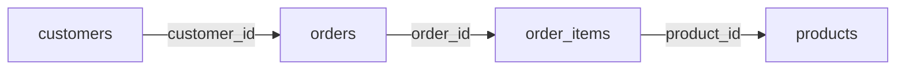
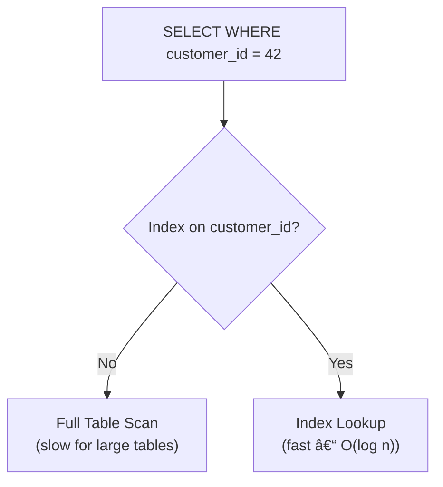
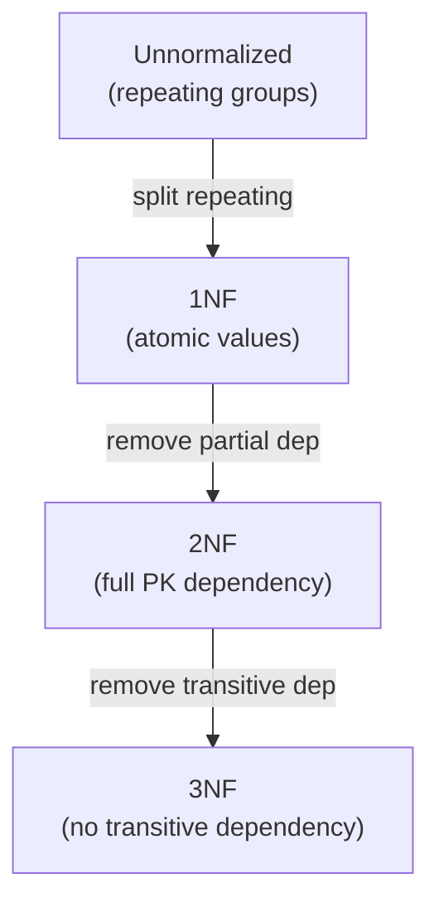
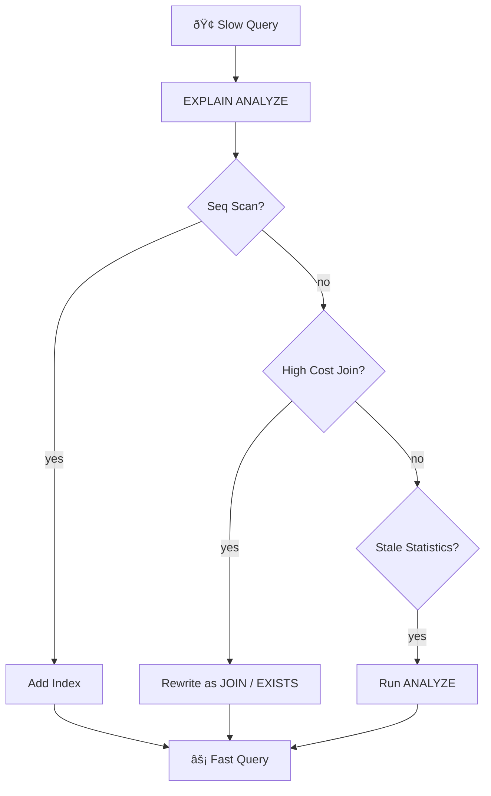

# SQL Interview Questions & Answers

## 1. SELECT, WHERE & Filtering

### Question
Write a query to find all orders above $500 placed in the last 30 days.

### Answer

```sql
SELECT
    o.order_id,
    o.customer_id,
    c.name          AS customer_name,
    o.total_amount,
    o.created_at
FROM orders o
JOIN customers c ON c.id = o.customer_id
WHERE
    o.total_amount > 500
    AND o.created_at >= CURRENT_DATE - INTERVAL '30 days'
    AND o.status != 'cancelled'
ORDER BY o.total_amount DESC;
```

### Pattern Matching & NULL Handling

```sql
-- LIKE: customers whose email is a Gmail address
SELECT * FROM customers
WHERE email LIKE '%@gmail.com'
  AND phone IS NOT NULL;

-- IN: orders in specific statuses
SELECT * FROM orders
WHERE status IN ('pending', 'processing', 'shipped');

-- BETWEEN: products in a price range
SELECT name, price FROM products
WHERE price BETWEEN 100 AND 500;

-- COALESCE: replace NULL with a default
SELECT name, COALESCE(phone, 'N/A') AS contact
FROM customers;
```

---

## 2. JOIN Operations

### Question
Explain the different types of JOINs with a real e-commerce schema.

### Answer

```sql
-- Schema
-- customers(id, name, email)
-- orders(id, customer_id, total, status, created_at)
-- order_items(id, order_id, product_id, qty, price)
-- products(id, name, category, price, stock)

-- INNER JOIN – only customers who have placed orders
SELECT c.name, COUNT(o.id) AS order_count, SUM(o.total) AS lifetime_value
FROM customers c
INNER JOIN orders o ON o.customer_id = c.id
GROUP BY c.id, c.name
ORDER BY lifetime_value DESC;

-- LEFT JOIN – ALL customers, including those with no orders
SELECT c.name, COALESCE(COUNT(o.id), 0) AS order_count
FROM customers c
LEFT JOIN orders o ON o.customer_id = c.id
GROUP BY c.id, c.name;

-- Self JOIN – find customers referred by other customers
SELECT
    r.name AS referrer,
    u.name AS referred_user
FROM customers u
JOIN customers r ON r.id = u.referred_by_id;

-- Multiple JOINs – full order breakdown
SELECT
    c.name        AS customer,
    o.id          AS order_id,
    p.name        AS product,
    oi.qty,
    oi.price,
    oi.qty * oi.price AS line_total
FROM orders o
JOIN customers   c  ON c.id  = o.customer_id
JOIN order_items oi ON oi.order_id = o.id
JOIN products    p  ON p.id  = oi.product_id
WHERE o.status = 'delivered';
```

### Diagram



---

## 3. Aggregate Functions & GROUP BY

### Question
Write a query to generate a monthly sales report by product category.

### Answer

```sql
SELECT
    p.category,
    DATE_TRUNC('month', o.created_at)   AS month,
    COUNT(DISTINCT o.id)                AS order_count,
    SUM(oi.qty)                         AS units_sold,
    SUM(oi.qty * oi.price)              AS revenue,
    AVG(oi.qty * oi.price)              AS avg_order_value,
    MIN(oi.price)                       AS min_price,
    MAX(oi.price)                       AS max_price
FROM orders o
JOIN order_items oi ON oi.order_id = o.id
JOIN products    p  ON p.id  = oi.product_id
WHERE o.status = 'delivered'
  AND o.created_at >= CURRENT_DATE - INTERVAL '12 months'
GROUP BY p.category, DATE_TRUNC('month', o.created_at)
HAVING SUM(oi.qty * oi.price) > 1000   -- only categories with >$1K revenue
ORDER BY month DESC, revenue DESC;
```

### Window Functions (PARTITION BY)

```sql
-- Rank products by revenue within each category
SELECT
    p.name,
    p.category,
    SUM(oi.qty * oi.price)  AS revenue,
    RANK()    OVER (PARTITION BY p.category ORDER BY SUM(oi.qty * oi.price) DESC) AS rank_in_cat,
    ROW_NUMBER() OVER (ORDER BY SUM(oi.qty * oi.price) DESC)                      AS overall_rank,
    SUM(SUM(oi.qty * oi.price)) OVER (PARTITION BY p.category)                   AS category_total
FROM order_items oi
JOIN products p ON p.id = oi.product_id
GROUP BY p.id, p.name, p.category;
```

---

## 4. Subqueries & CTEs

### Question
Find the top 3 customers by revenue per region using a CTE.

### Answer

```sql
-- CTE (WITH clause) – readable, reusable within the query
WITH customer_revenue AS (
    SELECT
        c.id,
        c.name,
        c.region,
        SUM(o.total) AS total_spent
    FROM customers c
    JOIN orders o ON o.customer_id = c.id
    WHERE o.status = 'delivered'
    GROUP BY c.id, c.name, c.region
),
ranked AS (
    SELECT
        *,
        RANK() OVER (PARTITION BY region ORDER BY total_spent DESC) AS rank
    FROM customer_revenue
)
SELECT region, name, total_spent
FROM ranked
WHERE rank <= 3
ORDER BY region, rank;
```

### Correlated Subquery

```sql
-- Find products whose price is above their category average
SELECT name, category, price
FROM products p
WHERE price > (
    SELECT AVG(price)
    FROM products
    WHERE category = p.category  -- references outer query
);
```

### Recursive CTE – Employee Hierarchy

```sql
-- employees(id, name, manager_id)
WITH RECURSIVE org_chart AS (
    -- Anchor: top-level employees (no manager)
    SELECT id, name, manager_id, 0 AS level, name::TEXT AS path
    FROM employees
    WHERE manager_id IS NULL

    UNION ALL

    -- Recursive: each employee's reports
    SELECT e.id, e.name, e.manager_id, oc.level + 1, oc.path || ' > ' || e.name
    FROM employees e
    JOIN org_chart oc ON oc.id = e.manager_id
)
SELECT level, path FROM org_chart ORDER BY path;
```

---

## 5. Indexes & Query Performance

### Question
How do indexes work and when should you create them?

### Answer

```sql
-- B-tree index (default) – equality + range queries
CREATE INDEX idx_orders_customer ON orders(customer_id);
CREATE INDEX idx_orders_created  ON orders(created_at DESC);

-- Composite index – supports queries filtering on BOTH columns
CREATE INDEX idx_orders_status_date ON orders(status, created_at);
-- Efficient for: WHERE status = 'pending' AND created_at > ...
-- NOT efficient for: WHERE created_at > ... (status not in lead position)

-- Partial index – only index the rows you actually query
CREATE INDEX idx_orders_pending ON orders(created_at)
WHERE status = 'pending';  -- smaller, faster

-- Covering index – avoids table lookup entirely
CREATE INDEX idx_products_search ON products(category, price)
INCLUDE (name, stock);  -- PostgreSQL INCLUDE syntax

-- Unique index – constraint + performance
CREATE UNIQUE INDEX idx_customers_email ON customers(email);
```

### EXPLAIN ANALYZE – Reading Query Plans

```sql
EXPLAIN ANALYZE
SELECT c.name, SUM(o.total)
FROM customers c
JOIN orders o ON o.customer_id = c.id
GROUP BY c.id;

-- Look for:
-- Seq Scan  → full table scan (no index)
-- Index Scan / Index Only Scan → using an index ✅
-- Hash Join / Nested Loop / Merge Join → join strategy
-- Actual rows vs Estimated rows → stale statistics? Run ANALYZE
```

### Diagram



---

## 6. Stored Procedures & Functions

### Question
Write a stored procedure to process an order with stock validation.

### Answer

```sql
-- PostgreSQL stored procedure
CREATE OR REPLACE PROCEDURE place_order(
    p_customer_id  INT,
    p_items        JSON,    -- [{"product_id":1,"qty":2}, ...]
    OUT p_order_id INT
)
LANGUAGE plpgsql AS $$
DECLARE
    v_product   RECORD;
    v_item      JSON;
    v_total     NUMERIC := 0;
BEGIN
    -- Validate stock for all items first
    FOR v_item IN SELECT * FROM json_array_elements(p_items)
    LOOP
        SELECT id, price, stock
        INTO v_product
        FROM products
        WHERE id = (v_item->>'product_id')::INT
        FOR UPDATE;  -- lock row

        IF v_product.stock < (v_item->>'qty')::INT THEN
            RAISE EXCEPTION 'Insufficient stock for product %', v_product.id;
        END IF;

        v_total := v_total + v_product.price * (v_item->>'qty')::INT;
    END LOOP;

    -- Create order
    INSERT INTO orders (customer_id, total, status)
    VALUES (p_customer_id, v_total, 'pending')
    RETURNING id INTO p_order_id;

    -- Insert items and decrement stock
    FOR v_item IN SELECT * FROM json_array_elements(p_items)
    LOOP
        INSERT INTO order_items (order_id, product_id, qty, price)
        SELECT p_order_id,
               (v_item->>'product_id')::INT,
               (v_item->>'qty')::INT,
               price
        FROM products WHERE id = (v_item->>'product_id')::INT;

        UPDATE products
        SET stock = stock - (v_item->>'qty')::INT
        WHERE id  = (v_item->>'product_id')::INT;
    END LOOP;

EXCEPTION
    WHEN OTHERS THEN
        RAISE;  -- rollback happens automatically
END;
$$;

-- User-defined function (scalar)
CREATE OR REPLACE FUNCTION get_discount_price(
    p_price    NUMERIC,
    p_tier     VARCHAR
) RETURNS NUMERIC AS $$
BEGIN
    RETURN CASE p_tier
        WHEN 'gold'     THEN p_price * 0.80
        WHEN 'silver'   THEN p_price * 0.90
        WHEN 'bronze'   THEN p_price * 0.95
        ELSE p_price
    END;
END;
$$ LANGUAGE plpgsql IMMUTABLE;

-- Usage
SELECT name, price, get_discount_price(price, 'gold') AS gold_price
FROM products;
```

---

## 7. Transactions & ACID Properties

### Question
Explain ACID and write a transaction for a bank transfer.

### Answer

| Property | Meaning | Example |
|---|---|---|
| Atomicity | All-or-nothing | Both debit & credit succeed or neither does |
| Consistency | Data rules always valid | Balance never goes negative |
| Isolation | Concurrent txns don't interfere | Two transfers don't corrupt each other |
| Durability | Committed data survives crashes | Written to disk |

```sql
-- Bank transfer with full error handling
BEGIN;

    -- Lock both accounts in consistent order (lower id first) to avoid deadlock
    SELECT balance FROM accounts WHERE id = LEAST(1, 2)    FOR UPDATE;
    SELECT balance FROM accounts WHERE id = GREATEST(1, 2) FOR UPDATE;

    -- Validate sufficient funds
    DO $$
    DECLARE v_balance NUMERIC;
    BEGIN
        SELECT balance INTO v_balance FROM accounts WHERE id = 1;
        IF v_balance < 500 THEN
            RAISE EXCEPTION 'Insufficient funds: balance=%, required=500', v_balance;
        END IF;
    END $$;

    -- Debit sender
    UPDATE accounts SET balance = balance - 500 WHERE id = 1;

    -- Credit receiver
    UPDATE accounts SET balance = balance + 500 WHERE id = 2;

    -- Audit log
    INSERT INTO transfer_log (from_account, to_account, amount, transferred_at)
    VALUES (1, 2, 500, NOW());

COMMIT;
-- On any error, PostgreSQL automatically rolls back
```

### Isolation Levels

```sql
-- READ COMMITTED (default PostgreSQL) – sees committed data at each statement
SET TRANSACTION ISOLATION LEVEL READ COMMITTED;

-- REPEATABLE READ – same rows seen throughout the transaction
SET TRANSACTION ISOLATION LEVEL REPEATABLE READ;

-- SERIALIZABLE – strongest: transactions appear to run sequentially
SET TRANSACTION ISOLATION LEVEL SERIALIZABLE;
```

---

## 8. Database Normalization

### Question
Explain normalization forms with an e-commerce example.

### Answer

### Unnormalized (0NF) – Problems

```sql
-- orders table with repeating groups and redundant data
-- order_id | customer_name | customer_email | product1 | qty1 | product2 | qty2
-- 101      | Alice         | a@a.com        | Laptop   | 1    | Mouse    | 2
```

### 1NF – Atomic values, no repeating groups

```sql
CREATE TABLE orders (
    order_id    INT,
    customer_name  VARCHAR(100),
    customer_email VARCHAR(100),
    product     VARCHAR(100),
    qty         INT,
    price       DECIMAL(10,2)
);
-- Problem: customer data repeats for every item → update anomaly
```

### 2NF – Remove partial dependencies (all columns depend on full PK)

```sql
CREATE TABLE orders    (order_id INT PRIMARY KEY, customer_id INT, created_at TIMESTAMP);
CREATE TABLE customers (id INT PRIMARY KEY, name VARCHAR(100), email VARCHAR(100));
CREATE TABLE order_items (
    order_id   INT REFERENCES orders(order_id),
    product_id INT REFERENCES products(id),
    qty        INT,
    price      DECIMAL(10,2),
    PRIMARY KEY (order_id, product_id)
);
```

### 3NF – Remove transitive dependencies

```sql
CREATE TABLE products (
    id          INT PRIMARY KEY,
    name        VARCHAR(100),
    category_id INT REFERENCES categories(id),  -- category extracted
    price       DECIMAL(10,2)
);
CREATE TABLE categories (id INT PRIMARY KEY, name VARCHAR(50), description TEXT);
-- Now category name & description live only in categories table
```

### Diagram



---

## 9. Views & Materialized Views

### Question
When would you use a view vs a materialized view?

### Answer

```sql
-- VIEW – virtual table, executes query on each access
CREATE VIEW v_order_summary AS
SELECT
    o.id,
    c.name          AS customer,
    o.total,
    o.status,
    COUNT(oi.id)    AS item_count
FROM orders o
JOIN customers   c  ON c.id = o.customer_id
JOIN order_items oi ON oi.order_id = o.id
GROUP BY o.id, c.name, o.total, o.status;

-- Use like a table
SELECT * FROM v_order_summary WHERE status = 'pending';

-- MATERIALIZED VIEW – stores results physically, refresh on demand
CREATE MATERIALIZED VIEW mv_daily_sales AS
SELECT
    DATE(created_at)        AS sale_date,
    p.category,
    SUM(oi.qty * oi.price)  AS daily_revenue
FROM orders o
JOIN order_items oi ON oi.order_id = o.id
JOIN products    p  ON p.id = oi.product_id
WHERE o.status = 'delivered'
GROUP BY DATE(created_at), p.category
WITH DATA;

CREATE INDEX ON mv_daily_sales(sale_date, category);

-- Refresh nightly via a cron job
REFRESH MATERIALIZED VIEW CONCURRENTLY mv_daily_sales;
```

| Feature | View | Materialized View |
|---|---|---|
| Storage | No | Yes |
| Performance | Query runs every time | Pre-computed |
| Freshness | Always current | Stale until refreshed |
| Use case | Simple abstraction | Heavy analytics queries |

---

## 10. UNION, INTERSECT & EXCEPT

### Question
When do you use UNION, INTERSECT, and EXCEPT?

### Answer

```sql
-- UNION ALL – combine two result sets (keeps duplicates, faster)
SELECT 'email' AS channel, customer_id, sent_at
FROM email_campaigns
WHERE campaign_id = 42
UNION ALL
SELECT 'sms', customer_id, sent_at
FROM sms_campaigns
WHERE campaign_id = 42;

-- UNION – removes duplicates
SELECT customer_id FROM orders WHERE EXTRACT(YEAR FROM created_at) = 2023
UNION
SELECT customer_id FROM orders WHERE EXTRACT(YEAR FROM created_at) = 2024;

-- INTERSECT – customers who ordered in BOTH years
SELECT customer_id FROM orders WHERE EXTRACT(YEAR FROM created_at) = 2023
INTERSECT
SELECT customer_id FROM orders WHERE EXTRACT(YEAR FROM created_at) = 2024;

-- EXCEPT – customers who ordered in 2023 but NOT 2024 (churned customers)
SELECT customer_id FROM orders WHERE EXTRACT(YEAR FROM created_at) = 2023
EXCEPT
SELECT customer_id FROM orders WHERE EXTRACT(YEAR FROM created_at) = 2024;
```

---

## 11. CASE Statement & Conditional Logic

### Question
Write a query that segments customers by spend tier.

### Answer

```sql
SELECT
    c.name,
    SUM(o.total) AS total_spent,
    CASE
        WHEN SUM(o.total) >= 10000 THEN 'Platinum'
        WHEN SUM(o.total) >= 5000  THEN 'Gold'
        WHEN SUM(o.total) >= 1000  THEN 'Silver'
        ELSE                            'Bronze'
    END AS tier,
    -- Pivot: count orders per status in one row
    COUNT(CASE WHEN o.status = 'delivered'  THEN 1 END) AS delivered_orders,
    COUNT(CASE WHEN o.status = 'cancelled'  THEN 1 END) AS cancelled_orders,
    COUNT(CASE WHEN o.status = 'pending'    THEN 1 END) AS pending_orders
FROM customers c
JOIN orders o ON o.customer_id = c.id
GROUP BY c.id, c.name
ORDER BY total_spent DESC;
```

---

## 12. Query Optimisation Checklist

### Question
How do you optimise a slow SQL query?

### Answer

```sql
-- Step 1: Run EXPLAIN ANALYZE to see the execution plan
EXPLAIN (ANALYZE, BUFFERS, FORMAT TEXT)
SELECT c.name, SUM(o.total)
FROM customers c JOIN orders o ON o.customer_id = c.id
WHERE o.created_at > NOW() - INTERVAL '90 days'
GROUP BY c.id;

-- Step 2: Add missing indexes
-- Seq Scan on orders with filter on created_at → add index
CREATE INDEX CONCURRENTLY idx_orders_created ON orders(created_at DESC);

-- Step 3: Rewrite correlated subquery as a JOIN (often 10-100× faster)
-- ❌ Slow – runs subquery for EVERY row
SELECT name FROM products p
WHERE p.id IN (SELECT product_id FROM order_items);

-- ✅ Fast – single join
SELECT DISTINCT p.name FROM products p
JOIN order_items oi ON oi.product_id = p.id;

-- Step 4: Use EXISTS instead of IN for large subqueries
-- ❌
SELECT * FROM customers WHERE id IN (SELECT customer_id FROM orders);
-- ✅
SELECT * FROM customers c WHERE EXISTS (
    SELECT 1 FROM orders WHERE customer_id = c.id
);

-- Step 5: Avoid SELECT * in production queries
-- ❌
SELECT * FROM orders;
-- ✅
SELECT id, customer_id, total, status FROM orders;

-- Step 6: Pagination – use keyset instead of OFFSET for large tables
-- ❌ Slow – scans and discards first 10000 rows
SELECT * FROM orders ORDER BY id LIMIT 20 OFFSET 10000;

-- ✅ Fast – index seek
SELECT * FROM orders WHERE id > :last_seen_id ORDER BY id LIMIT 20;
```

### Optimisation Diagram



---

## Interview Level Summary

### Junior
| Topic | Key Points |
|---|---|
| SELECT / WHERE | Filtering, ordering, LIKE, IN, BETWEEN |
| JOINs | INNER, LEFT – read query results correctly |
| GROUP BY / HAVING | Aggregates, filtering groups |
| NULL Handling | IS NULL, COALESCE |

### Mid-Level
| Topic | Key Points |
|---|---|
| CTEs | WITH clause, readability |
| Window Functions | RANK, ROW_NUMBER, PARTITION BY |
| Indexes | B-tree, composite, when to create |
| Subqueries | Correlated, EXISTS vs IN |

### Senior
| Topic | Key Points |
|---|---|
| Query Optimisation | EXPLAIN ANALYZE, index strategies |
| Transactions | ACID, isolation levels, deadlock prevention |
| Normalisation | 1NF–3NF trade-offs |
| Stored Procedures | Business logic in DB, error handling |

