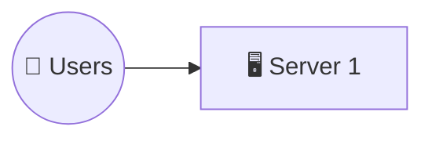
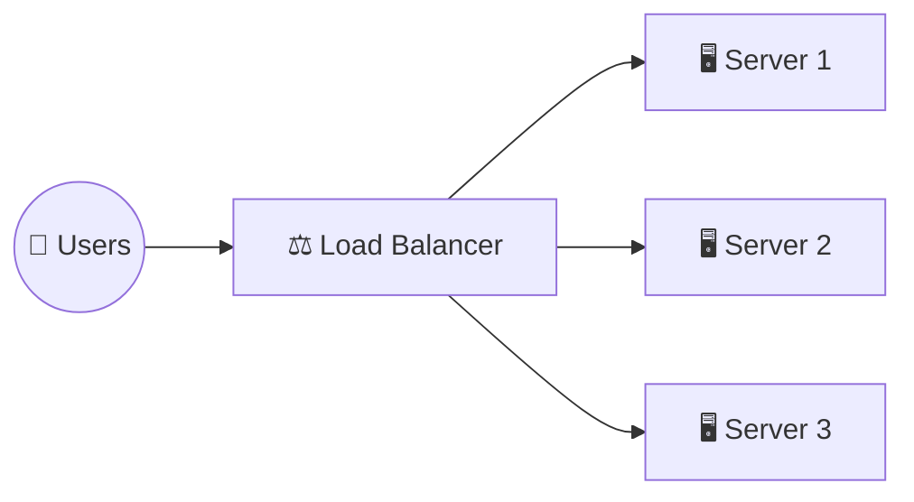
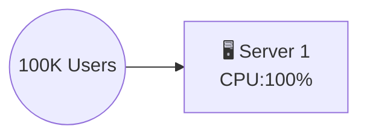
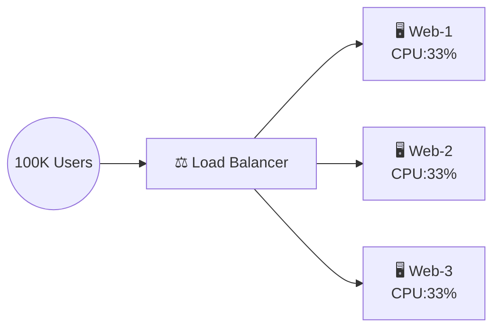
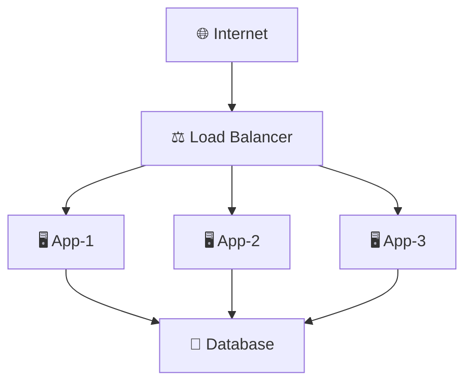
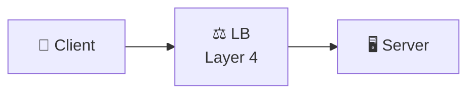
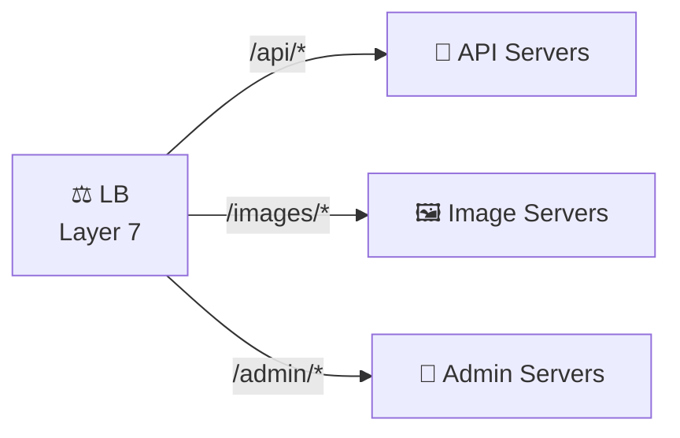
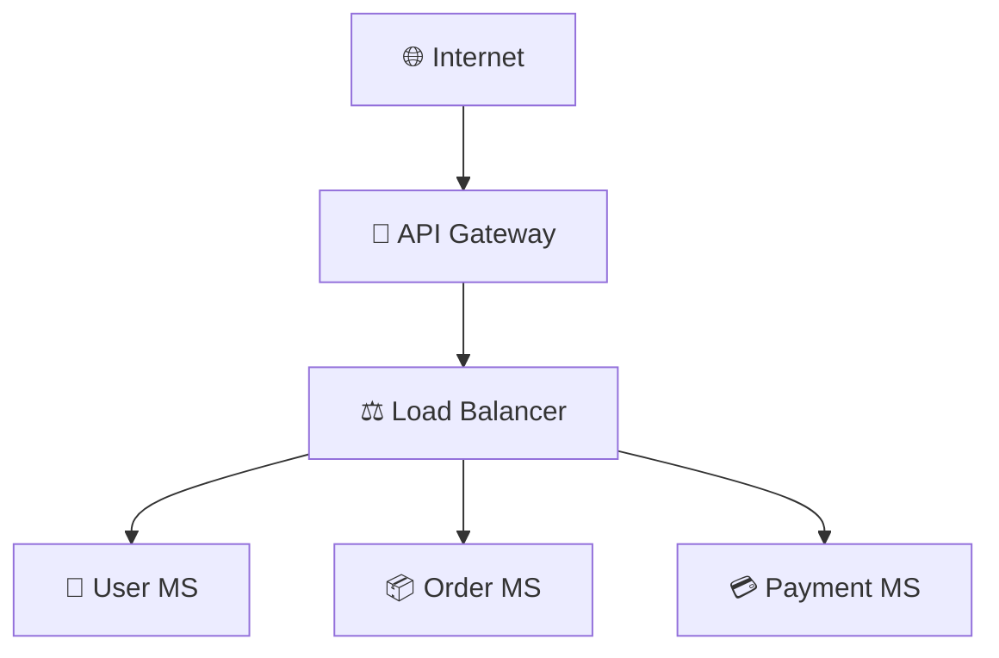
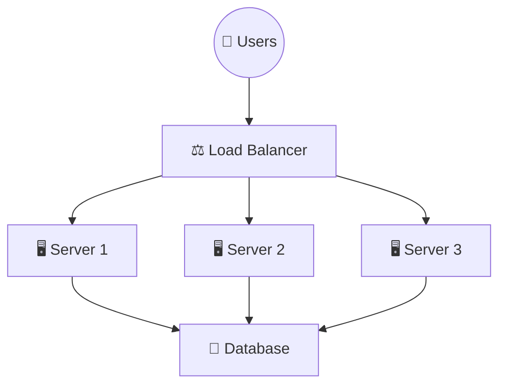

# What is a Load Balancer?

A Load Balancer is a traffic manager that sits between clients and servers and distributes incoming requests across multiple servers.

## Simple Definition

Instead of all users hitting a single server:



We use:



The Load Balancer decides which server should process each request.

---

## Real-World Example (Amazon / Flipkart Sale)

Imagine Amazon's Great Indian Festival Sale.

### Without Load Balancer:



Result:

❌ CPU 100%

❌ Memory Exhausted

❌ Website Crash

❌ Revenue Loss

### With Load Balancer:



Result:

✅ Traffic distributed

✅ Faster response

✅ High availability

✅ No single point of failure

This is exactly why e-commerce platforms rely heavily on load balancing during peak events.

---

## Why Load Balancer is Needed?

### 1. High Availability

If one server crashes:

```
Server1 ❌
Server2 ✅
Server3 ✅
```

Traffic automatically shifts to healthy servers.

---

### 2. Traffic Distribution

Instead of:

```
Server1 = 1000 Requests
Server2 = 0
Server3 = 0
```

We get:

```
Server1 = 333
Server2 = 333
Server3 = 334
```

---

### 3. Better Performance

Users get faster response times because workload is shared.

---

### 4. Scalability

Add more servers:

```
3 Servers
   ↓
10 Servers
   ↓
50 Servers
```

No application redesign required.

---

### 5. Fault Tolerance

Failed servers are removed automatically using Health Checks.

---

## Load Balancer Architecture



Flow:

1. User sends request
2. Request reaches Load Balancer
3. Load Balancer checks server availability
4. Selects best server
5. Sends response back

---

## Types of Load Balancers

### Layer 4 Load Balancer (Transport Layer)

Works on:

- TCP
- UDP

Looks at:

- IP Address
- Port Number

#### Example



LB only checks:

```
IP: 10.0.0.1
Port: 443
```

Does NOT inspect HTTP content.

#### Advantages

✅ Very Fast

✅ Low Latency

#### Examples

- NLB in AWS
- HAProxy TCP Mode

---

### Layer 7 Load Balancer (Application Layer)

Understands:

- HTTP
- HTTPS
- URL
- Headers
- Cookies

#### Example



#### Advantages

✅ Smart Routing

✅ SSL Termination

✅ Content-Based Routing

#### Examples

- Nginx
- Envoy
- AWS ALB

---

## Load Balancing Algorithms

### 1. Round Robin

Traffic distributed sequentially.

```
Request 1 -> Server 1
Request 2 -> Server 2
Request 3 -> Server 3
Request 4 -> Server 1
```

**Best when:**

- Servers have equal capacity

---

### 2. Least Connections

Request goes to server with least active connections.

**Example:**

```
Server1 = 100 Connections
Server2 = 20 Connections

Next Request -> Server2
```

**Best for:**

- Long-running requests

---

### 3. IP Hash

Same user always goes to same server.

```
User A -> Server 1
User B -> Server 2
```

**Useful for:**

- Session persistence

---

### 4. Weighted Round Robin

Powerful servers receive more traffic.

**Example:**

```
Server1 Weight = 5
Server2 Weight = 2
Server3 Weight = 1
```

**Traffic Distribution:**

```
Server1 = 62%
Server2 = 25%
Server3 = 13%
```

---

### 5. Least Response Time

Request goes to fastest server.

**Example:**

```
Server1 = 200ms
Server2 = 40ms
Server3 = 80ms

Request -> Server2
```

---

## Health Checks

One of the most important interview topics.

Load Balancer continuously checks:

```
/health
/status
/ping
```

**Response:**

```
200 OK
```

Server remains active.

**If:**

```
500 Error
```

Server removed from rotation.

---

## Load Balancer in Microservices



**Benefits:**

- Better scaling
- Service isolation
- High availability

---

## Load Balancer in Cloud

### AWS

- Amazon Web Services ALB
- NLB
- Classic ELB

### Azure

- Microsoft Azure Load Balancer
- Application Gateway

### GCP

- Google Cloud Load Balancer

---

## Interview Diagram You Can Draw



This diagram alone can help explain:

- High Availability
- Scalability
- Fault Tolerance
- Horizontal Scaling

---

## Top 10 Load Balancer Interview Questions & Answers

### Q1. What is a Load Balancer?

**Answer:** A Load Balancer distributes incoming traffic across multiple servers to improve availability, performance, and scalability.

---

### Q2. Why is Load Balancing Important?

**Answer:** It prevents server overload, improves response time, provides failover, and supports horizontal scaling.

---

### Q3. Difference Between Layer 4 and Layer 7 Load Balancer?

| Aspect             | Layer 4       | Layer 7              |
| ------------------ | ------------- | -------------------- |
| Works on           | TCP/UDP       | HTTP/HTTPS           |
| Speed              | Faster        | Slower               |
| Intelligence       | Less          | More (Content-aware) |
| Content Inspection | No            | Yes                  |
| Routing            | IP/Port based | URL/Header based     |

---

### Q4. What is Round Robin?

**Answer:** Requests are distributed sequentially among available servers in a circular manner.

---

### Q5. What is Least Connections?

**Answer:** Traffic is routed to the server with the fewest active connections at that moment.

---

### Q6. What is Sticky Session?

**Answer:** A user is consistently routed to the same server using cookies or IP hash, ensuring session persistence.

---

### Q7. What Happens When a Server Fails?

**Answer:** Health checks mark it as unhealthy and traffic is automatically redirected to healthy servers.

---

### Q8. What is SSL Termination?

**Answer:** The Load Balancer decrypts HTTPS traffic from clients and forwards HTTP traffic internally to servers, reducing their computational burden.

---

### Q9. How Does Load Balancer Improve Scalability?

**Answer:** New servers can be added to the pool without changing client applications or redeploying code.

---

### Q10. Design Load Balancer for Amazon During Black Friday Sale

**Expected Answer:**

- Use Layer 7 ALB (Application Load Balancer)
- Auto Scaling Group for dynamic scaling
- Multiple Availability Zones for geographic distribution
- Health Checks every 30 seconds
- CDN for static content delivery
- Cache Layer (Redis) to reduce database load
- Database Replication for read scalability
- Connection pooling
- Rate limiting to prevent abuse
- Monitoring and alerts

---

## Key Takeaways

✅ Load Balancer ensures **no single point of failure**

✅ Enables **horizontal scaling** without code changes

✅ Improves **performance** and **availability**

✅ Layer 4 is fast, Layer 7 is intelligent

✅ Always implement **health checks**

✅ Choose algorithm based on use case

✅ Essential for microservices and cloud architecture
