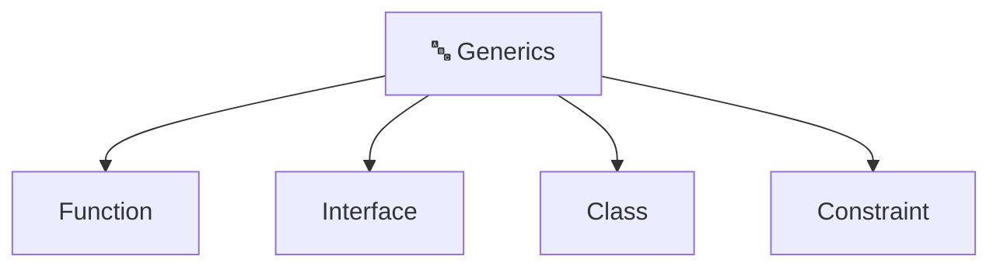

# TypeScript Interview Questions & Answers

## 1. Type Annotations and Interfaces

### Question

Explain type annotations and interfaces in TypeScript?

### Answer

Type annotations specify the type of variables, parameters, and return values.

```typescript
// Basic type annotations
let name: string = "John";
let age: number = 30;
let isActive: boolean = true;
let ids: number[] = [1, 2, 3];

// Function annotations
function greet(name: string): string {
  return `Hello, ${name}`;
}

// Interfaces define object structure
interface User {
  id: number;
  name: string;
  email: string;
  age?: number; // Optional property
}

const user: User = {
  id: 1,
  name: "John",
  email: "john@example.com",
};
```

### Real-World Example

```typescript
interface Product {
  id: number;
  name: string;
  price: number;
  inStock: boolean;
  tags?: string[];
}

interface Order {
  orderId: string;
  products: Product[];
  totalAmount: number;
  createdAt: Date;
}

function calculateOrderTotal(order: Order): number {
  return order.products.reduce((sum, p) => sum + p.price, 0);
}

const myOrder: Order = {
  orderId: "ORD-123",
  products: [
    { id: 1, name: "Laptop", price: 999, inStock: true },
    { id: 2, name: "Mouse", price: 25, inStock: true },
  ],
  totalAmount: 1024,
  createdAt: new Date(),
};
```

---

## 2. Generics

### Question

Explain generics with examples?

### Answer

Generics allow creating reusable components that work with any type.

```typescript
// Generic function
function getFirstElement<T>(arr: T[]): T {
  return arr[0];
}

getFirstElement<string>(["a", "b"]); // "a"
getFirstElement<number>([1, 2, 3]); // 1

// Generic interface
interface Repository<T> {
  getById(id: number): T;
  create(item: T): T;
  update(id: number, item: T): T;
  delete(id: number): void;
}

// Generic class
class UserRepository implements Repository<User> {
  getById(id: number): User {
    // Implementation
    return {} as User;
  }

  create(user: User): User {
    return user;
  }

  update(id: number, user: User): User {
    return user;
  }

  delete(id: number): void {
    // Implementation
  }
}

// Generic with constraints
interface HasId {
  id: number;
}

function getId<T extends HasId>(obj: T): number {
  return obj.id;
}
```

### Mermaid Diagram



---

## 3. Union and Intersection Types

### Question

Explain union and intersection types?

### Answer

```typescript
// Union Type - can be ONE of several types
type StringOrNumber = string | number;

let value: StringOrNumber = "hello"; // OK
value = 42; // OK
value = true; // Error!

// Function with union
function formatValue(val: string | number): string {
  if (typeof val === "string") {
    return val.toUpperCase();
  }
  return val.toFixed(2);
}

// Intersection Type - must have ALL properties
interface Timestamps {
  createdAt: Date;
  updatedAt: Date;
}

interface Identifiable {
  id: number;
}

type TimestampedEntity = Timestamps & Identifiable;

const entity: TimestampedEntity = {
  id: 1,
  createdAt: new Date(),
  updatedAt: new Date(),
};
```

### Real-World Example

```typescript
// API Response handling
type ApiResponse<T> =
  | { status: "success"; data: T }
  | { status: "error"; error: string };

async function fetchUser(id: number): Promise<ApiResponse<User>> {
  try {
    const response = await fetch(`/api/users/${id}`);
    const data = await response.json();
    return { status: "success", data };
  } catch (error) {
    return { status: "error", error: error.message };
  }
}

// Usage
const result = await fetchUser(1);

if (result.status === "success") {
  console.log(result.data.name); // data is User
} else {
  console.log(result.error); // error is string
}
```

---

## 4. Enums

### Question

What are enums and when to use them?

### Answer

Enums allow defining a set of named constants.

```typescript
// String enum
enum Status {
  Active = "ACTIVE",
  Inactive = "INACTIVE",
  Pending = "PENDING",
}

const userStatus: Status = Status.Active;

// Numeric enum
enum Level {
  Low = 1,
  Medium = 2,
  High = 3,
}

const priority: Level = Level.High; // 3

// Enum in function
function getStatusMessage(status: Status): string {
  switch (status) {
    case Status.Active:
      return "User is active";
    case Status.Inactive:
      return "User is inactive";
    case Status.Pending:
      return "User is pending";
  }
}
```

### Real-World Example

```typescript
enum OrderStatus {
  Pending = "PENDING",
  Processing = "PROCESSING",
  Shipped = "SHIPPED",
  Delivered = "DELIVERED",
  Cancelled = "CANCELLED",
}

interface Order {
  id: string;
  status: OrderStatus;
  items: Product[];
}

function canCancelOrder(order: Order): boolean {
  return (
    order.status === OrderStatus.Pending ||
    order.status === OrderStatus.Processing
  );
}

function getStatusColor(status: OrderStatus): string {
  const colors: Record<OrderStatus, string> = {
    [OrderStatus.Pending]: "yellow",
    [OrderStatus.Processing]: "blue",
    [OrderStatus.Shipped]: "purple",
    [OrderStatus.Delivered]: "green",
    [OrderStatus.Cancelled]: "red",
  };
  return colors[status];
}
```

---

## 5. Decorators

### Question

Explain decorators in TypeScript?

### Answer

Decorators provide a way to add metadata or modify classes and properties.

```typescript
// Class decorator
function Component(config: { name: string }) {
  return function <T extends { new (...args: any[]): {} }>(constructor: T) {
    console.log(`Creating component: ${config.name}`);
    return class extends constructor {};
  };
}

@Component({ name: "UserComponent" })
class UserService {
  // ...
}

// Property decorator
function Required(target: any, propertyKey: string) {
  // Mark property as required
}

class User {
  @Required
  name: string;
}

// Method decorator
function Logger(
  target: any,
  propertyKey: string,
  descriptor: PropertyDescriptor,
) {
  const originalMethod = descriptor.value;

  descriptor.value = function (...args: any[]) {
    console.log(`Calling ${propertyKey}`, args);
    return originalMethod.apply(this, args);
  };

  return descriptor;
}

class Calculator {
  @Logger
  add(a: number, b: number): number {
    return a + b;
  }
}
```

---

## 6. Modules and Namespaces

### Question

Explain modules and how to export/import?

### Answer

```typescript
// types.ts
export interface User {
  id: number;
  name: string;
}

export type UserRole = "admin" | "user" | "guest";

// userService.ts
import { User, UserRole } from "./types";

export class UserService {
  async getUser(id: number): Promise<User> {
    // Implementation
    return {} as User;
  }
}

export function hasPermission(role: UserRole): boolean {
  return role !== "guest";
}

// main.ts
import { UserService, hasPermission } from "./userService";
import type { User, UserRole } from "./types";

const userService = new UserService();
const user = await userService.getUser(1);
```

### Named vs Default Export

```typescript
// Named exports
export const API_URL = "https://api.example.com";
export interface Config {
  /* ... */
}

// Default export
export default class Logger {
  log(message: string) {
    console.log(message);
  }
}

// Importing
import Logger from "./logger"; // Default
import { API_URL, Config } from "./constants"; // Named
```

---

## 7. async/await

### Question

Explain async/await in TypeScript?

### Answer

```typescript
// Regular function returning Promise
function fetchUserData(id: number): Promise<User> {
  return fetch(`/api/users/${id}`).then((res) => res.json());
}

// Async/await version
async function fetchUserDataAsync(id: number): Promise<User> {
  const response = await fetch(`/api/users/${id}`);
  return response.json();
}

// Error handling
async function fetchUserWithErrorHandling(id: number): Promise<User | null> {
  try {
    const response = await fetch(`/api/users/${id}`);
    if (!response.ok) throw new Error("User not found");
    return await response.json();
  } catch (error) {
    console.error(error);
    return null;
  }
}

// Parallel operations
async function getUserWithPosts(userId: number) {
  const [user, posts] = await Promise.all([
    fetch(`/api/users/${userId}`).then((r) => r.json()),
    fetch(`/api/posts?userId=${userId}`).then((r) => r.json()),
  ]);

  return { user, posts };
}
```

---

## 8. Utility Types

### Question

Explain common utility types?

### Answer

TypeScript provides built-in utility types for type transformations.

```typescript
interface User {
  id: number;
  name: string;
  email: string;
  password: string;
}

// Partial - makes all properties optional
type PartialUser = Partial<User>;
// { id?: number; name?: string; ... }

// Required - makes all properties required
type RequiredUser = Required<User>;

// Readonly - makes all properties readonly
type ReadonlyUser = Readonly<User>;

// Pick - selects specific properties
type UserPreview = Pick<User, "id" | "name">;
// { id: number; name: string }

// Omit - excludes specific properties
type UserUpdate = Omit<User, "id" | "password">;
// { name: string; email: string }

// Record - creates object with specific keys
type UserRole = "admin" | "user" | "guest";
type RolePermissions = Record<UserRole, string[]>;
// { admin: string[]; user: string[]; guest: string[] }

// Exclude - removes types from union
type Status = "active" | "inactive" | "pending";
type ActiveStatus = Exclude<Status, "inactive">; // "active" | "pending"

// Extract - selects types from union
type StringOrNumber = string | number | boolean;
type StringTypes = Extract<StringOrNumber, string | number>; // string | number
```

### Real-World Example

```typescript
// API DTOs using utility types
interface CreateUserRequest {
  name: string;
  email: string;
  password: string;
}

// For updates, password is optional
type UpdateUserRequest = Partial<CreateUserRequest>;

// Response hides sensitive data
type UserResponse = Omit<User, "password">;

// Admin endpoints with all fields
type AdminUserResponse = User;
```

---

## 9. Type Guards

### Question

Explain type guards and narrowing?

### Answer

```typescript
// typeof guard
function processValue(value: string | number) {
  if (typeof value === "string") {
    return value.toUpperCase(); // value is string
  }
  return value.toFixed(2); // value is number
}

// instanceof guard
class Dog {
  bark() {}
}

class Cat {
  meow() {}
}

function animalSound(animal: Dog | Cat) {
  if (animal instanceof Dog) {
    animal.bark(); // animal is Dog
  } else {
    animal.meow(); // animal is Cat
  }
}

// Custom type guard
interface User {
  type: "user";
  name: string;
}

interface Admin {
  type: "admin";
  permissions: string[];
}

function isAdmin(user: User | Admin): user is Admin {
  return user.type === "admin";
}

function processUser(user: User | Admin) {
  if (isAdmin(user)) {
    console.log(user.permissions); // user is Admin
  } else {
    console.log(user.name); // user is User
  }
}
```

---

## 10. Class and Access Modifiers

### Question

Explain access modifiers and class features?

### Answer

```typescript
class User {
  // Public - accessible everywhere (default)
  public id: number;

  // Private - accessible only within class
  private password: string;

  // Protected - accessible in class and subclasses
  protected createdAt: Date;

  // Readonly - can't be modified after creation
  readonly email: string;

  constructor(id: number, email: string, password: string) {
    this.id = id;
    this.email = email;
    this.password = password;
    this.createdAt = new Date();
  }

  // Public method
  public getEmail(): string {
    return this.email;
  }

  // Private method
  private validatePassword(): boolean {
    return this.password.length > 8;
  }

  // Protected method
  protected resetPassword(): void {
    this.password = "";
  }
}

// Inheritance
class Admin extends User {
  private adminLevel: number;

  constructor(id: number, email: string, password: string, level: number) {
    super(id, email, password);
    this.adminLevel = level;
  }

  override getEmail(): string {
    return `[ADMIN] ${this.email}`;
  }

  // Can access protected members
  resetUserPassword(): void {
    this.resetPassword();
  }
}

// Shorthand property declaration
class Product {
  constructor(
    public id: number,
    public name: string,
    private price: number,
  ) {}

  getPrice(): number {
    return this.price;
  }
}
```
